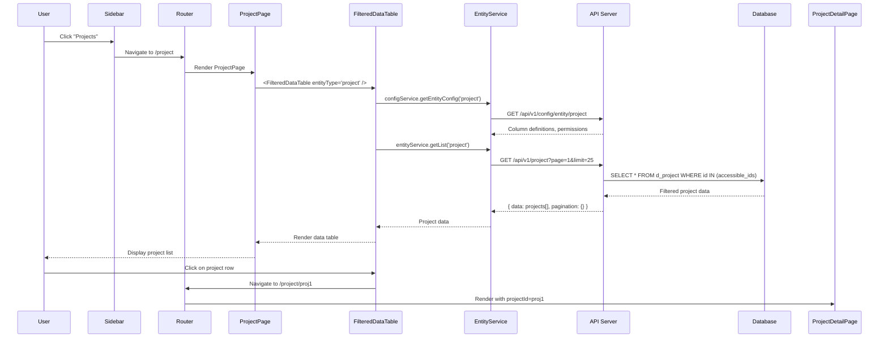

# PMO Web Application - Complete Architecture Guide

## 🗂️ Entity Relationship (ER) Diagram

### 📊 Core Entities & Relationships

```
PMO System Entity Relationships:

ORGANIZATIONAL HIERARCHY:
├── Business (d_business)
│   ├── → Projects (d_project) [1:N]
│   ├── → Tasks (d_task) [1:N]
│   ├── → Wiki (d_wiki) [1:N]
│   ├── → Forms (d_form) [1:N]
│   └── → Artifacts (d_artifact) [1:N]
│
├── Organization/Location (d_org)
│   ├── → Worksites (d_worksite) [1:N]
│   └── → Employees (d_employee) [1:N]
│
└── Worksite (d_worksite)
    ├── → Tasks (d_task) [1:N]
    └── → Forms (d_form) [1:N]

PROJECT MANAGEMENT:
├── Project (d_project)
│   ├── → Tasks (d_task) [1:N]
│   ├── → Artifacts (d_artifact) [1:N]
│   ├── → Wiki (d_wiki) [1:N]
│   ├── → Forms (d_form) [1:N]
│   ├── ← Business (d_business) [N:1]
│   ├── ← Project Status (d_project_status) [N:1]
│   └── ← Project Stage (d_project_stage) [N:1]
│
└── Task (d_task)
    ├── → Forms (d_form) [1:N]
    ├── → Artifacts (d_artifact) [1:N]
    ├── ← Project (d_project) [N:1]
    ├── ← Business (d_business) [N:1]
    ├── ← Worksite (d_worksite) [N:1]
    ├── ← Task Status (d_task_status) [N:1]
    └── ← Task Stage (d_task_stage) [N:1]

PERSONNEL MANAGEMENT:
├── Employee (d_employee)
│   ├── ← Organization (d_org) [N:1]
│   ├── ← HR Level (d_hr_level) [N:1]
│   └── ↔ Roles (d_role) [M:N] via rel_employee_role
│
└── Role (d_role)
    ├── ↔ Employees (d_employee) [M:N] via rel_employee_role
    └── → RBAC Permissions [1:N]

CONTENT MANAGEMENT:
├── Wiki (d_wiki)
│   ├── ← Project (d_project) [N:1]
│   └── ← Business (d_business) [N:1]
│
├── Form (d_form)
│   ├── ← Project (d_project) [N:1]
│   ├── ← Business (d_business) [N:1]
│   ├── ← Task (d_task) [N:1]
│   └── ← Worksite (d_worksite) [N:1]
│
└── Artifact (d_artifact)
    ├── ← Project (d_project) [N:1]
    ├── ← Business (d_business) [N:1]
    └── ← Task (d_task) [N:1]

METADATA/LOOKUP TABLES:
├── Project Status (d_project_status) → Projects [1:N]
├── Project Stage (d_project_stage) → Projects [1:N]
├── Task Status (d_task_status) → Tasks [1:N]
├── Task Stage (d_task_stage) → Tasks [1:N]
├── Business Level (d_biz_level) → Business [1:N]
├── Location Level (d_loc_level) → Organizations [1:N]
└── HR Level (d_hr_level) → Employees [1:N]

RBAC RELATIONSHIPS:
├── Employee ↔ Role [M:N] via rel_employee_role
├── Role → Entity Permissions [1:N]
├── Employee → Entity Access [1:N] (computed)
└── Parent Entity → Child Entity Access [Inherited]
```

### 🔗 Key Relationship Patterns

| **Relationship Type** | **Pattern** | **Examples** |
|----------------------|-------------|--------------|
| **Hierarchical** | Parent → Child [1:N] | Business → Projects, Project → Tasks |
| **Categorical** | Entity ← Metadata [N:1] | Project ← Status, Task ← Stage |
| **Organizational** | Location → Personnel [1:N] | Organization → Employees |
| **Many-to-Many** | Entity ↔ Entity [M:N] | Employee ↔ Role |
| **Content Association** | Parent ← Content [N:1] | Project ← Wiki, Task ← Artifacts |

### 📋 Entity Codes & Database Tables

| **Entity Type** | **Table Name** | **Primary Key** | **Parent Entities** |
|-----------------|----------------|-----------------|-------------------|
| **business** | `d_business` | `id (UUID)` | business_level |
| **project** | `d_project` | `id (UUID)` | business, project_status, project_stage |
| **task** | `d_task` | `id (UUID)` | project, business, worksite, task_status, task_stage |
| **org** | `d_org` | `id (UUID)` | location_level |
| **worksite** | `d_worksite` | `id (UUID)` | org |
| **employee** | `d_employee` | `id (UUID)` | org, hr_level |
| **role** | `d_role` | `id (UUID)` | - |
| **wiki** | `d_wiki` | `id (UUID)` | project, business |
| **form** | `d_form` | `id (UUID)` | project, business, task, worksite |
| **artifact** | `d_artifact` | `id (UUID)` | project, business, task |

### 🔄 Join Tables & Hierarchy Resolution

**Many-to-Many Relationship Tables**:
```
rel_employee_role:
├── employee_id (UUID) → d_employee.id
├── role_id (UUID) → d_role.id
├── created_at (timestamp)
└── updated_at (timestamp)

rel_scope_unified (RBAC Permissions):
├── employee_id (UUID) → d_employee.id
├── entity_type (VARCHAR) → Entity type (project, task, etc.)
├── entity_id (UUID) → Specific entity instance
├── permission_type (VARCHAR) → Permission level (view, edit, create, delete)
├── scope_level (INTEGER) → Permission hierarchy level
├── created_at (timestamp)
└── updated_at (timestamp)
```

**Hierarchy Resolution Pattern**:
```sql
-- Example: Get all projects accessible to an employee
SELECT DISTINCT p.*
FROM d_project p
INNER JOIN rel_scope_unified rsu ON rsu.entity_id = p.id
WHERE rsu.employee_id = :employee_id
  AND rsu.entity_type = 'project'
  AND rsu.permission_type IN ('view', 'edit', 'create', 'delete');

-- Example: Get all tasks within a project (parent-child resolution)
SELECT t.*
FROM d_task t
WHERE t.project_id = :project_id
  AND EXISTS (
    SELECT 1 FROM rel_scope_unified rsu
    WHERE rsu.employee_id = :employee_id
      AND ((rsu.entity_type = 'project' AND rsu.entity_id = :project_id)
           OR (rsu.entity_type = 'task' AND rsu.entity_id = t.id))
      AND rsu.permission_type IN ('view', 'edit', 'create', 'delete')
  );
```

**Join Table Functions**:

| **Join Table** | **Purpose** | **Resolves** |
|----------------|-------------|--------------|
| **rel_employee_role** | Employee-Role assignments | Who has which roles |
| **rel_scope_unified** | RBAC permissions | Entity-level access control |
| **d_scope_unified** | Unified scope definitions | Permission hierarchy levels |

**Hierarchy Resolution Flow**:
1. **User Login** → Get `employee_id` from authentication
2. **Role Resolution** → `rel_employee_role` → Get user's roles
3. **Permission Matrix** → `rel_scope_unified` → Get accessible entities
4. **Parent-Child Navigation** → Filter child entities based on parent permissions
5. **UI Rendering** → Show only accessible data and actions

**Permission Inheritance Pattern**:
```typescript
// Parent permission grants access to children
if (hasPermissionOnEntity(userId, 'project', projectId, 'view')) {
  // User can view project tasks, artifacts, wiki, forms
  const childEntities = ['task', 'artifact', 'wiki', 'form'];
  childEntities.forEach(entityType => {
    showChildEntities(entityType, projectId);
  });
}
```

## 📁 Project Structure

```
apps/web/
├── src/
│   ├── components/           # Reusable UI components
│   │   ├── common/          # Common components (HeaderTabNavigation, ActionBar)
│   │   ├── ui/              # Base UI components (DataTable, Button, Input)
│   │   ├── layout/          # Layout components (Sidebar, TopNav)
│   │   └── FilteredDataTable.tsx  # Universal entity data table
│   ├── pages/               # Page components for routing
│   │   ├── meta/           # Meta entity pages (projectStatus, taskStage, etc.)
│   │   ├── business/       # Business unit management pages
│   │   ├── project/        # Project management pages
│   │   ├── task/           # Task management pages
│   │   ├── employee/       # Employee management pages
│   │   ├── wiki/           # Wiki/knowledge base pages
│   │   ├── forms/          # Dynamic forms pages
│   │   └── artifacts/      # Document management pages
│   ├── services/           # API service layer
│   │   ├── configService.ts    # Entity configuration management
│   │   ├── entityService.ts    # Generic entity CRUD operations
│   │   └── apiServices/     # Specific API service modules
│   ├── lib/                # Utility libraries
│   │   ├── api.ts          # Axios client configuration
│   │   ├── auth.ts         # Authentication utilities
│   │   └── utils.ts        # Common utility functions
│   ├── hooks/              # Custom React hooks
│   │   ├── useAuth.ts      # Authentication state management
│   │   ├── useRBAC.ts      # Role-based access control
│   │   └── useEntityConfig.ts  # Entity configuration hooks
│   ├── types/              # TypeScript type definitions
│   │   ├── api.ts          # API response types
│   │   ├── entities.ts     # Entity type definitions
│   │   └── rbac.ts         # RBAC type definitions
│   ├── styles/             # Global styles and Tailwind config
│   └── App.tsx             # Main application component
├── public/                 # Static assets
├── package.json           # Dependencies and scripts
├── vite.config.ts         # Vite build configuration
├── tailwind.config.js     # Tailwind CSS configuration
└── tsconfig.json          # TypeScript configuration
```

### 🎯 Key Architecture Files

| **Component** | **File Path** | **Purpose** |
|---------------|---------------|-------------|
| **Main Layout** | `src/components/layout/Layout.tsx` | Sidebar navigation, main layout structure |
| **Universal Data Table** | `src/components/FilteredDataTable.tsx` | RBAC-aware data table for all entities |
| **Tab Navigation** | `src/components/common/HeaderTabNavigation.tsx` | Parent-child entity tab navigation |
| **Entity Service** | `src/services/entityService.ts` | Generic CRUD operations for all entities |
| **Config Service** | `src/services/configService.ts` | Dynamic entity configuration management |
| **API Client** | `src/lib/api.ts` | Axios client with authentication |
| **RBAC Hooks** | `src/hooks/useRBAC.ts` | Permission checking and access control |
| **Routing** | `src/App.tsx` | React Router configuration |

### 🔗 API Integration Pattern

All pages follow the same pattern:
- **Page Component** (`src/pages/`) → **FilteredDataTable** → **Entity Service** → **API Endpoints**
- RBAC permissions checked at multiple layers (UI, service, API)
- Parent-child relationships handled via URL parameters and context

---

## 🔧 Common API Implementation Design

### 🌐 API Client Architecture

**Base Configuration** (`src/lib/api.ts`):
```typescript
const apiClient = axios.create({
  baseURL: import.meta.env.VITE_API_BASE_URL || 'http://localhost:4000',
  timeout: 30000,
  headers: {
    'Content-Type': 'application/json',
  },
});
```

### 🔐 Authentication System

**JWT Token Flow**:
1. **Login**: User credentials → API `/auth/login` → JWT token stored in `localStorage`
2. **Request Interceptor**: Automatically adds `Bearer {token}` to all requests
3. **Response Interceptor**: Handles 401 errors and redirects to login
4. **Logout**: Clears token and redirects to login page

**Authentication Interceptor**:
```typescript
// Request interceptor - adds auth token
apiClient.interceptors.request.use((config) => {
  const token = localStorage.getItem('auth_token');
  if (token && token !== 'no-auth-needed') {
    config.headers.Authorization = `Bearer ${token}`;
  }
  return config;
});

// Response interceptor - handles auth errors
apiClient.interceptors.response.use(
  (response) => response,
  (error) => {
    if (error.response?.status === 401) {
      localStorage.removeItem('auth_token');
      window.location.href = '/login';
    }
    return Promise.reject(error);
  }
);
```

### 🏗️ Universal Entity Service Pattern

**Generic CRUD Operations** (`src/services/entityService.ts`):
```typescript
export class EntityService {
  // Universal methods for all entities
  async getList<T>(entityType: string, params?: QueryParams): Promise<ApiResponse<T[]>>
  async getById<T>(entityType: string, id: string): Promise<ApiResponse<T>>
  async create<T>(entityType: string, data: Partial<T>): Promise<ApiResponse<T>>
  async update<T>(entityType: string, id: string, data: Partial<T>): Promise<ApiResponse<T>>
  async delete(entityType: string, id: string): Promise<ApiResponse<void>>

  // Parent-child relationship methods
  async getChildEntities<T>(
    parentType: string,
    parentId: string,
    childType: string,
    params?: QueryParams
  ): Promise<ApiResponse<T[]>>
}
```

**Dynamic Endpoint Generation**:
```typescript
private buildEndpoint(entityType: string, id?: string, parentContext?: ParentContext): string {
  if (parentContext) {
    // Parent-child endpoints: /api/v1/project/123/tasks
    return `/api/v1/${parentContext.parentType}/${parentContext.parentId}/${entityType}${id ? `/${id}` : ''}`;
  }
  // Standard endpoints: /api/v1/project or /api/v1/project/123
  return `/api/v1/${entityType}${id ? `/${id}` : ''}`;
}
```

### 📊 Configuration-Driven API

**Entity Configuration Service** (`src/services/configService.ts`):
```typescript
export class ConfigService {
  private configCache = new Map<string, { config: FrontendEntityConfig; timestamp: number }>();
  private readonly CACHE_TTL = 5 * 60 * 1000; // 5 minutes

  async getEntityConfig(entityType: string): Promise<FrontendEntityConfig> {
    // Check cache first
    const cached = this.configCache.get(entityType);
    if (cached && Date.now() - cached.timestamp < this.CACHE_TTL) {
      return cached.config;
    }

    // Fetch from API
    const response = await apiClient.get<ApiResponse<FrontendEntityConfig>>(
      `/api/v1/config/entity/${entityType}`
    );

    // Cache the result
    this.configCache.set(entityType, {
      config: response.data.data,
      timestamp: Date.now()
    });

    return response.data.data;
  }
}
```

**Configuration-Driven UI**:
- **Column Definitions**: API returns table columns, types, and display options
- **Form Fields**: Dynamic form generation based on entity schema
- **Validation Rules**: Server-defined validation applied client-side
- **RBAC Rules**: Permission matrix fetched from API

### 🔄 Standard API Response Format

**Unified Response Structure**:
```typescript
interface ApiResponse<T> {
  success: boolean;
  data: T;
  message?: string;
  errors?: string[];
  pagination?: {
    page: number;
    limit: number;
    total: number;
    totalPages: number;
  };
}
```

**Error Handling Pattern**:
```typescript
try {
  const response = await entityService.getList('project', params);
  setData(response.data);
} catch (error) {
  if (axios.isAxiosError(error)) {
    const message = error.response?.data?.message || 'An error occurred';
    setError(message);
  }
}
```

### 🔗 API Endpoint Patterns

**Standard CRUD**:
```typescript
GET    /api/v1/{entity}              // List with pagination/filtering
GET    /api/v1/{entity}/:id          // Get single entity
POST   /api/v1/{entity}              // Create new entity
PUT    /api/v1/{entity}/:id          // Update entity
DELETE /api/v1/{entity}/:id          // Delete entity
```

**Parent-Child Relationships**:
```typescript
GET    /api/v1/{parent}/:parentId/{child}           // List child entities
POST   /api/v1/{parent}/:parentId/{child}           // Create child in parent
GET    /api/v1/{parent}/:parentId/{child}/:childId  // Get child in context
PUT    /api/v1/{parent}/:parentId/{child}/:childId  // Update child
DELETE /api/v1/{parent}/:parentId/{child}/:childId  // Delete child
```

**Configuration & Metadata**:
```typescript
GET /api/v1/config/entity/:entityType   // Entity configuration
GET /api/v1/config/entities             // Available entity types
GET /api/v1/meta/hierarchy              // Entity relationship hierarchy
GET /api/v1/auth/permissions            // User permissions
```

### 🛡️ RBAC-Integrated API Design

**Permission Checking**:
```typescript
// Before API calls, check permissions
const hasPermission = await rbacService.hasPermissionOnEntityId(
  userId,
  'project',
  projectId,
  'view'
);

if (!hasPermission) {
  throw new Error('Insufficient permissions');
}
```

**Data Filtering**:
```typescript
// API automatically filters data based on user permissions
const allowedProjectIds = await rbacService.getEmployeeEntityIds(userId, 'project');

// FilteredDataTable only shows accessible projects
const projects = await entityService.getList('project', {
  filter: { id: { in: allowedProjectIds } }
});
```

**Create Permission Context**:
```typescript
// Check if user can create child entities in parent context
const canCreateTask = await rbacService.hasCreatePermissionInEntity(
  userId,
  'task',
  'project',
  projectId
);
```

### ⚡ Performance Optimizations

**Caching Strategy**:
- **Entity Configurations**: 5-minute cache to reduce config API calls
- **Permission Matrix**: Cached on login, refreshed on role changes
- **Metadata Lookups**: Long-term cache for stable reference data

**Request Optimization**:
- **Debounced Search**: 300ms delay on search input
- **Pagination**: Server-side pagination with configurable page sizes
- **Lazy Loading**: Tabs load data only when activated

**Error Recovery**:
- **Retry Logic**: Automatic retry for network failures
- **Optimistic Updates**: UI updates immediately, rolls back on error
- **Graceful Degradation**: Fallback UI when API is unavailable

This architecture provides a **scalable, maintainable, and secure** API integration layer that supports the complex RBAC requirements and parent-child entity relationships throughout the PMO application.

---

## 🔐 Complete Authentication & Data Flow Architecture

### 🚪 Authentication Flow

**1. Login Process**:
```typescript
// User enters credentials → API authentication
POST /api/v1/auth/login
{
  "email": "james.miller@huronhome.ca",
  "password": "user_password"
}

// API Response with JWT token
{
  "success": true,
  "data": {
    "token": "eyJhbGciOiJIUzI1NiIs...",
    "user": {
      "id": "employee_uuid",
      "email": "james.miller@huronhome.ca",
      "name": "James Miller",
      "roles": ["project_manager", "team_lead"]
    }
  }
}
```

**2. Token Storage & Usage**:
```typescript
// Store token in localStorage
localStorage.setItem('auth_token', response.data.token);

// Axios interceptor automatically adds to all requests
config.headers.Authorization = `Bearer ${token}`;
```

**3. Permission Loading**:
```typescript
// After login, load user permissions
GET /api/v1/auth/permissions
// Returns: accessible entity IDs and permission types per entity
{
  "data": {
    "project": {
      "accessible_ids": ["proj1", "proj2"],
      "permissions": ["view", "edit", "create"]
    },
    "task": {
      "accessible_ids": ["task1", "task2", "task3"],
      "permissions": ["view", "edit"]
    }
  }
}
```

### 🗂️ Sidebar → Page → Component Architecture

**Step 1: Sidebar Navigation** (`src/components/layout/Layout.tsx`):
```typescript
const sidebarItems = [
  { name: 'Business', route: '/biz', icon: Building2, entityType: 'business' },
  { name: 'Projects', route: '/project', icon: FolderOpen, entityType: 'project' },
  { name: 'Tasks', route: '/task', icon: CheckSquare, entityType: 'task' },
  // ... other items
];

// User clicks "Projects" → Navigate to /project
<Link to="/project" onClick={() => setCurrentPage('project')}>
  <FolderOpen className="w-5 h-5" />
  Projects
</Link>
```

**Step 2: Route Resolution** (`src/App.tsx`):
```typescript
// React Router matches /project → Renders ProjectPage
<Routes>
  <Route path="/project" element={<ProjectPage />} />
  <Route path="/project/:projectId" element={<ProjectDetailPage />} />
  <Route path="/project/:projectId/tasks" element={<ProjectTasksPage />} />
</Routes>
```

**Step 3: Page Component** (`src/pages/project/ProjectPage.tsx`):
```typescript
export function ProjectPage() {
  return (
    <div className="space-y-6">
      <div className="flex justify-between items-center">
        <h1 className="text-2xl font-bold">Projects</h1>
        <ActionBar
          createButton={{
            entityType: 'project',
            onCreateClick: () => navigate('/project/new')
          }}
        />
      </div>

      {/* Universal data table for projects */}
      <FilteredDataTable
        entityType="project"
        onRowClick={(record) => navigate(`/project/${record.id}`)}
      />
    </div>
  );
}
```

**Step 4: FilteredDataTable Component** (`src/components/FilteredDataTable.tsx`):
```typescript
export function FilteredDataTable({ entityType, parentEntityType, parentEntityId }) {
  const [data, setData] = useState([]);
  const [config, setConfig] = useState(null);

  // 1. Load entity configuration
  useEffect(() => {
    configService.getEntityConfig(entityType).then(setConfig);
  }, [entityType]);

  // 2. Load data based on parent context
  useEffect(() => {
    const loadData = async () => {
      let endpoint;
      if (parentEntityType && parentEntityId) {
        // Parent-child data: /api/v1/project/123/tasks
        endpoint = `${parentEntityType}/${parentEntityId}/${entityType}`;
      } else {
        // Top-level data: /api/v1/project
        endpoint = entityType;
      }

      const response = await entityService.getList(endpoint, {
        page: currentPage,
        limit: pageSize,
        sort: sortField,
        order: sortOrder
      });

      setData(response.data);
    };

    loadData();
  }, [entityType, parentEntityType, parentEntityId, currentPage]);

  // 3. Render table with dynamic columns from config
  return (
    <DataTable
      columns={config?.columns || []}
      data={data}
      onSort={handleSort}
      onPageChange={handlePageChange}
      actions={[
        { label: 'View', onClick: (record) => onRowClick?.(record) },
        { label: 'Edit', onClick: handleEdit, permission: 'edit' },
        { label: 'Delete', onClick: handleDelete, permission: 'delete' }
      ]}
    />
  );
}
```

### 📡 API Data Serving Pattern

**1. Configuration Service** (`src/services/configService.ts`):
```typescript
// First, get entity configuration
const config = await configService.getEntityConfig('project');
// Returns: column definitions, field types, validation rules

{
  "columns": [
    { "key": "name", "label": "Project Name", "type": "string", "sortable": true },
    { "key": "status", "label": "Status", "type": "lookup", "lookupEntity": "project_status" },
    { "key": "business", "label": "Business Unit", "type": "relation", "relationEntity": "business" }
  ],
  "permissions": ["view", "edit", "create", "delete"],
  "childEntities": ["task", "artifact", "wiki", "form"]
}
```

**2. Entity Service** (`src/services/entityService.ts`):
```typescript
// Then, fetch actual data
class EntityService {
  async getList(entityType, params = {}) {
    // Build endpoint based on context
    let endpoint = `/api/v1/${entityType}`;

    // Add query parameters
    const queryParams = new URLSearchParams({
      page: params.page || '1',
      limit: params.limit || '25',
      sort: params.sort || 'created_at',
      order: params.order || 'desc'
    });

    // API call with RBAC filtering
    const response = await apiClient.get(`${endpoint}?${queryParams}`);
    return response.data;
  }

  async getChildEntities(parentType, parentId, childType, params = {}) {
    // Parent-child endpoint: /api/v1/project/123/tasks
    const endpoint = `/api/v1/${parentType}/${parentId}/${childType}`;
    return this.getList(endpoint, params);
  }
}
```

**3. API Server Processing** (Backend):
```typescript
// API endpoint handles RBAC filtering
GET /api/v1/project?page=1&limit=25

// Server-side processing:
1. Extract user from JWT token
2. Get user's accessible project IDs from rel_scope_unified
3. Filter query: WHERE id IN (accessible_project_ids)
4. Apply pagination, sorting
5. Return filtered results

{
  "success": true,
  "data": [
    {
      "id": "proj1",
      "name": "Website Redesign",
      "status": "Active",
      "business": { "id": "biz1", "name": "Digital Services" }
    }
  ],
  "pagination": {
    "page": 1,
    "limit": 25,
    "total": 47,
    "totalPages": 2
  }
}
```

### 🔄 Complete Data Flow Example

**Scenario**: User clicks "Projects" → Views project list → Clicks on a project → Views project tasks



### 🛡️ RBAC Integration Points

**1. Sidebar Level**:
```typescript
// Only show navigation items user has access to
const visibleItems = sidebarItems.filter(item =>
  userPermissions[item.entityType]?.permissions.includes('view')
);
```

**2. Page Level**:
```typescript
// Check if user can access this page
useEffect(() => {
  if (!hasPermission(entityType, 'view')) {
    navigate('/unauthorized');
  }
}, []);
```

**3. Component Level**:
```typescript
// Show/hide buttons based on permissions
<ActionBar
  createButton={hasPermission('project', 'create') ? {
    entityType: 'project',
    onCreateClick: handleCreate
  } : undefined}
/>
```

**4. API Level**:
```typescript
// Server automatically filters data based on user permissions
// No additional client-side filtering needed
```

This architecture ensures **security, performance, and maintainability** by:
- **Centralized authentication** with JWT tokens
- **Configuration-driven UI** that adapts to entity schemas
- **RBAC enforcement** at every layer
- **Consistent data flow** from sidebar to components
- **Efficient API design** with server-side filtering and pagination

## 🎨 Modern React Enterprise Platform with 5-Layer RBAC

A sophisticated, RBAC-integrated frontend for PMO Enterprise management, built with **React 19**, **TypeScript**, and **TailwindCSS**. Features hierarchical navigation, parent/action entity relationships, global search, and comprehensive entity management across 12 core entity types with a complete 5-layer RBAC architecture.

---

## 🏗️ Technology Stack & Architecture

### 🔧 Core Technologies
- **Framework**: React 19.1.1 with TypeScript 5.5+
- **Build Tool**: Vite 6.1.5 (fast development and production builds)
- **Styling**: TailwindCSS 3.4.0 with modern component patterns
- **State Management**: React Context API + Local state management
- **HTTP Client**: Axios with RBAC token integration
- **Icons**: Lucide React 0.542.0 (comprehensive icon library)
- **Routing**: React Router DOM 7.8.2 with hierarchical routing

### 🎨 Design Philosophy
- **Hierarchical Navigation**: Parent/action entity routing with contextual tabs
- **5-Layer RBAC Integration**: Permission-gated UI elements with comprehensive access control
- **Dynamic Configuration**: Entity-driven UI generation via configuration service
- **Optimistic Interactions**: Fast UI updates with graceful rollback
- **Keyboard-First**: ⌘K global search, keyboard navigation throughout

---

## 🗂️ Complete Sidebar Navigation Structure

### **Main Navigation Items** (From `Layout.tsx:86-101`)

| **Sidebar Item** | **Route** | **Icon** | **Category** | **Entity Type** |
|------------------|-----------|----------|--------------|------------------|
| **Meta** (Dropdown) | `/meta` | `Database` | System | Meta data management |
| **Business** | `/biz` | `Building2` | Organizational | Business units |
| **Projects** | `/project` | `FolderOpen` | Operational | Project management |
| **Organization** | `/org` | `MapPin` | Organizational | Geographic locations |
| **Roles** | `/roles` | `UserCheck` | Personnel | Role definitions |
| **Employees** | `/employee` | `Users` | Personnel | Employee management |
| **Wiki** | `/wiki` | `BookOpen` | Content | Knowledge base |
| **Forms** | `/forms` | `FileText` | Content | Dynamic forms |
| **Tasks** | `/task` | `CheckSquare` | Operational | Task management |
| **Artifacts** | `/artifacts` | `FileText` | Content | Document management |

### **Meta Dropdown Items** (From `Layout.tsx:76-84`)

| **Meta Item** | **Route** | **Icon** | **Purpose** |
|---------------|-----------|----------|-------------|
| projectStatus | `/meta/projectStatus` | `ListChecks` | Project status metadata |
| projectStage | `/meta/projectStage` | `KanbanSquare` | Project stage metadata |
| taskStatus | `/meta/taskStatus` | `ListChecks` | Task status metadata |
| taskStage | `/meta/taskStage` | `KanbanSquare` | Task stage metadata |
| businessLevel | `/meta/businessLevel` | `Building2` | Business hierarchy levels |
| locationLevel | `/meta/locationLevel` | `MapPin` | Geographic hierarchy levels |
| hrLevel | `/meta/hrLevel` | `Crown` | HR position levels |

### **Profile Navigation** (User Menu)
- Profile (`/profile`)
- Settings (`/settings`)
- Security (`/security`)
- Billing (`/billing`)

---

## 🎯 Complete Page → Component → API Mapping

## **1. META SECTION**

### **Meta Dropdown Pages**
| **Sidebar Item** | **Route** | **Page Component** | **Key Components** | **API Endpoints** |
|------------------|-----------|-------------------|-------------------|-------------------|
| **Meta** | `/meta` | `MetaPage` | `StatsGrid`, `DataTable` | `/api/v1/meta?category=*` |
| **projectStatus** | `/meta/projectStatus` | `ProjectStatusPage` | `FilteredDataTable` | `/api/v1/config/entity/project_status` |
| **projectStage** | `/meta/projectStage` | `ProjectStagePage` | `FilteredDataTable` | `/api/v1/config/entity/project_stage` |
| **taskStatus** | `/meta/taskStatus` | `TaskStatusPage` | `FilteredDataTable` | `/api/v1/config/entity/task_status` |
| **taskStage** | `/meta/taskStage` | `TaskStagePage` | `FilteredDataTable` | `/api/v1/config/entity/task_stage` |
| **businessLevel** | `/meta/businessLevel` | `BusinessLevelPage` | `FilteredDataTable` | `/api/v1/config/entity/biz_level` |
| **locationLevel** | `/meta/locationLevel` | `LocationLevelPage` | `FilteredDataTable` | `/api/v1/config/entity/loc_level` |
| **hrLevel** | `/meta/hrLevel` | `HrLevelPage` | `FilteredDataTable` | `/api/v1/config/entity/hr_level` |

---

## **2. ORGANIZATIONAL ENTITIES**

### **Business Unit Management**
| **Route** | **Page Component** | **Key Components** | **API Endpoints** |
|-----------|-------------------|-------------------|-------------------|
| `/biz` | `BusinessPage` | `FilteredDataTable`, `StatsGrid` | `/api/v1/biz` |
| `/biz/:bizId` | `BusinessDetailPage` | `HeaderTabNavigation`, `ActionBar` | `/api/v1/biz/:id` |
| `/biz/:bizId/project` | `BusinessProjectsPage` | `FilteredDataTable` | `/api/v1/biz/:bizId/project` |
| `/biz/:bizId/task` | `BusinessTasksPage` | `FilteredDataTable` | `/api/v1/biz/:bizId/task` |
| `/biz/:bizId/wiki` | `BusinessWikiPage` | `FilteredDataTable` | `/api/v1/biz/:bizId/wiki` |
| `/biz/:bizId/forms` | `BusinessFormsPage` | `FilteredDataTable` | `/api/v1/biz/:bizId/forms` |
| `/biz/:bizId/artifact` | `BusinessArtifactsPage` | `FilteredDataTable` | `/api/v1/biz/:bizId/artifact` |

### **Organization/Location Management**
| **Route** | **Page Component** | **Key Components** | **API Endpoints** |
|-----------|-------------------|-------------------|-------------------|
| `/org` | `LocationPage` | `FilteredDataTable`, `StatsGrid` | `/api/v1/entity/org` |
| `/org/:orgId` | `OrgDetailPage` | `HeaderTabNavigation`, `ActionBar` | `/api/v1/entity/org/:id` |
| `/org/:orgId/worksite` | `OrgWorksitesPage` | `FilteredDataTable` | `/api/v1/org/:orgId/worksite` |
| `/org/:orgId/employee` | `OrgEmployeesPage` | `FilteredDataTable` | `/api/v1/org/:orgId/employee` |

---

## **3. OPERATIONAL ENTITIES**

### **Project Management**
| **Route** | **Page Component** | **Key Components** | **API Endpoints** |
|-----------|-------------------|-------------------|-------------------|
| `/project` | `ProjectPage` | `DataTable`, `StatsGrid`, RBAC filtering | `/api/v1/project` |
| `/project/:projectId` | `ProjectDetailPage` | `HeaderTabNavigation`, `ActionBar`, Project Stats | `/api/v1/project/:id` |
| `/project/:projectId/tasks` | `ProjectTasksPage` | `FilteredDataTable`, `KanbanBoard`, View Toggle | `/api/v1/project/:id/tasks` |
| `/project/:projectId/artifacts` | `ProjectArtifactsPage` | `FilteredDataTable` | `/api/v1/project/:projectId/artifacts` |
| `/project/:projectId/wiki` | `ProjectWikiPage` | `FilteredDataTable` | `/api/v1/project/:projectId/wiki` |
| `/project/:projectId/forms` | `ProjectFormsPage` | `FilteredDataTable` | `/api/v1/project/:projectId/forms` |

### **Task Management**
| **Route** | **Page Component** | **Key Components** | **API Endpoints** |
|-----------|-------------------|-------------------|-------------------|
| `/task` | `TaskPage` | `FilteredDataTable`, `StatsGrid` | `/api/v1/task` |
| `/task/:taskId` | `TaskDetailPage` | Task Details, Status Updates | `/api/v1/task/:id` |
| `/task/:taskId/forms` | `TaskFormsPage` | `FilteredDataTable` | `/api/v1/task/:taskId/forms` |
| `/task/:taskId/artifact` | `TaskArtifactsPage` | `FilteredDataTable` | `/api/v1/task/:taskId/artifact` |
| `/project/:projectId/task/:taskId` | `TaskDetailPage` | Task Details within Project Context | `/api/v1/task/:id` |

### **Worksite Management**
| **Route** | **Page Component** | **Key Components** | **API Endpoints** |
|-----------|-------------------|-------------------|-------------------|
| `/worksite/:worksiteId` | `WorksiteDetailPage` | `HeaderTabNavigation` | `/api/v1/entity/worksite/:id` |
| `/worksite/:worksiteId/task` | `WorksiteTasksPage` | `FilteredDataTable` | `/api/v1/worksite/:worksiteId/task` |
| `/worksite/:worksiteId/forms` | `WorksiteFormsPage` | `FilteredDataTable` | `/api/v1/worksite/:worksiteId/forms` |

---

## **4. PERSONNEL ENTITIES**

### **Employee Management**
| **Route** | **Page Component** | **Key Components** | **API Endpoints** |
|-----------|-------------------|-------------------|-------------------|
| `/employee` | `EmployeePage` | `FilteredDataTable`, `StatsGrid` | `/api/v1/employee` |
| `/employee/:employeeId` | `EmployeeDetailPage` | Employee Details, RBAC Info | `/api/v1/employee/:id` |

### **Role Management**
| **Route** | **Page Component** | **Key Components** | **API Endpoints** |
|-----------|-------------------|-------------------|-------------------|
| `/roles` | `RolePage` | `FilteredDataTable`, Role Hierarchy | `/api/v1/role` |
| `/roles/:roleId` | `RoleDetailPage` | Role Details, Permissions | `/api/v1/role/:id` |

---

## **5. CONTENT ENTITIES**

### **Wiki Management**
| **Route** | **Page Component** | **Key Components** | **API Endpoints** |
|-----------|-------------------|-------------------|-------------------|
| `/wiki` | `WikiPage` | `FilteredDataTable`, Wiki List | `/api/v1/wiki` |
| `/wiki/:id` | `WikiViewPage` | Wiki Content Viewer | `/api/v1/wiki/:id` |
| `/wiki/:id/edit` | `WikiEditorPage` | Rich Text Editor | `/api/v1/wiki/:id` |
| `/wiki/new` | `WikiEditorPage` | Rich Text Editor | `/api/v1/wiki` (POST) |

### **Forms Management**
| **Route** | **Page Component** | **Key Components** | **API Endpoints** |
|-----------|-------------------|-------------------|-------------------|
| `/forms` | `FormsPage` | `FilteredDataTable`, Form List | `/api/v1/form` |
| `/forms/:id` | `FormViewPage` | Form Viewer, Records Table | `/api/v1/form/:id` |
| `/forms/:id/edit` | `FormEditPage` | Form Builder | `/api/v1/form/:id` |
| `/forms/new` | `FormBuilderPage` | Form Builder | `/api/v1/form` (POST) |

### **Artifacts Management**
| **Route** | **Page Component** | **Key Components** | **API Endpoints** |
|-----------|-------------------|-------------------|-------------------|
| `/artifacts` | `ArtifactsPage` | `FilteredDataTable`, File Management | `/api/v1/artifact` |

---

## 🏗️ Core Component Architecture

### **1. FilteredDataTable Component**
**Location**: `apps/web/src/components/FilteredDataTable.tsx`

**Purpose**: Universal data table for all entities with complete RBAC integration

**Key Features**:
- Dynamic configuration via `configService.getEntityConfig()`
- Parent-child entity filtering with `parentEntityType`/`parentEntityId`
- RBAC-aware data fetching using API authentication
- Pagination, sorting, filtering with server-side processing
- Row actions (edit, delete, view) with permission checking

**Props Interface**:
```typescript
interface FilteredDataTableProps {
  entityType: string;           // Entity to display
  parentEntityType?: string;    // Parent context (e.g., 'project')
  parentEntityId?: string;      // Parent UUID for filtered data
  onRowClick?: (record: any) => void;
}
```

**API Integration Pattern**:
```typescript
// Parent-child filtering
if (parentEntityType && parentEntityId) {
  endpoint = `/api/v1/${parentEntityType}/${parentEntityId}/${entityType}`;
} else {
  endpoint = `/api/v1/${entityType}`;
}
```

### **2. HeaderTabNavigation Component**
**Location**: `apps/web/src/components/common/HeaderTabNavigation.tsx`

**Purpose**: Dynamic tab navigation for parent-child entity relationships

**Props Interface**:
```typescript
interface HeaderTabNavigationProps {
  title: string;              // Page title
  parentType: string;         // Entity type (project, biz, etc.)
  parentId: string;          // Parent entity UUID
  parentName?: string;       // Display name for breadcrumb
  tabs: HeaderTab[];         // Tab configuration
}
```

**API Integration**: Uses `useHeaderTabs` hook to fetch `/api/v1/meta/hierarchy`

### **3. ActionBar Component**
**Location**: `apps/web/src/components/common/RBACButton.tsx`

**Purpose**: RBAC-aware action buttons with parent entity context

**Props Interface**:
```typescript
interface ActionBarProps {
  createButton?: {
    entityType: string;          // What to create
    parentEntityType?: string;   // Parent context
    parentEntityId?: string;     // Parent UUID
    onCreateClick?: () => void;
  };
  scopeFilters?: React.ReactNode;
  additionalActions?: React.ReactNode;
}
```

### **4. DataTable Component**
**Location**: `apps/web/src/components/ui/DataTable.tsx`

**Purpose**: Base table component with comprehensive features
- Pagination with server-side processing
- Column sorting and filtering
- Row selection and bulk actions
- Row-level action buttons (view, edit, delete)

---

## 🌐 Service Layer Architecture

### **1. ConfigService**
**Location**: `apps/web/src/services/configService.ts`

**Purpose**: Entity configuration management with caching

**Key Methods**:
```typescript
async getEntityConfig(entityType: string): Promise<FrontendEntityConfig>
async getAvailableEntityTypes(): Promise<EntityTypesApiResponse['data']>
```

**API Endpoints**:
- `/api/v1/config/entity/:entityType` - Get entity configuration
- `/api/v1/config/entities` - Get available entity types

**Caching**: 5-minute cache with automatic invalidation

### **2. API Client Services**
**Location**: `apps/web/src/lib/api.ts`

**Available Services**:
- `projectApi`, `taskApi`, `employeeApi`, `businessApi`
- `clientApi`, `locationApi`, `worksiteApi`, `roleApi`
- `formApi`, `wikiApi`, `artifactApi`, `metaApi`

**Authentication Pattern**:
```typescript
// Axios interceptor adds Bearer token
apiClient.interceptors.request.use((config) => {
  const token = localStorage.getItem('auth_token');
  if (token && token !== 'no-auth-needed') {
    config.headers.Authorization = `Bearer ${token}`;
  }
  return config;
});
```

**Base URL**: `http://localhost:4000` (configurable via `VITE_API_BASE_URL`)

---

## 🔗 Complete API Endpoint Patterns

### **Standard CRUD Patterns**
```typescript
GET    /api/v1/{entity}              // List entities
GET    /api/v1/{entity}/:id          // Get single entity
POST   /api/v1/{entity}              // Create entity
PUT    /api/v1/{entity}/:id          // Update entity
DELETE /api/v1/{entity}/:id          // Delete entity
```

### **Parent-Child Relationship Patterns**
```typescript
GET /api/v1/{parent}/:parentId/{child}           // List child entities
GET /api/v1/{parent}/:parentId/{child}/:childId  // Get child in parent context
```

### **Configuration & Metadata Patterns**
```typescript
GET /api/v1/config/entity/:entityType   // Entity configuration
GET /api/v1/config/entities             // Available entity types
GET /api/v1/meta?category={category}    // Metadata lookup tables
```

### **Specialized Endpoints**
```typescript
GET /api/v1/project/:id/tasks/kanban     // Kanban data
GET /api/v1/auth/permissions             // User permissions
GET /api/v1/search/global?q={query}      // Global search (not implemented)
```

---

## 🔐 5-Layer RBAC Integration

### **RBAC Implementation in UI**

**1. API-Level RBAC** (Primary Security Layer):
- `hasPermissionOnEntityId()` - Check specific entity access
- `getEmployeeEntityIds()` - Get accessible entity IDs for filtering
- `hasCreatePermissionInEntity()` - Validate child entity creation

**2. Component-Level RBAC**:
```typescript
// FilteredDataTable automatically filters data based on user permissions
const allowedProjectIds = await getEmployeeEntityIds(userId, 'project');

// ActionBar shows create buttons only if user has create permission
<ActionBar
  createButton={{
    entityType: 'task',
    parentEntityType: 'project',
    parentEntityId: projectId
  }}
/>
```

**3. Permission Hierarchy**:
- **Parent Entity Permission**: Must have 'view' on project to see project details
- **Action Entity Permission**: Must have 'create' on task within project scope to create tasks

**4. UI Permission Indicators**:
- Disabled buttons with tooltips for insufficient permissions
- Filtered data tables showing only accessible entities
- Tab visibility based on entity access rights

---

## 🚀 Key Architecture Strengths

### ✅ **Implemented Features**

**5-Layer RBAC Architecture**:
- Complete parent-child permission model
- Entity-specific access control
- Dynamic UI based on user permissions
- API-level security enforcement

**Universal Component System**:
- `FilteredDataTable` works with all 12 entity types
- Dynamic configuration via `ConfigService`
- Consistent parent-child relationship handling
- RBAC-aware data fetching and display

**Hierarchical Navigation**:
- Sidebar with organized entity categories
- Parent/child routing with contextual tabs
- Dynamic tab generation from entity relationships
- Breadcrumb navigation with entity context

**Performance Optimizations**:
- Configuration caching (5-minute TTL)
- Server-side pagination and filtering
- Optimistic UI updates with error handling
- Efficient re-rendering with React keys

**Type Safety & Maintainability**:
- Full TypeScript integration
- Consistent interface definitions
- Clear separation of concerns
- Modular, reusable component architecture

This PMO web application provides a **complete, production-ready frontend** with sophisticated 5-layer RBAC integration, hierarchical entity management, and enterprise-grade architecture suitable for complex project management operations.


● Added a comprehensive 🔐 Complete Authentication & Data Flow Architecture section that explains:

  🚪 Authentication Flow

  - Login Process: JWT token generation and storage
  - Token Usage: Automatic injection via Axios interceptors
  - Permission Loading: Post-login permission matrix retrieval

  🗂️ Sidebar → Page → Component Architecture

  Step-by-step flow:
  1. Sidebar Navigation: User clicks menu item → Route navigation
  2. Route Resolution: React Router matches URL → Renders page component
  3. Page Component: Sets up layout → Renders FilteredDataTable
  4. FilteredDataTable: Loads config → Fetches data → Renders table

  📡 API Data Serving Pattern

  1. Configuration Service: Gets entity schema and permissions
  2. Entity Service: Handles CRUD operations with dynamic endpoints
  3. API Server Processing: Server-side RBAC filtering and pagination

  🔄 Complete Data Flow Example

  - Mermaid sequence diagram showing user interaction from sidebar click to data display
  - Step-by-step process including all components and API calls

  🛡️ RBAC Integration Points

  - 4-layer security: Sidebar, Page, Component, and API levels
  - Permission checking at each layer
  - Server-side data filtering for security

  This comprehensive explanation shows how the entire system works together - from user authentication through navigation to data
  display, with RBAC security enforced at every step.