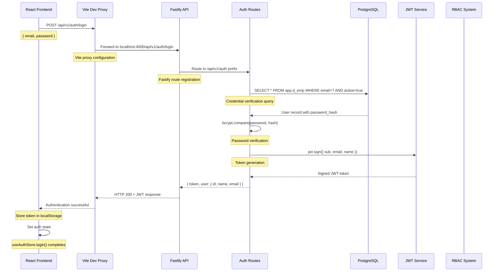

# PMO Enterprise Task Management Platform
## Architecture & System Design

This document outlines the comprehensive architecture for a next-generation, enterprise-grade Project Management Office (PMO) platform designed for task management, workflow automation, and multi-domain business operations.

---

## 🎯 Design Principles

- **Domain-First**: UI and APIs mirror domain tables. Head (immutable identity) vs Records (temporal snapshots)
- **Scalable by Default**: Horizontal API scaling, CQRS-style reads, async job processing
- **Zero-Surprise UX**: Consistent patterns across all domains (search, filters, bulk actions)
- **RBAC + Scope-Aware**: Role-based access control scoped to Location/Business/HR/Worksite/Project/Task
- **Policy-Gated Routes**: Same endpoints for all users, permissions enforced at middleware level
- **Real-time & Resilient**: WebSocket/SSE for live updates with optimistic UI and server reconciliation
- **API Contracts**: Zod-validated schemas with OpenAPI documentation and type generation

---

## 🔐 Authentication & Authorization Architecture

The PMO platform implements a **JWT-based authentication system** with **database-driven RBAC (Role-Based Access Control)** that follows the **Policy-Gated Routes** principle. Here's how the authentication plumbing works:

### Authentication Flow Plumbing

#### **🔄 Simplified Flow Overview**
```
Frontend Form → auth.login(email, password)
    ↓
Auth Store → fetch('/api/v1/auth/login') 
    ↓  
Vite Proxy → localhost:4000/api/v1/auth/login
    ↓
Fastify API → JWT validation & database lookup
    ↓
Database → John Smith verified (active=true)
    ↓
Response → { token: "jwt...", user: { id, name, email } }
```

#### **📋 Detailed Sequence Diagram**


### 1. **Frontend Layer** (`/apps/web/src/`)

**Location**: `apps/web/src/stores/auth.ts` & `apps/web/src/lib/api.ts`

```typescript
// Authentication store with real JWT login
const login = async (email: string, password: string) => {
  const response = await fetch('/api/v1/auth/login', {
    method: 'POST',
    headers: { 'Content-Type': 'application/json' },
    body: JSON.stringify({ email, password }),
  });
  
  const { token, user } = await response.json();
  localStorage.setItem('auth_token', token);
  set({ user, isAuthenticated: true });
};
```

**Key Features**:
- **Dual Authentication**: Real JWT login + dev persona switching
- **Token Storage**: localStorage persistence with Zustand
- **State Management**: Global auth state across React components

### 2. **Development Proxy** (`/apps/web/vite.config.ts`)

```typescript
// Vite development proxy configuration
server: {
  proxy: {
    '/api': {
      target: 'http://localhost:4000',
      changeOrigin: true,
      // Keeps /api prefix - no rewriting
    },
  },
}
```

**Purpose**: 
- **CORS Handling**: Eliminates cross-origin issues in development
- **API Routing**: Frontend `/api/*` → Backend `localhost:4000/api/*`
- **Seamless Integration**: No environment-specific API URLs

### 3. **Backend API Layer** (`/apps/api/src/`)

**Route Registration** (`apps/api/src/modules/index.ts`):
```typescript
// Authentication routes with v1 prefix
await fastify.register(authRoutes, { prefix: '/api/v1/auth' });
```

**Authentication Endpoint** (`apps/api/src/modules/auth/routes.ts`):
```typescript
fastify.post('/login', {
  schema: { body: LoginRequestSchema, response: { 200: LoginResponseSchema } }
}, async (request, reply) => {
  const { email, password } = request.body;
  
  // 1. Database lookup with active user filtering
  const userResult = await db.execute(sql`
    SELECT id, name, email, password_hash
    FROM app.d_emp 
    WHERE email = ${email} 
      AND active = true
      AND (to_ts IS NULL OR to_ts > NOW())
  `);
  
  // 2. bcrypt password verification
  const isValidPassword = await bcrypt.compare(password, passwordHash);
  
  // 3. JWT token generation
  const token = jwt.sign({ sub: user.id, email, name }, JWT_SECRET);
  
  return { token, user: { id, name, email } };
});
```

### 4. **Database Layer** (`/db/schema.sql`)

**Employee Table** (`app.d_emp`):
```sql
CREATE TABLE app.d_emp (
  id uuid PRIMARY KEY DEFAULT gen_random_uuid(),
  name text NOT NULL,
  email text UNIQUE NOT NULL,
  password_hash text,                    -- bcrypt hashed passwords
  active boolean NOT NULL DEFAULT true, -- Soft deletion flag
  from_ts timestamptz NOT NULL DEFAULT now(),
  to_ts timestamptz,                     -- Temporal validity
  created timestamptz NOT NULL DEFAULT now(),
  updated timestamptz NOT NULL DEFAULT now()
);
```

**Sample Data**:
```sql
INSERT INTO app.d_emp (name, email, password_hash) VALUES
('John Smith', 'john.smith@techcorp.com', '$2b$10$rQJZa.HZjH9YbC9K4kW5UeL...');
-- password_hash corresponds to 'password123'
```

### 5. **RBAC Integration** (`/apps/api/src/modules/rbac/scope-auth.ts`)

**JWT Authentication Decorator**:
```typescript
fastify.decorate('authenticate', async function(request, reply) {
  try {
    await request.jwtVerify(); // Validates JWT and extracts user
    // request.user now contains: { sub, email, name }
  } catch (err) {
    throw err; // 401 Unauthorized
  }
});
```

**Scope-Based Permission Checking**:
```typescript
export async function checkScopeAccess(
  userId: string,           // From JWT: request.user.sub
  scopeType: string,       // 'app', 'business', 'project', etc.
  action: 'view' | 'create' | 'modify' | 'delete'
): Promise<ScopeAccess> {
  
  const permissions = await db.execute(sql`
    SELECT scope_permission
    FROM app.rel_user_scope 
    WHERE emp_id = ${userId} 
      AND scope_type = ${scopeType} 
      AND active = true
  `);
  
  // Check if user has required permission level
  return { allowed: hasPermission, scopeIds, permissions };
}
```

**John Smith's Database Permissions**:
```sql
-- Super Admin: 61 total permissions across 8 scope types
SELECT scope_type, scope_name, scope_permission 
FROM app.rel_user_scope 
WHERE emp_id = '139fbe67-71b2-47f3-884d-099c83b3934e'
  AND active = true;

-- Results: app, business, location, hr, worksite, project permissions
-- All with {0,1,2,3,4} = [view, modify, share, delete, create]
```

### 6. **Policy-Gated Routes Implementation**

**Protected Endpoint Example**:
```typescript
// All users hit same endpoint, permissions enforced at API level
fastify.get('/v1/emp', {
  preHandler: [fastify.authenticate], // JWT validation
}, async (request, reply) => {
  const userId = request.user.sub;
  
  // On-demand RBAC check
  const access = await checkScopeAccess(userId, 'app', 'view');
  if (!access.allowed) {
    return reply.status(403).send({ error: 'Insufficient permissions' });
  }
  
  // Apply scope filtering to query results
  const employees = await getEmployeesWithScopeFiltering(userId);
  return { data: employees };
});
```

**Frontend Authorization**:
```typescript
// NO frontend role guards - API handles all authorization
<Route path="/admin/*" element={
  <ProtectedRoute>  {/* Only checks JWT presence */}
    <AdminPage />     {/* API returns 403 if no permissions */}
  </ProtectedRoute>
} />

// Error handling for unauthorized access
catch (error) {
  if (error.status === 403) {
    showToast('You do not have permission to access this resource');
  }
}
```

### 7. **Architecture Compliance**

This authentication system follows all **Design Principles**:

- ✅ **Domain-First**: Authentication mirrors `app.d_emp` table structure
- ✅ **Scalable by Default**: JWT tokens are stateless, no server-side sessions
- ✅ **RBAC + Scope-Aware**: Database-driven permissions with 8 scope types
- ✅ **Policy-Gated Routes**: Same endpoints for all users, middleware enforcement
- ✅ **API Contracts**: TypeBox schemas for login request/response validation

### 8. **Security Features**

- **Password Security**: bcrypt hashing with salt rounds
- **JWT Security**: Signed tokens with expiration (24 hours)
- **Temporal Validity**: `active` flag + `to_ts` for user lifecycle
- **Scope Isolation**: Users only see data within their permission scopes
- **SQL Injection Protection**: Parameterized queries with Drizzle ORM
- **Rate Limiting**: 100 requests/minute on authentication endpoints
