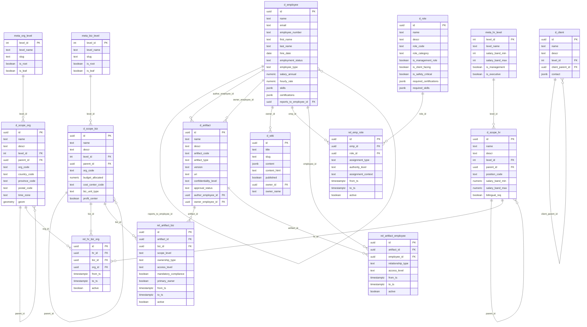

# Huron Home Services Database Schema - Enterprise Data Architecture

A sophisticated **35-table PostgreSQL database** designed for **Canadian enterprise project management** with comprehensive RBAC, temporal data patterns, and real-world business operations.

## 🏗️ Current Database State (2025-09-04)

### 🎯 System Specifications
- **Database Engine**: PostgreSQL 16+ with PostGIS, pgcrypto, uuid-ossp, and pg_trgm extensions
- **Total Tables**: **35 tables** across **6 logical categories**  
- **DDL Organization**: **35 DDL files** in dependency-optimized loading order (00-90)
- **Sample Data**: **Real Canadian business context** - Huron Home Services operations
- **Employee Records**: **20 employees** from CEO to seasonal workers with comprehensive profiles
- **Geographic Coverage**: Complete Canadian administrative structure with GTA focus

### 🚀 Latest Schema Updates (2025-09-04)
- **✅ Organizational Structure Separation**: `location` → `org` (geographic), `business` → `biz` (organizational)
- **✅ Normalized Relationship Tables**: Minimal column structures with proper foreign keys
- **✅ Wiki Knowledge Base**: Comprehensive company documentation authored by James Miller
- **✅ Artifact Management**: Design templates and documents with proper ownership
- **✅ Role-Based Access Control**: Comprehensive role catalog with employee assignments
- **✅ Dependency-Optimized Loading**: Fixed circular dependencies and proper load order

---

## 🏗️ Schema Overview

### 🎯 Core Design Philosophy

The Huron Home Services database represents a **production-ready enterprise project management system** specifically designed for **Canadian home services operations**. Key architectural principles:

- **🏢 Real Business Context**: Huron Home Services (Est. 2020, Mississauga) - landscaping, plumbing, HVAC, electrical, snow removal, solar installation
- **🔐 Multi-Dimensional RBAC**: Separate business organizational and geographic hierarchies with role-based permissions
- **⏰ Temporal Data Architecture**: SCD Type 2 patterns for complete audit trails and operational history
- **🍁 Canadian Compliance Ready**: PIPEDA privacy, Ontario regulations, municipal permits, professional licensing
- **🚀 API Integration**: Seamless integration with API modules and JWT authentication system
- **📊 Normalized Relations**: Clean many-to-many relationships with minimal required columns

### Entity Relationship Diagram - Core Structure



---

## 📊 Complete Table Structure & Naming Conventions

### **Key Naming Changes**
- **`location` → `org`**: Geographic organizational hierarchy (`d_scope_org`)
- **`business` → `biz`**: Business organizational hierarchy (`d_scope_biz`)
- **Normalized Relations**: All relationship tables use minimal required columns
- **Clear Semantics**: Table names clearly indicate their purpose and relationships

### **Category 1: Extensions & Meta Configuration (00-10)**

| File | Table | Purpose | Records |
|------|-------|---------|---------|
| `00___extensions.ddl` | PostgreSQL Extensions | pgcrypto, uuid-ossp, PostGIS | N/A |
| `01___extensions.ddl` | PostgreSQL Extensions | pg_trgm, btree_gin | N/A |
| `02___meta_org_level.ddl` | `meta_org_level` | Business organizational levels (Corporation → Sub-team) | 6 levels |
| `03___meta_biz_level.ddl` | `meta_biz_level` | Business function levels | 6 levels |
| `04___meta_geo_level.ddl` | `meta_org_level` | Geographic levels (Corp-Region → Address) | 8 levels |
| `05___meta_hr_level.ddl` | `meta_hr_level` | HR hierarchy levels | 8 levels |
| `06___meta_client_level.ddl` | `meta_client_level` | Client organization levels | 5 levels |
| `07___meta_project_status.ddl` | `meta_project_status` | Project lifecycle statuses | 16 statuses |
| `08___meta_project_stage.ddl` | `meta_project_stage` | PMBOK project stages | 5 stages |
| `09___meta_task_status.ddl` | `meta_task_status` | Task workflow statuses | 15 statuses |
| `10___meta_task_stage.ddl` | `meta_task_stage` | Kanban task stages | 14 stages |

### **Category 2: Core Dimensions (20-37)**

#### **Organizational Structure**
| File | Table | Purpose | Hierarchy |
|------|-------|---------|-----------|
| `20___d_scope_biz.ddl` | `d_scope_biz` | Business organizational hierarchy | Corporation → Division → Department → Team → Squad → Sub-team |
| `21___d_scope_org.ddl` | `d_scope_org` | Geographic organizational hierarchy | Corp-Region → Country → Province → Economic Region → Metro → City → District → Address |
| `22___d_scope_hr.ddl` | `d_scope_hr` | HR position hierarchy | CEO → C-Level → SVP → VP → AVP → Senior Director → Director → Associate Director |
| `23___d_scope_worksite.ddl` | `d_scope_worksite` | Physical worksite locations | Headquarters, Branch, Project, Storage, Seasonal |

#### **Master Data Entities**
| File | Table | Purpose | Records |
|------|-------|---------|---------|
| `24___d_employee.ddl` | `d_employee` | Employee master data | 20 employees |
| `25___d_role.ddl` | `d_role` | Role definitions | 15 roles |
| `26___d_client.ddl` | `d_client` | Client organizations | Various clients |
| `27___d_artifact.ddl` | `d_artifact` | Knowledge artifacts | Design templates, SOWs, RFPs |

#### **Advanced Scope Tables**
| File | Table | Purpose |
|------|-------|---------|
| `34___d_scope_unified.ddl` | `d_scope_unified` | Unified scope registry for RBAC |
| `35___d_scope_project.ddl` | `d_scope_project` | Project definitions |
| `36___d_scope_task.ddl` | `d_scope_task` | Task definitions |
| `37___d_scope_app.ddl` | `d_scope_app` | Application components and routes |

### **Category 3: Relationship Tables (23, 26, 28-33, 55, 90)**

**Normalized Many-to-Many Relationships with Minimal Columns:**

| File | Table | Relationship | Key Columns |
|------|-------|--------------|-------------|
| `23___rel_hr_biz_org.ddl` | `rel_hr_biz_org` | HR ↔ Business ↔ Geographic | `hr_id`, `biz_id`, `org_id`, `from_ts`, `to_ts`, `active` |
| `26___rel_emp_role.ddl` | `rel_emp_role` | Employee ↔ Role | `emp_id`, `role_id`, `assignment_type`, `authority_level` |
| `28___rel_artifact_project.ddl` | `rel_artifact_project` | Artifact ↔ Project | `artifact_id`, `project_id`, `relationship_type` |
| `29___rel_artifact_biz.ddl` | `rel_artifact_biz` | Artifact ↔ Business Unit | `artifact_id`, `biz_id`, `scope_level`, `ownership_type` |
| `30___rel_artifact_project_stage.ddl` | `rel_artifact_project_stage` | Artifact ↔ Project Stage | `artifact_id`, `project_stage_id`, `stage_context` |
| `31___rel_artifact_employee.ddl` | `rel_artifact_employee` | Artifact ↔ Employee | `artifact_id`, `employee_id`, `relationship_type` |
| `32___rel_artifact_role.ddl` | `rel_artifact_role` | Artifact ↔ Role | `artifact_id`, `role_id`, `access_level` |
| `33___rel_project_client.ddl` | `rel_project_client` | Project ↔ Client | `project_id`, `client_id`, `relationship_type` |
| `55___rel_task_employee.ddl` | `rel_task_employee` | Task ↔ Employee | `task_id`, `employee_id`, `assignment_type` |
| `90___rel_employee_scope_unified.ddl` | `rel_employee_scope_unified` | Employee ↔ Unified Scope | `employee_id`, `scope_id`, `permission_level` |

### **Category 4: Operational Tables (50-54)**

| File | Table | Purpose |
|------|-------|---------|
| `50___ops_formlog_head.ddl` | `ops_formlog_head` | Dynamic form definitions |
| `51___ops_formlog_records.ddl` | `ops_formlog_records` | Form submission records |
| `52___ops_task_records.ddl` | `ops_task_records` | Task activity logs |
| `53___ops_task_head.ddl` | `ops_task_head` | Task master records |
| `54___d_wiki.ddl` | `d_wiki` | Wiki knowledge base |

---

## 🏢 Real-World Business Implementation

### 🎯 Huron Home Services - Complete Business Model
- **📍 Founded**: 2020 in Mississauga, Ontario with operations across GTA
- **🛠️ Services Portfolio**: 
  - **Landscaping**: Residential & commercial design, installation, maintenance
  - **Snow Removal**: Commercial properties, municipal contracts, emergency response  
  - **HVAC Services**: Installation, maintenance, emergency repair
  - **Plumbing Services**: Installation, repair, water system management
  - **Solar Installation**: Residential and commercial solar panel systems
- **👥 Workforce**: **20 employees** across all levels and employment types
- **🏢 Operations**: Multi-divisional structure with seasonal scaling

### 📊 Production Data Examples

#### **Executive Leadership**
- **James Miller** (CEO) - `james.miller@huronhome.ca`
  - Primary Role: CEO with strategic oversight
  - Secondary Roles: Project Manager for strategic initiatives, System Administrator for setup
  - Knowledge Artifacts: Company vision, project management best practices
  - Wiki Content: Strategic documentation and leadership materials

#### **Organizational Structure**
```
Huron Home Services (Corporation)
├── Business Operations Division
│   ├── Landscaping Department
│   │   ├── Residential Landscaping Team
│   │   │   ├── Garden Design Squad
│   │   │   │   ├── Native Plant Specialists
│   │   │   │   └── Water Feature Specialists
│   │   │   └── Installation Squad
│   │   └── Commercial Landscaping Team
│   ├── Snow Removal Department
│   ├── HVAC Services Department
│   └── Plumbing Services Department
└── Corporate Services Division
```

#### **Geographic Coverage**
```
North America Central (Corp-Region)
└── Canada (Country)
    └── Ontario (Province)
        ├── Greater Toronto Area (Economic Region)
        │   ├── Toronto CMA (Metropolitan Area)
        │   │   ├── Mississauga (City) - HQ Location
        │   │   ├── Toronto (City)
        │   │   └── Oakville (City)
        │   └── Hamilton CMA
        └── Hamilton-Niagara Peninsula (Economic Region)
```

#### **Sample Artifacts**
- **DESIGN-LAND-RES-001**: Residential Premium Landscape Design Template
- **DESIGN-LAND-COM-001**: Commercial Plaza Design Standards
- **POLICY-SAFETY-001**: Corporate Safety Policy
- **MANUAL-QA-001**: Quality Assurance Manual

---

## 🔗 Key Design Patterns

### **Multi-Dimensional Hierarchies**
- **Business Organizational**: 6-level structure from Corporation to Sub-team
- **Geographic Organizational**: 8-level structure from Corp-Region to Address
- **HR Hierarchy**: 8-level structure from CEO to Associate Director
- **Self-Referencing**: All hierarchies support unlimited depth via parent_id

### **Normalized Relationship Tables**
All relationship tables follow consistent patterns:
```sql
CREATE TABLE app.rel_[entity1]_[entity2] (
  id uuid PRIMARY KEY DEFAULT gen_random_uuid(),
  [entity1]_id uuid NOT NULL REFERENCES app.d_[entity1](id) ON DELETE CASCADE,
  [entity2]_id uuid NOT NULL REFERENCES app.d_[entity2](id) ON DELETE CASCADE,
  -- Temporal fields
  from_ts timestamptz NOT NULL DEFAULT now(),
  to_ts timestamptz,
  active boolean NOT NULL DEFAULT true,
  created timestamptz NOT NULL DEFAULT now(),
  updated timestamptz NOT NULL DEFAULT now(),
  -- Relationship-specific context fields (minimal)
  [context_field] text
);
```

### **Temporal Data Patterns**
- **SCD Type 2**: All dimension tables support temporal validity with `from_ts`/`to_ts`
- **Audit Trails**: Complete lifecycle tracking with `created`/`updated` timestamps
- **Active Records**: `active` boolean for soft deletes and status management

---

## 🏗️ DDL Loading Order (Dependency-Optimized)

Files must be loaded in strict dependency order to avoid foreign key constraint violations:

### **Phase 1: Foundation (00-10)**
Extensions and meta configuration tables that define system structure

### **Phase 2: Core Dimensions (20-27)**
Master data entities and hierarchical structures:
1. `20___d_scope_biz.ddl` - Business organizational hierarchy
2. `21___d_scope_org.ddl` - Geographic organizational hierarchy  
3. `22___d_scope_hr.ddl` - HR position hierarchy
4. `23___d_scope_worksite.ddl` - Physical worksite locations
5. `24___d_employee.ddl` - Employee master data
6. `25___d_role.ddl` - Role definitions
7. `26___d_client.ddl` - Client organizations
8. `27___d_artifact.ddl` - Knowledge artifacts

### **Phase 3: Artifact Relations (28-33)**
Artifact relationship tables that depend on core dimensions

### **Phase 4: Advanced Scopes (34-37)**
Advanced scope tables for unified permission management

### **Phase 5: Operational Data (50-54)**
Transaction and activity tables

### **Phase 6: Final Relations (55, 90)**
Relationship tables that depend on operational data

---

## 🔐 Security & Access Control

### **Role-Based Access Control**
- **15 Role Definitions**: From CEO to operational roles
- **Normalized Assignments**: `rel_emp_role` table with assignment types and authority levels
- **Temporal Role Tracking**: Track role changes over time with effective dates

### **Knowledge Management Security**
- **Artifact Ownership**: Clear ownership chains through employee references
- **Confidentiality Levels**: Internal, confidential, restricted classifications
- **Access Control**: Business unit and role-based access restrictions

### **Canadian Compliance**
- **PIPEDA Compliance**: Personal information protection patterns
- **Professional Licensing**: Tracking of TSSA, ESA, and trade certifications
- **Municipal Compliance**: Support for regional regulations and permits

---

## 📈 Schema Features

### **Database Optimization**
- **UUID Primary Keys**: Distributed-system friendly identifiers
- **JSONB Storage**: Flexible metadata with query performance
- **PostGIS Integration**: Spatial data support for geographic operations
- **Audit Patterns**: Comprehensive tracking across all entities

### **Business Intelligence Ready**
- **Financial Integration**: Cost centers, budgets, approval hierarchies
- **Operational Metrics**: Project tracking, resource utilization
- **Compliance Reporting**: Certification and regulatory tracking
- **Knowledge Management**: Document workflow and version control

### **Enterprise Scalability**
- **Matrix Organizations**: Complex reporting relationships
- **Seasonal Operations**: Support for temporary staff and equipment
- **Multi-Jurisdictional**: Canadian federal, provincial, municipal compliance
- **API Integration**: Clean data contracts for modern application architectures

---

This database schema represents a production-ready foundation for Canadian home services operations, demonstrating enterprise-level data architecture with comprehensive business context, normalized relationships, and real operational data centered around James Miller as the primary user and CEO of Huron Home Services.