# PMO Database Schema

**Platform**: PostgreSQL 16+ with PostGIS and pgcrypto extensions  
**Schema**: `app`  
**Tables**: 24 tables across 5 categories  
**Authentication**: JWT + bcrypt with email-based login  
**DDL Structure**: Standardized 3-section format (Semantics → DDL → Data Curation)

## 🏗️ Schema Overview

### Entity Relationship Diagram - Foreign Key Relationships

```mermaid
erDiagram
    %% Meta Configuration Tables
    meta_biz_level {
        int level_id PK
        text name
        text descr
        int sort_order
        boolean is_leaf_level
    }
    
    meta_loc_level {
        int level_id PK
        text name
        text descr
        text country_code
        int sort_order
        boolean is_leaf_level
    }
    
    meta_hr_level {
        int level_id PK
        text name
        text descr
        int salary_band_min
        int salary_band_max
        boolean is_management
        boolean is_executive
    }
    
    meta_project_status {
        uuid id PK
        text code
        text name
        text descr
        int sort_id
        boolean is_initial
        boolean is_final
        boolean is_active
    }
    
    meta_project_stage {
        uuid id PK
        int level_id
        text name
        text descr
        int duration_weeks
        boolean is_milestone
    }
    
    meta_task_status {
        uuid id PK
        text code
        text name
        text descr
        int sort_id
        boolean is_initial
        boolean is_final
        boolean is_blocked
    }
    
    meta_task_stage {
        uuid id PK
        text code
        text name
        text descr
        int sort_id
        boolean is_default
        boolean is_done
        boolean is_blocked
        int wip_limit
    }

    %% Core Scope Tables
    d_scope_business {
        uuid id PK
        text name
        text descr
        text code
        text business_type
        text cost_center_code
        numeric budget_allocated
        numeric fte_allocation
        uuid manager_emp_id FK
        text parent_cost_center
        boolean is_profit_center
        boolean is_cost_center
        numeric approval_limit
        text operational_status
        date establishment_date
        int level_id FK
        uuid parent_id FK
    }
    
    d_scope_location {
        uuid id PK
        text name
        text descr
        text addr
        text postal_code
        text country_code
        text province_code
        text time_zone
        text currency_code
        text language_primary
        text language_secondary
        text regulatory_region
        jsonb tax_jurisdiction
        jsonb emergency_contacts
        int level_id FK
        uuid parent_id FK
        geometry geom
    }
    
    d_scope_hr {
        uuid id PK
        text name
        text descr
        text position_code
        text job_family
        text job_level
        numeric salary_band_min
        numeric salary_band_max
        numeric bonus_target_pct
        boolean equity_eligible
        int direct_reports_max
        numeric approval_limit
        boolean bilingual_req
        int level_id FK
        uuid parent_id FK
    }
    
    d_scope_worksite {
        uuid id PK
        text name
        text descr
        text worksite_code
        text worksite_type
        text operational_status
        uuid loc_id FK
        uuid biz_id FK
        text security_level
        jsonb access_hours
        jsonb emergency_contacts
        jsonb safety_protocols
        geometry geom
        text timezone
    }
    
    d_scope_app {
        uuid id PK
        text scope_type
        text scope_path
        text name
        text descr
        boolean is_protected
        text method
        text component_type
        text access_level
        text auth_required
        uuid parent_id FK
    }
    
    d_scope_unified {
        uuid id PK
        text scope_type
        text scope_reference_table_name
        uuid scope_id
        text name
        text descr
        text scope_path
        int scope_level_id
        text tenant_id
        boolean is_system_scope
        jsonb resource_permission
        uuid parent_scope_id FK
    }

    %% Identity and Domain Tables
    d_employee {
        uuid id PK
        text name
        text descr
        text addr
        text email
        text password_hash
        text phone
        text mobile
        jsonb emergency_contact
        text lang
        date birth_date
        text emp_code
        date hire_date
        text status
        text employment_type
        text work_mode
        text security_clearance
        jsonb skills
        jsonb certifications
        jsonb education
        jsonb labels
    }
    
    d_role {
        uuid id PK
        text name
        text descr
        text role_type
        text role_category
        text authority_level
        numeric approval_limit
        boolean delegation_allowed
    }
    
    d_client {
        uuid id PK
        text name
        text descr
        uuid client_parent_id FK
        jsonb contact
        int level_id
        text level_name
    }
    
    d_client_grp {
        uuid id PK
        text name
        text descr
        uuid[] clients
    }

    %% Operational Tables
    ops_project_head {
        uuid id PK
        text name
        text descr
        text slug
        text project_code
        text project_type
        text priority_level
        numeric budget_allocated
        text budget_currency
        date planned_start_date
        date planned_end_date
        numeric estimated_hours
        text security_classification
        jsonb compliance_requirements
        jsonb risk_assessment
        text tenant_id
    }
    
    ops_task_head {
        uuid id PK
        text title
        text descr
        text task_code
        text task_type
        text priority
        text complexity
        numeric estimated_hours
        numeric actual_hours
        date due_date
        date start_date
        date completion_date
        text current_status
        text current_stage
        uuid proj_head_id FK
        uuid parent_task_id FK
        text sub_task_type
        text workflow_state
        text approval_required
        jsonb approval_workflow
        jsonb dependencies
        jsonb acceptance_criteria
        uuid assignee_id FK
        uuid reporter_id FK
        uuid worksite_id FK
        text tenant_id
        boolean is_milestone
        jsonb time_tracking
        jsonb quality_gates
    }
    
    ops_task_records {
        uuid id PK
        uuid head_id FK
        text title
        text descr
        text workflow_state
        text assigned_to_emp_name
        text assigned_to_emp_code
        uuid assigned_to_emp_id
        text priority
        text complexity
        date due_date
        date start_date
        date completion_date
        numeric estimated_hours
        numeric actual_hours
        numeric percent_complete
        text current_status
        text current_stage
        text previous_status
        text previous_stage
        jsonb status_change_reason
        jsonb time_log_entries
        jsonb quality_check_results
        jsonb approval_history
        jsonb collaboration_log
        jsonb external_references
        jsonb deliverables_status
        jsonb risk_updates
        jsonb resource_usage
        uuid log_owner_id FK
        timestamptz log_timestamp
        text log_type
        jsonb log_metadata
        text tenant_id
    }

    %% Relationship Tables
    rel_emp_role {
        uuid id PK
        uuid emp_id FK
        uuid role_id FK
        timestamptz from_ts
        timestamptz to_ts
    }
    
    rel_hr_biz_loc {
        uuid id PK
        uuid hr_id FK
        uuid biz_id FK
        uuid loc_id FK
        text assignment_type
        numeric assignment_pct
        timestamptz effective_from
        timestamptz effective_to
        timestamptz from_ts
        timestamptz to_ts
    }
    
    rel_employee_scope_unified {
        uuid id PK
        uuid emp_id FK
        uuid scope_id FK
        text resource_type
        text resource_id
        jsonb resource_permission
        text name
        text descr
    }

    %% Forms System
    ops_formlog_head {
        uuid id PK
        text name
        text descr
        text form_global_link
        boolean project_specific
        boolean task_specific
        boolean location_specific
        boolean business_specific
        boolean hr_specific
        boolean worksite_specific
        jsonb schema
        text version
    }
    
    ops_formlog_records {
        uuid id PK
        uuid head_id FK
        jsonb form_data
        text submitted_by_name
        text submitted_by_email
        text submitted_by_emp_code
        uuid submitted_by_emp_id
        text submission_context
        text ip_address
        text user_agent
    }

    %% Foreign Key Relationships - Meta to Scope
    meta_biz_level ||--o{ d_scope_business : "level_id"
    meta_loc_level ||--o{ d_scope_location : "level_id"
    meta_hr_level ||--o{ d_scope_hr : "level_id"
    
    %% Self-referencing Hierarchies
    d_scope_business ||--o{ d_scope_business : "parent_id"
    d_scope_location ||--o{ d_scope_location : "parent_id"
    d_scope_hr ||--o{ d_scope_hr : "parent_id"
    d_scope_app ||--o{ d_scope_app : "parent_id"
    d_scope_unified ||--o{ d_scope_unified : "parent_scope_id"
    d_client ||--o{ d_client : "client_parent_id"
    
    %% Cross-scope Relationships
    d_scope_location ||--o{ d_scope_worksite : "loc_id"
    d_scope_business ||--o{ d_scope_worksite : "biz_id"
    
    %% HR-Business-Location Matrix
    d_scope_hr ||--o{ rel_hr_biz_loc : "hr_id"
    d_scope_business ||--o{ rel_hr_biz_loc : "biz_id"  
    d_scope_location ||--o{ rel_hr_biz_loc : "loc_id"
    
    %% Employee-Role Relationships
    d_employee ||--o{ rel_emp_role : "emp_id"
    d_role ||--o{ rel_emp_role : "role_id"
    
    %% Project-Task Hierarchy
    ops_project_head ||--o{ ops_task_head : "proj_head_id"
    ops_task_head ||--o{ ops_task_head : "parent_task_id"
    ops_task_head ||--o{ ops_task_records : "head_id"
    
    %% Task Assignments
    d_employee ||--o{ ops_task_head : "assignee_id"
    d_employee ||--o{ ops_task_head : "reporter_id" 
    d_scope_worksite ||--o{ ops_task_head : "worksite_id"
    d_employee ||--o{ ops_task_records : "log_owner_id"
    
    %% Forms System
    ops_formlog_head ||--o{ ops_formlog_records : "head_id"
    
    %% Unified Permission System
    d_employee ||--o{ rel_employee_scope_unified : "emp_id"
    d_scope_unified ||--o{ rel_employee_scope_unified : "scope_id"
```



### Foreign Key Relationship Summary

The schema contains **22 foreign key relationships** organized into these patterns:

#### 1. **Meta-to-Scope Relationships** (3 FKs)
- `d_scope_business.level_id` → `meta_biz_level.level_id`
- `d_scope_location.level_id` → `meta_loc_level.level_id`
- `d_scope_hr.level_id` → `meta_hr_level.level_id`

#### 2. **Self-Referencing Hierarchies** (6 FKs)
- `d_scope_business.parent_id` → `d_scope_business.id`
- `d_scope_location.parent_id` → `d_scope_location.id`
- `d_scope_hr.parent_id` → `d_scope_hr.id`
- `d_scope_app.parent_id` → `d_scope_app.id`
- `d_scope_unified.parent_scope_id` → `d_scope_unified.id`
- `d_client.client_parent_id` → `d_client.id`

#### 3. **Cross-Scope Integration** (2 FKs)
- `d_scope_worksite.loc_id` → `d_scope_location.id`
- `d_scope_worksite.biz_id` → `d_scope_business.id`

#### 4. **Multi-Dimensional Matrix** (3 FKs)
- `rel_hr_biz_loc.hr_id` → `d_scope_hr.id`
- `rel_hr_biz_loc.biz_id` → `d_scope_business.id`
- `rel_hr_biz_loc.loc_id` → `d_scope_location.id`

#### 5. **Employee-Role System** (2 FKs)
- `rel_emp_role.emp_id` → `d_employee.id`
- `rel_emp_role.role_id` → `d_role.id`

#### 6. **Project-Task Hierarchy** (4 FKs)
- `ops_task_head.proj_head_id` → `ops_project_head.id`
- `ops_task_head.parent_task_id` → `ops_task_head.id`
- `ops_task_head.assignee_id` → `d_employee.id`
- `ops_task_head.reporter_id` → `d_employee.id`

#### 7. **Operational Tracking** (3 FKs)
- `ops_task_head.worksite_id` → `d_scope_worksite.id`
- `ops_task_records.head_id` → `ops_task_head.id`
- `ops_task_records.log_owner_id` → `d_employee.id`

#### 8. **Forms System** (1 FK)
- `ops_formlog_records.head_id` → `ops_formlog_head.id`

#### 9. **Unified Permissions** (2 FKs)
- `rel_employee_scope_unified.emp_id` → `d_employee.id`
- `rel_employee_scope_unified.scope_id` → `d_scope_unified.id`

## 📊 Table Categories

### 1. Meta Configuration (7 tables)
- **meta_biz_level**: Business hierarchy levels (Corporation → Division → Department → Team)
- **meta_loc_level**: Location hierarchy levels (Corp-Region → Country → Province → City)  
- **meta_hr_level**: HR hierarchy levels (C-Level → VP → Director → Manager → Individual)
- **meta_project_status**: Project status workflow (Draft → Active → Completed)
- **meta_project_stage**: Project stages (Initiation → Planning → Execution → Closure)
- **meta_task_status**: Task status workflow (Open → In Progress → Done)
- **meta_task_stage**: Task stages (Backlog → Todo → In Progress → Review → Done)

### 2. Scope Hierarchies (5 tables)
- **d_scope_business**: Organizational structure with budgets and cost centers
- **d_scope_location**: Canadian geographic hierarchy with timezone/currency
- **d_scope_hr**: HR positions with salary bands and reporting structure
- **d_scope_worksite**: Physical facilities linking business and location
- **d_scope_app**: Application components, pages, and API endpoints

### 3. Domain Tables (5 tables)  
- **d_employee**: Employee master with JWT authentication (25 columns)
- **d_role**: Role definitions with authority levels and approval limits
- **d_client**: External client entities with contact information
- **d_client_grp**: Client groups for project stakeholder management
- **d_employee_grp**: Task team assignments with roles and allocation percentages

### 4. Operational Tables (5 tables)
- **ops_project_head**: Project definitions with scope assignments (31 columns)
- **ops_project_records**: Project status tracking and timeline (24 columns)
- **ops_task_head**: Task definitions with assignments and dependencies (31 columns) 
- **ops_task_records**: Task execution tracking with comprehensive logging (40 columns)
- **ops_formlog_head**: Dynamic form system with scope-based access

### 5. Permission Tables (2 tables)
- **rel_emp_role**: Employee role assignments with temporal validity
- **rel_hr_biz_loc**: HR position assignments across business/location dimensions

## 🔗 Key Relationships

### Hierarchical Patterns
- **Business**: `d_scope_business.parent_id → d_scope_business.id`
- **Location**: `d_scope_location.parent_id → d_scope_location.id`  
- **HR**: `d_scope_hr.parent_id → d_scope_hr.id`
- **Tasks**: `ops_task_head.parent_task_id → ops_task_head.id`

### Cross-Dimensional Integration
- **Worksite Context**: Links business and location scopes
- **Project Scoping**: Multi-dimensional scope assignments (business, location, worksite)
- **Task Assignment**: Employee assignments with worksite context

## 📋 Sample Data Structure

### Employee with Role Assignment
```sql
-- Employee
d_employee: {id: uuid, name: "John Smith", email: "john@techcorp.ca", emp_code: "EMP001"}

-- Role Assignment  
rel_emp_role: {emp_id: uuid, role_id: uuid, from_ts: "2024-01-01", active: true}
```

### Project with Tasks
```sql
-- Project
ops_project_head: {
  id: uuid, 
  name: "Platform Modernization",
  project_code: "PM-2024-001",
  business_scope_id: uuid,
  location_scope_id: uuid
}

-- Task
ops_task_head: {
  id: uuid,
  proj_head_id: uuid,
  title: "Database Migration", 
  assignee_id: uuid,
  worksite_id: uuid
}
```

### Hierarchical Scope Example
```sql
-- Business Hierarchy
d_scope_business: {
  level_1: "TechCorp Inc.",
  level_2: "Engineering Division", 
  level_3: "Platform Team"
}

-- Location Hierarchy  
d_scope_location: {
  level_2: "Canada",
  level_3: "Ontario", 
  level_5: "Toronto"
}
```

## 🔐 Security & Authentication

- **Employee Authentication**: JWT tokens with bcrypt password hashing
- **Role-Based Access**: Employee-role assignments with temporal validity
- **Multi-Dimensional Permissions**: Business, location, HR, and worksite scope assignments
- **Canadian Compliance**: Support for federal/provincial/municipal structures

## 🚀 Key Design Features

- **Temporal Data**: Head/Records pattern for audit trails
- **Hierarchical Scopes**: Self-referencing trees for organizational structures
- **Multi-Dimensional Access**: Cross-scope permission inheritance
- **Canadian Context**: Timezone, currency, language, and regulatory support
- **Flexible Task Management**: Recursive task breakdown with team assignments
- **Comprehensive Logging**: Detailed activity tracking in task records

## 📈 Performance Considerations

- **Primary Keys**: UUID-based with gen_random_uuid()
- **Simplified Schema**: Foreign key constraints and indexes removed for import simplicity
- **Standard Fields**: Consistent audit fields (created, updated, active, from_ts, to_ts)
- **Clean DDL**: No constraints or indexes in base schema files

## 🛠️ DDL File Structure

Each DDL file follows a standardized 3-section format:

### File Format Standard
```
-- ============================================================================
-- SEMANTICS:
-- ============================================================================
-- Brief description of purpose and key features

-- ============================================================================
-- DDL:
-- ============================================================================
-- Table definitions with standard fields

-- ============================================================================
-- DATA CURATION:
-- ============================================================================
-- Sample data for testing and development
```

### Loading Order (Dependency-Optimized)
Files are loaded in strict dependency order:

1. **00_extensions.ddl** - PostgreSQL extensions and schema setup
2. **01_meta.ddl** - Meta configuration tables (business, location, HR levels, project/task status/stages)
3. **02_location.ddl** - Geographic hierarchy (depends on meta_loc_level)
4. **03_business.ddl** - Organizational structure (depends on meta_biz_level)
5. **04_worksite.ddl** - Physical facilities (depends on location, business)
6. **05_employee.ddl** - Employee identity and authentication
7. **06_role.ddl** - Role definitions (depends on employee)
8. **07_client.ddl** - Client management (self-referencing hierarchy)
9. **08_hr.ddl** - HR hierarchy and matrix assignments (depends on meta_hr_level, business, location)
10. **09_project_task.ddl** - Project and task operational tables (depends on employee, worksite)
11. **10_forms.ddl** - Dynamic forms system
12. **11_app_tables.ddl** - Application component scopes (self-referencing)
13. **12_unified_scope.ddl** - Central permission registry (self-referencing)
14. **13_permission_tables.ddl** - RBAC relationship tables (depends on employee, unified_scope)

### Recent Updates
- **Simplified Semantics**: Concise descriptions replacing verbose documentation
- **Standardized Headers**: Consistent section formatting across all files
- **Table Renaming**: `d_emp` → `d_employee` for clarity
- **Constraint Removal**: Clean DDL without constraints or indexes
- **Data Curation Cleanup**: Consistent formatting for sample data

**Total Schema**: 24 tables, clean structure, comprehensive Canadian PMO functionality.


## Schema Category Map (for API/React Middleware)

The JSON below defines column categories that middleware can use to automate API contracts and UI behavior. Consumers should apply each category to a table only for columns that actually exist in that table (i.e., treat lists as apply-if-present). Pattern entries like `*_id` match any column ending with `_id`.

```json
{
  "$defaults": {
    "api:restrict": ["from_ts", "to_ts", "active", "created", "updated"],
    "flexible": ["tags", "attr"],
    "ui:invisible": ["id", "*_id"],
    "api:pii_masking": ["addr", "birth_date", "ssn", "sin"],
    "ui:search": ["name", "descr"],
    "ui:sort": ["name"]
  },
  "tables": {
    "app.meta_biz_level": {},
    "app.meta_loc_level": {},
    "app.meta_hr_level": {},
    "app.meta_project_status": { "ui:search": ["code", "name", "descr"], "ui:sort": ["code", "name"] },
    "app.meta_project_stage": {},
    "app.meta_task_status": { "ui:search": ["code", "name", "descr"], "ui:sort": ["code", "name"] },
    "app.meta_task_stage": { "ui:search": ["code", "name", "descr"], "ui:sort": ["code", "name"] },

    "app.d_scope_location": { "api:pii_masking": ["addr"], "ui:search": ["name", "descr"] },
    "app.d_scope_worksite": { "ui:search": ["name", "descr"] },
    "app.d_scope_business": { "ui:search": ["name", "descr"] },
    "app.d_scope_hr": { "ui:search": ["name", "descr"] },

    "app.rel_hr_biz_loc": { "ui:search": ["assignment_type"] },

    "app.d_employee": {
      "api:pii_masking": ["addr", "birth_date"],
      "ui:search": ["name", "descr"]
    },
    "app.d_role": { "ui:search": ["name", "descr"] },
    "app.rel_emp_role": {},

    "app.d_client": { "api:pii_masking": ["contact"], "ui:search": ["name"] },
    "app.d_client_grp": { "ui:search": ["name"] },

    "app.ops_project_head": { "ui:search": ["name", "descr"] },
    "app.ops_project_records": { "ui:search": ["phase_name"] },
    "app.ops_task_head": { "ui:search": ["title", "descr"] },
    "app.ops_task_records": { "ui:search": ["title", "workflow_state"] },
    "app.d_employee_grp": { "ui:search": ["role_in_task"] }
  }
}
```

Notes
- api:restrict: Hide or protect in write paths; expose via audit endpoints.
- flexible: Treat as opaque JSON for storage; render as key-value in UI.
- ui:invisible: Hide by default; use for joins and references.
- api:pii_masking: Mask values unless requester owns the record or has clearance.
- ui:search/ui:sort: Default fields for list views and global search.
