# PMO Database Schema

**Platform**: PostgreSQL 16+ with PostGIS and pgcrypto extensions  
**Schema**: `app`  
**Tables**: 24 tables across 5 categories  
**Authentication**: JWT + bcrypt with email-based login

## 🏗️ Schema Overview

### Entity Relationship Diagram

```mermaid
erDiagram
    %% Meta Configuration
    meta_biz_level ||--o{ d_scope_business : "defines levels"
    meta_loc_level ||--o{ d_scope_location : "defines levels"
    meta_hr_level ||--o{ d_scope_hr : "defines levels"
    meta_project_status ||--o{ ops_project_records : "current status"
    meta_project_stage ||--o{ ops_project_records : "current stage"
    meta_task_status ||--o{ ops_task_records : "task status"
    meta_task_stage ||--o{ ops_task_records : "task stage"
    
    %% Core Identity & Hierarchy
    d_emp ||--o{ rel_emp_role : "has roles"
    d_role ||--o{ rel_emp_role : "role assignments"
    d_emp ||--o{ d_emp_grp : "task assignments"
    
    %% Scope Hierarchies (Self-referencing)
    d_scope_business ||--o{ d_scope_business : "parent-child"
    d_scope_location ||--o{ d_scope_location : "parent-child" 
    d_scope_hr ||--o{ d_scope_hr : "parent-child"
    d_scope_app ||--o{ d_scope_app : "parent-child"
    
    %% Cross-scope Relationships
    d_scope_worksite }o--|| d_scope_location : "located at"
    d_scope_worksite }o--|| d_scope_business : "operated by"
    rel_hr_biz_loc }o--|| d_scope_hr : "hr position"
    rel_hr_biz_loc }o--|| d_scope_business : "business unit"
    rel_hr_biz_loc }o--|| d_scope_location : "location"
    
    %% Project & Task System
    ops_project_head ||--o{ ops_project_records : "status tracking"
    ops_project_head ||--o{ ops_task_head : "contains tasks"
    ops_task_head ||--o{ ops_task_records : "task tracking"
    ops_task_head ||--o{ ops_task_head : "subtasks"
    ops_task_head ||--o{ d_emp_grp : "team members"
    
    %% Client Management
    d_client ||--o{ d_client_grp : "grouped clients"
    d_client_grp ||--o{ ops_task_head : "client tasks"
    
    %% Forms System
    ops_formlog_head }o--|| d_scope_business : "business scope"
    ops_formlog_head }o--|| d_scope_location : "location scope"
    ops_formlog_head }o--|| d_scope_hr : "hr scope"
    ops_formlog_head }o--|| d_scope_worksite : "worksite scope"
```



## 📊 Table Categories

### 1. Meta Configuration (7 tables)
- **meta_biz_level**: Business hierarchy levels (Corporation → Division → Department → Team)
- **meta_loc_level**: Location hierarchy levels (Corp-Region → Country → Province → City)  
- **meta_hr_level**: HR hierarchy levels (C-Level → VP → Director → Manager → Individual)
- **meta_project_status**: Project status workflow (Draft → Active → Completed)
- **meta_project_stage**: Project stages (Initiation → Planning → Execution → Closure)
- **meta_task_status**: Task status workflow (Open → In Progress → Done)
- **meta_task_stage**: Task stages (Backlog → Todo → In Progress → Review → Done)

### 2. Scope Hierarchies (5 tables)
- **d_scope_business**: Organizational structure with budgets and cost centers
- **d_scope_location**: Canadian geographic hierarchy with timezone/currency
- **d_scope_hr**: HR positions with salary bands and reporting structure
- **d_scope_worksite**: Physical facilities linking business and location
- **d_scope_app**: Application components, pages, and API endpoints

### 3. Domain Tables (5 tables)  
- **d_emp**: Employee master with JWT authentication (25 columns)
- **d_role**: Role definitions with authority levels and approval limits
- **d_client**: External client entities with contact information
- **d_client_grp**: Client groups for project stakeholder management
- **d_emp_grp**: Task team assignments with roles and allocation percentages

### 4. Operational Tables (5 tables)
- **ops_project_head**: Project definitions with scope assignments (31 columns)
- **ops_project_records**: Project status tracking and timeline (24 columns)
- **ops_task_head**: Task definitions with assignments and dependencies (31 columns) 
- **ops_task_records**: Task execution tracking with comprehensive logging (40 columns)
- **ops_formlog_head**: Dynamic form system with scope-based access

### 5. Permission Tables (2 tables)
- **rel_emp_role**: Employee role assignments with temporal validity
- **rel_hr_biz_loc**: HR position assignments across business/location dimensions

## 🔗 Key Relationships

### Hierarchical Patterns
- **Business**: `d_scope_business.parent_id → d_scope_business.id`
- **Location**: `d_scope_location.parent_id → d_scope_location.id`  
- **HR**: `d_scope_hr.parent_id → d_scope_hr.id`
- **Tasks**: `ops_task_head.parent_task_id → ops_task_head.id`

### Cross-Dimensional Integration
- **Worksite Context**: Links business and location scopes
- **Project Scoping**: Multi-dimensional scope assignments (business, location, worksite)
- **Task Assignment**: Employee assignments with worksite context

## 📋 Sample Data Structure

### Employee with Role Assignment
```sql
-- Employee
d_emp: {id: uuid, name: "John Smith", email: "john@techcorp.ca", emp_code: "EMP001"}

-- Role Assignment  
rel_emp_role: {emp_id: uuid, role_id: uuid, from_ts: "2024-01-01", active: true}
```

### Project with Tasks
```sql
-- Project
ops_project_head: {
  id: uuid, 
  name: "Platform Modernization",
  project_code: "PM-2024-001",
  business_scope_id: uuid,
  location_scope_id: uuid
}

-- Task
ops_task_head: {
  id: uuid,
  proj_head_id: uuid,
  title: "Database Migration", 
  assignee_id: uuid,
  worksite_id: uuid
}
```

### Hierarchical Scope Example
```sql
-- Business Hierarchy
d_scope_business: {
  level_1: "TechCorp Inc.",
  level_2: "Engineering Division", 
  level_3: "Platform Team"
}

-- Location Hierarchy  
d_scope_location: {
  level_2: "Canada",
  level_3: "Ontario", 
  level_5: "Toronto"
}
```

## 🔐 Security & Authentication

- **Employee Authentication**: JWT tokens with bcrypt password hashing
- **Role-Based Access**: Employee-role assignments with temporal validity
- **Multi-Dimensional Permissions**: Business, location, HR, and worksite scope assignments
- **Canadian Compliance**: Support for federal/provincial/municipal structures

## 🚀 Key Design Features

- **Temporal Data**: Head/Records pattern for audit trails
- **Hierarchical Scopes**: Self-referencing trees for organizational structures
- **Multi-Dimensional Access**: Cross-scope permission inheritance
- **Canadian Context**: Timezone, currency, language, and regulatory support
- **Flexible Task Management**: Recursive task breakdown with team assignments
- **Comprehensive Logging**: Detailed activity tracking in task records

## 📈 Performance Considerations

- **Primary Keys**: UUID-based with gen_random_uuid()
- **Foreign Key Constraints**: Referential integrity maintained
- **Indexes**: Basic indexes on foreign keys and commonly queried columns
- **Constraints**: Simplified CHECK constraints for enum values only

## 🛠️ DDL File Structure

Files are loaded in dependency order:
1. `00_extensions.ddl` - PostgreSQL extensions and schema
2. `01_meta.ddl` - Meta configuration tables  
3. `02-05_*.ddl` - Scope hierarchy tables
4. `06-08_*.ddl` - Identity and domain tables
5. `09_project_task.ddl` - Operational tables
6. `11-12_*.ddl` - Forms and app tables
7. `13-14_*.ddl` - Permission tables

**Total Schema**: 24 tables, 36 foreign key relationships, temporal data support, comprehensive Canadian PMO functionality.