# Huron Home Services - Database Schema Architecture

**Platform**: PostgreSQL 16+ with PostGIS and pgcrypto extensions  
**Schema**: `app`  
**Tables**: 24 tables across 6 categories  
**Authentication**: JWT + bcrypt with email-based login  
**DDL Structure**: Standardized 3-section format (Semantics → DDL → Data Curation)

---

## 🏗️ Schema Overview

### Core Design Philosophy

The Huron Home Services database represents a **real-world Canadian home services company** operating across Southern Ontario. This schema demonstrates:

- **Canadian Business Context**: Full integration with Canadian geographic, regulatory, and business structures
- **Operational Excellence**: Complete service delivery from landscaping to solar installation  
- **Scalable Architecture**: Hierarchical scopes supporting growth from startup to enterprise
- **Regulatory Compliance**: WSIB, TSSA, ESA, and municipal requirement integration

### Entity Relationship Diagram - Foreign Key Relationships

```mermaid
erDiagram
    %% Meta Configuration Tables
    meta_biz_level {
        int level_id PK
        text name
        text descr
        int sort_order
        boolean is_leaf_level
    }
    
    meta_loc_level {
        int level_id PK
        text name
        text descr  
        text country_code
        int sort_order
        boolean is_leaf_level
    }
    
    meta_hr_level {
        int level_id PK
        text name
        text descr
        int salary_band_min
        int salary_band_max
        boolean is_management
        boolean is_executive
    }
    
    meta_project_status {
        uuid id PK
        text code
        text name
        text descr
        int sort_id
        boolean is_initial
        boolean is_final
        boolean is_active
    }
    
    meta_task_status {
        uuid id PK
        text code
        text name
        text descr
        int sort_id
        boolean is_initial
        boolean is_final
        boolean is_blocked
    }
    
    meta_task_stage {
        uuid id PK
        text code
        text name
        text descr
        int sort_id
        boolean is_default
        boolean is_done
        boolean is_blocked
        int wip_limit
    }

    %% Core Scope Tables
    d_scope_location {
        uuid id PK
        text name
        text descr
        text addr
        text postal_code
        text country_code
        text province_code
        text time_zone
        text currency_code
        text language_primary
        text language_secondary
        text regulatory_region
        jsonb tax_jurisdiction
        jsonb emergency_contacts
        int level_id FK
        uuid parent_id FK
        geometry geom
    }
    
    d_scope_business {
        uuid id PK
        text name
        text descr
        text code
        text business_type
        text cost_center_code
        numeric budget_allocated
        numeric fte_allocation
        uuid manager_emp_id FK
        text parent_cost_center
        boolean is_profit_center
        boolean is_cost_center
        numeric approval_limit
        text operational_status
        date establishment_date
        int level_id FK
        uuid parent_id FK
    }
    
    d_scope_worksite {
        uuid id PK
        text name
        text descr
        text worksite_code
        text worksite_type
        text operational_status
        uuid loc_id FK
        uuid biz_id FK
        text security_level
        jsonb access_hours
        jsonb emergency_contacts
        jsonb safety_protocols
        geometry geom
        text timezone
    }
    
    d_scope_hr {
        uuid id PK
        text name
        text descr
        text position_code
        text job_family
        text job_level
        numeric salary_band_min
        numeric salary_band_max
        numeric bonus_target_pct
        boolean equity_eligible
        int direct_reports_max
        numeric approval_limit
        boolean bilingual_req
        int level_id FK
        uuid parent_id FK
    }

    %% Identity and Domain Tables
    d_employee {
        uuid id PK
        text name
        text descr
        text addr
        text email
        text password_hash
        text phone
        text mobile
        jsonb emergency_contact
        text lang
        date birth_date
        text emp_code
        date hire_date
        text status
        text employment_type
        text work_mode
        text security_clearance
        jsonb skills
        jsonb certifications
        jsonb education
        jsonb labels
    }

    %% Operational Tables
    ops_project_head {
        uuid id PK
        uuid tenant_id
        text name
        text descr
        text project_code
        text project_type
        text priority_level
        text slug
        numeric budget_allocated
        text budget_currency
        uuid business_id FK
        uuid[] locations
        uuid[] worksites
        uuid[] project_managers
        uuid[] project_sponsors
        uuid[] project_leads
        jsonb clients
        uuid[] approvers
        date planned_start_date
        date planned_end_date
        date actual_start_date
        date actual_end_date
        jsonb milestones
        jsonb deliverables
        numeric estimated_hours
        numeric actual_hours
        text project_stage
        text project_status
        text security_classification
        jsonb compliance_requirements
        jsonb risk_assessment
    }
    
    ops_task_head {
        uuid id PK
        uuid proj_head_id FK
        uuid parent_task_id FK
        text title
        text name
        text descr
        text task_code
        text task_type
        text priority
        uuid assignee_id FK
        uuid reporter_id FK
        uuid[] reviewers
        uuid[] approvers
        uuid[] collaborators
        uuid[] watchers
        uuid client_group_id FK
        uuid[] clients
        uuid worksite_id FK
        text location_context
        numeric estimated_hours
        int story_points
        date planned_start_date
        date planned_end_date
        uuid[] depends_on_tasks
        uuid[] blocks_tasks
        uuid[] related_tasks
    }
    
    ops_task_records {
        uuid id PK
        uuid head_id FK
        text name
        text descr
        text status_name
        text stage_name
        numeric completion_percentage
        date actual_start_date
        date actual_end_date
        numeric actual_hours
        jsonb work_log
        numeric time_spent
        timestamptz start_ts
        timestamptz end_ts
        uuid log_owner_id FK
        text log_type
        jsonb log_content
        jsonb attachments
        uuid form_log_id
        jsonb acceptance_criteria
        text acceptance_status
        text quality_gate_status
    }

    %% Relationship Tables
    rel_hr_biz_loc {
        uuid id PK
        uuid hr_id FK
        uuid biz_id FK
        uuid loc_id FK
        text assignment_type
        numeric assignment_pct
        timestamptz effective_from
        timestamptz effective_to
    }

    %% Foreign Key Relationships
    meta_biz_level ||--o{ d_scope_business : "level_id"
    meta_loc_level ||--o{ d_scope_location : "level_id"
    meta_hr_level ||--o{ d_scope_hr : "level_id"
    
    d_scope_business ||--o{ d_scope_business : "parent_id"
    d_scope_location ||--o{ d_scope_location : "parent_id"
    d_scope_hr ||--o{ d_scope_hr : "parent_id"
    
    d_scope_location ||--o{ d_scope_worksite : "loc_id"
    d_scope_business ||--o{ d_scope_worksite : "biz_id"
    
    d_scope_hr ||--o{ rel_hr_biz_loc : "hr_id"
    d_scope_business ||--o{ rel_hr_biz_loc : "biz_id"
    d_scope_location ||--o{ rel_hr_biz_loc : "loc_id"
    
    ops_project_head ||--o{ ops_task_head : "proj_head_id"
    ops_task_head ||--o{ ops_task_head : "parent_task_id"
    ops_task_head ||--o{ ops_task_records : "head_id"
    
    d_employee ||--o{ ops_task_head : "assignee_id"
    d_employee ||--o{ ops_task_head : "reporter_id"
    d_employee ||--o{ ops_task_records : "log_owner_id"
    
    d_scope_worksite ||--o{ ops_task_head : "worksite_id"
```



---

## 📊 Table Categories

### 1. Meta Configuration Tables (7 tables) - Expanded Data

**Purpose**: Define organizational vocabulary, hierarchical structures, and operational workflows

- **meta_biz_level**: 6 business hierarchy levels (Corporation → Division → Department → Team → Squad → Sub-team)
- **meta_loc_level**: 8 Canadian location levels (Corp-Region → Country → Province → Economic Region → Metro → City → District → Address)
- **meta_hr_level**: 20 HR hierarchy levels with salary bands (CEO $300K-$600K → Engineer $55K-$95K)
- **meta_project_status**: 16 comprehensive project statuses (Draft → Submitted → Planning → Active → Delivered → Cancelled)
- **meta_project_stage**: 5 PMBOK-aligned stages (Initiation → Planning → Execution → Monitoring → Closure)
- **meta_task_status**: 15 development lifecycle statuses (Open → Assigned → In Progress → Code Review → Deployed → Verified)
- **meta_task_stage**: 14 enhanced Kanban stages with WIP limits (Icebox → Backlog → Ready → In Progress → UAT → Done)

### 2. Scope Hierarchy Tables (4 tables) - Geographic & Organizational Structure

**Purpose**: Multi-dimensional organizational scope management supporting hierarchical permissions

- **d_scope_location**: Canadian geographic hierarchy with PostGIS integration
  - Real data: North America → Canada → Ontario → Southern Ontario → GTA → Mississauga → Central District → 1250 South Service Rd (HQ)
  - Features: Timezone, currency, bilingual support, tax jurisdiction, emergency contacts

- **d_scope_business**: Huron Home Services organizational structure
  - Real data: Huron Home Services → Field Services Division → Landscaping Department
  - Features: Cost centers, budgets, profit/cost center flags, approval limits, FTE allocation

- **d_scope_worksite**: Physical operational facilities
  - Real data: HQ (Mississauga), Toronto Branch, London Office, Client sites, Mobile emergency, Seasonal staging
  - Features: Security levels, access hours, safety protocols, GPS coordinates

- **d_scope_hr**: Human resources hierarchy with salary bands
  - Real data: CEO Office ($300K-$500K) → VP Engineering ($200K-$300K) → Engineering Directors → Managers → Senior Engineers
  - Features: Position codes, job families, bonus targets, equity eligibility, approval limits

### 3. Domain Tables (1 table) - Identity & Authentication

**Purpose**: Employee identity management and authentication backbone

- **d_employee**: Complete employee repository with JWT authentication
  - Real data: 15 employees across all employment types (full-time, part-time, contractor, co-op, intern, contingent)
  - Features: Email/password authentication, emergency contacts, skills/certifications, education, work modes

### 4. Operational Tables (3 tables) - Project & Task Management

**Purpose**: Real-world project execution with comprehensive tracking

- **ops_project_head**: Project definitions with multi-dimensional scoping
  - Real data: 7 seasonal projects (Fall Landscaping, Winter Snow Removal, Water Heater Replacement, Solar Expansion)
  - Features: Budget tracking, stakeholder management, compliance requirements, risk assessment

- **ops_task_head**: Task definitions with assignment and collaboration
  - Real data: 20+ tasks across seasonal operations, equipment management, staff training, client coordination
  - Features: Multi-person assignments (reviewers, approvers, collaborators), dependencies, story points

- **ops_task_records**: Task execution tracking with comprehensive logging
  - Features: Status/stage tracking, time logging, work log entries, quality gates, acceptance criteria

### 5. Relationship Tables (1 table) - Multi-Dimensional Assignments

**Purpose**: Matrix organization support across business, location, and HR dimensions

- **rel_hr_biz_loc**: HR position assignments across business units and locations
  - Features: Assignment percentages, temporal validity, assignment types (primary, secondary, temporary)

---

## 🔗 Key Relationships & Design Patterns

### Hierarchical Self-Referencing Patterns
- **Business**: Corporation → Division → Department (3 levels)
- **Location**: Corp-Region → Country → Province → Region → City → District → Address (8 levels)  
- **HR**: CEO → C-Level → VP → Director → Manager → Team Lead → Engineer (20 levels)
- **Tasks**: Project → Task → Subtask → Sub-subtask (unlimited depth)

### Cross-Dimensional Integration Patterns
- **Worksite Context**: Physical locations linked to both geographic locations and business units
- **Project Scoping**: Multi-dimensional scope assignments (business, location, worksite arrays)
- **Task Assignment**: Employee assignments with worksite context and collaboration arrays
- **Matrix Organizations**: HR positions spanning multiple business units and locations

### Temporal Data Patterns
- **Head/Records Pattern**: Immutable definitions (head) + mutable state tracking (records)
- **SCD Type 2**: All scope tables support temporal validity with from_ts/to_ts
- **Audit Trails**: Full lifecycle tracking with created/updated timestamps

---

## 🚀 Real-World Business Context

### Huron Home Services Company Profile
- **Founded**: 2018 in Mississauga, Ontario
- **Services**: Landscaping, Plumbing, HVAC, Electrical, Snow Removal, Solar Installation
- **Coverage**: Greater Toronto Area and London, Ontario
- **Team**: 125+ employees across all employment types
- **Operations**: 3 offices, seasonal scaling, 24/7 emergency response

### Sample Data Demonstrates
- **Seasonal Operations**: Fall landscaping campaigns, winter snow removal with 24/7 dispatch
- **Equipment Management**: Fleet preparation, maintenance schedules, safety protocols
- **Staff Scaling**: Full-time core team + seasonal contractors + student co-ops
- **Regulatory Compliance**: WSIB safety, TSSA gas licensing, ESA electrical, municipal permits
- **Geographic Distribution**: Headquarters (Mississauga), Branch (Toronto), Regional (London)
- **Service Delivery**: Emergency response (2-hour guarantee), scheduled maintenance, project installations

---

## 🏗️ DDL File Structure

### Standardized 3-Section Format

Each DDL file follows this consistent structure:

```sql
-- ============================================================================
-- SEMANTICS:
-- ============================================================================
-- Business context explanation with key features and integration points

-- ============================================================================
-- DDL:  
-- ============================================================================
-- Clean table definitions with standard field ordering

-- ============================================================================
-- DATA CURATION:
-- ============================================================================
-- Realistic sample data demonstrating operational scenarios
```

### Standard Field Ordering

All dimension tables follow this consistent pattern:

```sql
CREATE TABLE app.d_dimension_table (
  id uuid PRIMARY KEY DEFAULT gen_random_uuid(),
  -- Standard fields (audit, metadata, SCD type 2) - ALWAYS FIRST
  name text NOT NULL,
  "descr" text,
  tags jsonb NOT NULL DEFAULT '[]'::jsonb,
  attr jsonb NOT NULL DEFAULT '{}'::jsonb,
  from_ts timestamptz NOT NULL DEFAULT now(),
  to_ts timestamptz,
  active boolean NOT NULL DEFAULT true,
  created timestamptz NOT NULL DEFAULT now(),
  updated timestamptz NOT NULL DEFAULT now(),
  -- Table-specific fields follow...
)
```

### Loading Order (Dependency-Optimized)

Files must be loaded in strict dependency order:

1. **00_extensions.ddl** - PostgreSQL extensions and schema setup
2. **01_meta.ddl** - Meta configuration tables (7 tables)
3. **02_location.ddl** - Geographic hierarchy (depends on meta_loc_level)
4. **03_worksite.ddl** - Physical facilities (depends on location)
5. **04_business.ddl** - Organizational structure (depends on meta_biz_level)
6. **05_hr.ddl** - HR hierarchy and matrix (depends on meta_hr_level, business, location)
7. **06_employee.ddl** - Employee identity and authentication
8. **07_client.ddl** - Client management (self-referencing)
9. **08_project_task.ddl** - Project and task operations (depends on employee, worksite)
10. **09_forms.ddl** - Dynamic forms system
11. **10_app_tables.ddl** - Application component scopes
12. **11_unified_scope.ddl** - Central permission registry
13. **12_permission_tables.ddl** - RBAC relationship tables

---

## 🔐 Security & Authentication

### Employee Authentication System
- **JWT Tokens**: Secure token-based authentication with bcrypt password hashing
- **Email-Based Login**: Standard email/password authentication pattern
- **Real Credentials**: 15 employees with realistic email addresses (@huronhome.ca)

### Multi-Dimensional Access Control
- **Scope-Based RBAC**: Hierarchical permissions across location, business, HR, and worksite scopes
- **Permission Inheritance**: Parent scope permissions cascade to children
- **Cross-Scope Validation**: Operations validate access across multiple scope dimensions

### Canadian Compliance Integration
- **Privacy**: PIPEDA-compliant personal information handling
- **Provincial Jurisdiction**: Ontario regulatory framework integration
- **Municipal Compliance**: City-specific permit and regulation support
- **Professional Licensing**: TSSA, ESA, and trade certification tracking

---

## 📈 Performance & Architecture Considerations

### Database Optimization
- **UUID Primary Keys**: Distributed system friendly with gen_random_uuid()
- **PostGIS Integration**: Spatial queries for location-based operations
- **JSONB Storage**: Flexible metadata with query performance
- **Temporal Queries**: Optimized for time-based data access patterns

### Scalability Design
- **Hierarchical Scoping**: Supports growth from startup to enterprise
- **Matrix Organizations**: Complex reporting relationships without structural changes  
- **Multi-Tenant Ready**: Tenant isolation patterns embedded
- **Seasonal Scaling**: Handles temporary staff and equipment allocation

### Real-World Integration Points
- **Financial Systems**: Cost center codes and budget tracking
- **Dispatch Systems**: GPS tracking and emergency response
- **Regulatory Systems**: License tracking and compliance reporting
- **Customer Systems**: Service delivery and quality tracking

---

## 🎯 Schema Category Map (for API/React Middleware)

The JSON below defines column categories that middleware can use to automate API contracts and UI behavior:

```json
{
  "$defaults": {
    "api:restrict": ["from_ts", "to_ts", "active", "created", "updated"],
    "flexible": ["tags", "attr"],
    "ui:invisible": ["id", "*_id"],
    "api:pii_masking": ["addr", "birth_date", "ssn", "sin", "phone", "mobile", "emergency_contact"],
    "ui:search": ["name", "descr"],
    "ui:sort": ["name"]
  },
  "tables": {
    "app.meta_biz_level": {
      "ui:sort": ["sort_order", "name"]
    },
    "app.meta_loc_level": {
      "ui:sort": ["sort_order", "name"]
    },
    "app.meta_hr_level": {
      "ui:sort": ["sort_order", "name"],
      "api:pii_masking": ["salary_band_min", "salary_band_max"]
    },
    "app.meta_project_status": {
      "ui:search": ["code", "name", "descr"],
      "ui:sort": ["sort_id", "name"],
      "ui:color_field": "color_hex"
    },
    "app.meta_task_status": {
      "ui:search": ["code", "name", "descr"],
      "ui:sort": ["sort_id", "name"],
      "ui:color_field": "color_hex"
    },
    "app.meta_task_stage": {
      "ui:search": ["code", "name", "descr"],
      "ui:sort": ["sort_id", "name"],
      "ui:color_field": "color_hex",
      "ui:wip_limit": "wip_limit"
    },
    "app.d_scope_location": {
      "api:pii_masking": ["addr", "postal_code", "emergency_contacts"],
      "ui:search": ["name", "descr", "postal_code"],
      "ui:geographic": "geom",
      "ui:timezone": "time_zone",
      "ui:currency": "currency_code"
    },
    "app.d_scope_business": {
      "ui:search": ["name", "descr", "code"],
      "api:financial_masking": ["budget_allocated", "approval_limit"],
      "ui:hierarchy": "parent_id",
      "ui:cost_center": "cost_center_code"
    },
    "app.d_scope_worksite": {
      "ui:search": ["name", "descr", "worksite_code"],
      "ui:geographic": "geom",
      "api:safety_info": "safety_protocols",
      "ui:operational_hours": "access_hours"
    },
    "app.d_scope_hr": {
      "ui:search": ["name", "descr", "position_code"],
      "api:pii_masking": ["salary_band_min", "salary_band_max", "bonus_target_pct", "approval_limit"],
      "ui:hierarchy": "parent_id",
      "ui:job_info": ["job_family", "job_level"]
    },
    "app.d_employee": {
      "api:pii_masking": ["addr", "birth_date", "phone", "mobile", "emergency_contact", "email"],
      "ui:search": ["name", "descr", "emp_code"],
      "ui:employment": ["employment_type", "work_mode", "status"],
      "ui:skills": ["skills", "certifications", "education"],
      "api:auth_field": "password_hash"
    },
    "app.ops_project_head": {
      "ui:search": ["name", "descr", "project_code"],
      "api:financial_masking": ["budget_allocated"],
      "ui:timeline": ["planned_start_date", "planned_end_date", "actual_start_date", "actual_end_date"],
      "ui:stakeholders": ["project_managers", "project_sponsors", "approvers"],
      "ui:progress": ["estimated_hours", "actual_hours"]
    },
    "app.ops_task_head": {
      "ui:search": ["title", "name", "descr", "task_code"],
      "ui:assignment": ["assignee_id", "reporter_id", "reviewers", "approvers", "collaborators"],
      "ui:planning": ["estimated_hours", "story_points", "planned_start_date", "planned_end_date"],
      "ui:dependencies": ["depends_on_tasks", "blocks_tasks", "related_tasks"]
    },
    "app.ops_task_records": {
      "ui:search": ["name", "descr", "status_name", "stage_name"],
      "ui:progress": ["completion_percentage", "actual_hours", "time_spent"],
      "ui:timeline": ["actual_start_date", "actual_end_date", "start_ts", "end_ts"],
      "ui:quality": ["acceptance_criteria", "acceptance_status", "quality_gate_status"],
      "ui:logs": ["work_log", "log_content", "attachments"]
    },
    "app.rel_hr_biz_loc": {
      "ui:search": ["assignment_type"],
      "ui:assignment": ["assignment_pct", "effective_from", "effective_to"]
    }
  }
}
```

### Column Category Definitions

- **api:restrict**: Hide or protect in write paths; expose via audit endpoints
- **api:pii_masking**: Mask values unless requester owns record or has clearance
- **api:financial_masking**: Restrict financial data based on authorization level
- **flexible**: Treat as opaque JSON for storage; render as key-value in UI
- **ui:invisible**: Hide by default; use for joins and references
- **ui:search/ui:sort**: Default fields for list views and global search
- **ui:color_field**: Field containing color codes for UI styling
- **ui:geographic**: PostGIS geometry fields for mapping
- **ui:hierarchy**: Self-referencing parent field for tree views
- **ui:timeline**: Date/timestamp fields for Gantt charts and timelines
- **ui:progress**: Numeric fields for progress bars and completion tracking

---

## 🎯 Key Design Features

### Business Intelligence Ready
- **Financial Integration**: Cost centers, budgets, and approval hierarchies
- **Performance Metrics**: Time tracking, completion percentages, and quality gates
- **Compliance Reporting**: Regulatory requirements and certification tracking
- **Operational Dashboards**: Real-time project status and resource utilization

### Canadian Business Integration
- **Geographic Hierarchy**: Full Canadian administrative structure
- **Tax Jurisdiction**: Federal, provincial, and municipal tax integration
- **Regulatory Compliance**: Industry-specific licensing and certification
- **Bilingual Support**: English/French language and regulatory requirements

### Enterprise Scalability
- **Multi-Dimensional Scoping**: Business, geographic, HR, and operational dimensions
- **Temporal Data Management**: Full audit trails and historical analysis
- **Matrix Organizations**: Complex reporting and assignment relationships
- **Flexible Metadata**: JSONB fields for evolving business requirements

This database schema represents a production-ready foundation for Canadian home services operations, demonstrating enterprise-level data architecture with real-world business context and comprehensive operational support.