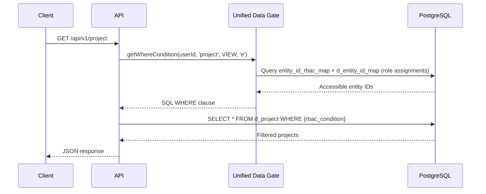
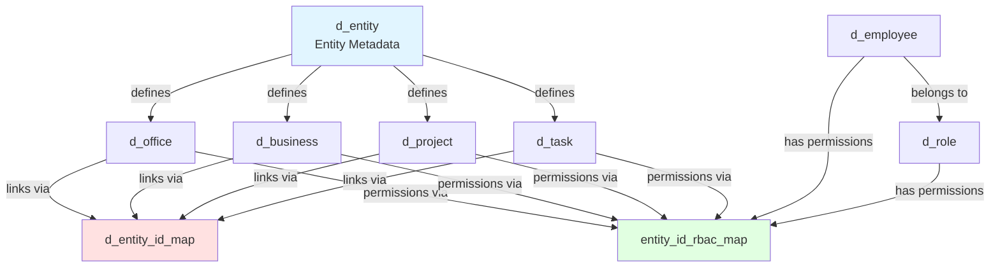
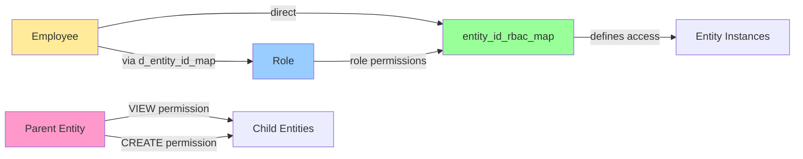

# Entity Endpoint Design - Reusable Patterns & Architecture

> **Central documentation for universal patterns used across ALL entity routes**
>
> Individual route files reference this document and contain only entity-specific details.

---

## Required Imports for Entity Routes

Every entity route file should import these universal libraries and services. Here's what each does and why you need them:

### **Core Libraries** (from `/lib/`)

```typescript
// 1. Universal Schema Metadata - Database schema introspection
import {
  getUniversalColumnMetadata,    // Get column definitions from database
  filterUniversalColumns,         // Filter columns by criteria
  createPaginatedResponse,        // Standard pagination response format
  getColumnsByMetadata           // Get columns from entity metadata
} from '../../lib/universal-schema-metadata.js';
```
**Role**: Auto-detects database columns, provides metadata for dynamic rendering
**Use When**: Building dynamic UIs, validating fields, generating schemas
**Why**: Avoids hardcoding column definitions; schema changes auto-propagate

```typescript
// 2. Universal Auto-Filter Builder - Zero-config query filtering
import { buildAutoFilters } from '../../lib/universal-filter-builder.js';
```
**Role**: Auto-builds SQL WHERE conditions from query params based on field naming
**Use When**: Every LIST endpoint that accepts query parameters
**Why**: Eliminates 20+ lines of manual filter mapping; convention-based, type-safe
**Example**: `?name=Kitchen&dl__project_stage=planning&active=true` → SQL conditions

```typescript
// 3. Unified Data Gate - Centralized RBAC & filtering
import { unified_data_gate, Permission, ALL_ENTITIES_ID } from '../../lib/unified-data-gate.js';
```
**Role**: Person-based RBAC permission checking and SQL WHERE clause generation
**Use When**: Every endpoint that needs permission checking (all of them!)
**Why**: Single source of truth for RBAC; handles role inheritance, parent permissions
**Example**: `getWhereCondition(userId, 'project', Permission.VIEW, 'e')` → RBAC SQL

---

### **Factory Functions** (Route Generators)

```typescript
// 4. Entity Delete Route Factory - Auto-generate DELETE endpoint
import { createEntityDeleteEndpoint } from '../../lib/entity-delete-route-factory.js';
```
**Role**: Generates `DELETE /api/v1/{entity}/:id` with cascading cleanup
**Use When**: Adding delete capability to entity (almost always)
**Why**: Handles soft delete + cascade (registry, linkages) automatically; 100% consistent
**Example**: `createEntityDeleteEndpoint(fastify, 'project')` → Done!

```typescript
// 5. Child Entity Route Factory - Auto-generate child list endpoints
import { createChildEntityEndpointsFromMetadata } from '../../lib/child-entity-route-factory.js';
```
**Role**: Generates `GET /api/v1/{parent}/:id/{child}` for all child entities
**Use When**: Entity has children defined in `d_entity` metadata
**Why**: Zero boilerplate; auto-handles RBAC, JOIN, pagination, search
**Example**: `createChildEntityEndpointsFromMetadata(fastify, 'project')` → All child routes created

---

### **Services** (Business Logic)

```typescript
// 6. Linkage Service - Parent-child relationship management
import { createLinkage } from '../../services/linkage.service.js';
```
**Role**: Idempotently creates parent-child relationships in `d_entity_id_map`
**Use When**: Creating entities with parent context (e.g., task in project)
**Why**: Ensures referential integrity without foreign keys; handles duplicates safely
**Example**: Link task to project when creating task from project detail page

---

### **Standard Import Block Template**

Copy this for any new entity route:

```typescript
import type { FastifyInstance } from 'fastify';
import { Type } from '@sinclair/typebox';
import { db } from '@/db/index.js';
import { sql } from 'drizzle-orm';

// Universal libraries
import {
  getUniversalColumnMetadata,
  filterUniversalColumns,
  createPaginatedResponse,
  getColumnsByMetadata
} from '../../lib/universal-schema-metadata.js';
import { buildAutoFilters } from '../../lib/universal-filter-builder.js';
import { unified_data_gate, Permission, ALL_ENTITIES_ID } from '../../lib/unified-data-gate.js';

// Factory functions
import { createEntityDeleteEndpoint } from '../../lib/entity-delete-route-factory.js';
import { createChildEntityEndpointsFromMetadata } from '../../lib/child-entity-route-factory.js';

// Services
import { createLinkage } from '../../services/linkage.service.js';
```

---

## Table of Contents

1. [Required Imports](#required-imports-for-entity-routes) ⭐ **Start Here**
2. [Quick Reference](#quick-reference)
3. [Design Patterns](#design-patterns)
4. [Centralized Services](#centralized-services)
5. [Standard Entity Field Patterns](#standard-entity-field-patterns)
6. [System Architecture](#system-architecture)
7. [Permission Flow](#permission-flow)
8. [Implementation Guide](#implementation-guide)
9. [Entity Matrix](#entity-matrix)
10. [Summary Checklist](#summary-checklist)

---

## Quick Reference

All entity routes (office, business, project, task, etc.) follow these **5 universal patterns**:

1. **UNIFIED DATA GATE** - Centralized RBAC + parent-child filtering
2. **CREATE-LINK-EDIT** - Simplified parent-child relationships
3. **FACTORY PATTERN** - Auto-generated child entity endpoints
4. **MODULE CONSTANTS** - DRY principle (ENTITY_TYPE, TABLE_ALIAS)
5. **FILTER AUTOMATION** - Loop-based query filter building

---

## Design Patterns

### Pattern 1: UNIFIED DATA GATE PATTERN

**Purpose**: Centralized security and filtering for all entity endpoints

**Reference Implementation**:
- `apps/api/src/lib/unified-data-gate.ts` - Core RBAC logic
- `apps/api/src/modules/project/routes.ts:1-150` - Usage example

**Components**:

- **RBAC_GATE**: Row-level security with role inheritance
  - Direct employee permissions via `entity_id_rbac_map`
  - Role-based permissions (employee → role → permissions via `d_entity_id_map`)
  - Parent-VIEW inheritance (if parent has VIEW, children gain VIEW)
  - Parent-CREATE inheritance (if parent has CREATE, children gain CREATE)

- **PARENT_CHILD_FILTERING_GATE**: Context-aware data filtering
  - Filters entities by parent relationship via `d_entity_id_map`
  - Enables create-link-edit pattern
  - Supports many-to-many relationships

**Permission Checks**:
- Type-level: `checkPermission(db, userId, entityType, ALL_ENTITIES_ID, Permission.CREATE)`
- Instance-level: `checkPermission(db, userId, entityType, entityId, Permission.EDIT)`
- See: `apps/api/src/modules/project/routes.ts:400-450` for complete examples

---

### Pattern 2: CREATE-LINK-EDIT PATTERN

**Purpose**: Simplified parent-child relationships without nested creation endpoints

**Reference Implementation**:
- `apps/api/src/services/linkage.service.ts` - Idempotent linking service
- `apps/api/src/modules/project/routes.ts:400-500` - CREATE endpoint with linking
- `apps/api/src/modules/task/routes.ts:300-400` - Another example

**Workflow**:
1. Create entity independently in its table
2. Link to parent via `createLinkage()` if `parent_type`/`parent_id` provided
3. Auto-grant OWNER permission (5) to creator via `entity_id_rbac_map`

**Benefits**:
- Entities exist independently (no orphans when parent deleted)
- Many-to-many relationships supported naturally
- Simpler API surface (no custom nested endpoints like `/business/:id/project`)
- Idempotent linking (createLinkage handles duplicates)

**API Usage**:
```bash
# Create project independently
POST /api/v1/project { name: "New Project" }

# Create project linked to business
POST /api/v1/project?parent_type=business&parent_id={uuid} { name: "New Project" }

# View projects in business context
GET /api/v1/business/{id}/project
```

---

### Pattern 3: FACTORY PATTERN (Child Entity & Delete Endpoints)

**Purpose**: Auto-generated endpoints with zero boilerplate

**Reference Implementation**:
- `apps/api/src/lib/child-entity-route-factory.ts` - Child entity factory
- `apps/api/src/lib/entity-delete-route-factory.ts` - Delete factory
- `apps/api/src/modules/project/routes.ts:768` - Usage example

**Factory Functions**:

1. **Child Entity Endpoint Factory**:
   - `createChildEntityEndpoint(fastify, 'project', 'task')` → `GET /api/v1/project/:id/task`
   - Auto-handles: RBAC filtering, parent-child JOIN, pagination, search, sorting

2. **Delete Endpoint Factory**:
   - `createEntityDeleteEndpoint(fastify, 'project')` → `DELETE /api/v1/project/:id`
   - Auto-handles: Soft delete, cascade cleanup (registry + linkages), RBAC checks

**Auto-Generated Endpoints**:
- `GET /api/v1/{parent}/:id/{child}` - List child entities
- `DELETE /api/v1/{entity}/:id` - Soft delete with cascading cleanup

---

### Pattern 4: MODULE-LEVEL CONSTANTS

**Purpose**: DRY principle - define entity details once, use everywhere

**Implementation**:
```typescript
/**
 * Module-level constants (defined at top of routes.ts)
 */
const ENTITY_TYPE = 'project';  // Used in all DB queries, RBAC checks, linkage
const TABLE_ALIAS = 'e';        // Consistent SQL alias throughout file

// Usage examples:
unified_data_gate.rbac_gate.getWhereCondition(userId, ENTITY_TYPE, Permission.VIEW, TABLE_ALIAS)
createLinkage(db, { child_entity_type: ENTITY_TYPE, ... })
sql`SELECT ${sql.raw(TABLE_ALIAS)}.* FROM app.d_${sql.raw(ENTITY_TYPE)} ${sql.raw(TABLE_ALIAS)}`
```

**Benefits**:
- Single point of change
- Prevents typos and inconsistencies
- Makes refactoring easier
- Self-documenting code

---

### Pattern 5: UNIVERSAL AUTO-FILTER SYSTEM

**Purpose**: Zero-config query parameter filtering based on naming conventions

**Reference Implementation**:
- `apps/api/src/lib/universal-filter-builder.ts` - Core auto-filter logic
- `apps/api/src/modules/project/routes.ts:261-271` - Usage example

**How It Works**:
```typescript
import { buildAutoFilters } from '../../lib/universal-filter-builder.js';

// That's it! No manual field mapping needed
const autoFilters = buildAutoFilters(TABLE_ALIAS, request.query);
conditions.push(...autoFilters);
```

**Auto-Detection Rules**:
| Field Pattern | Detected Type | Example Query | Generated SQL |
|---------------|---------------|---------------|---------------|
| `dl__*` | Settings dropdown | `?dl__project_stage=planning` | `WHERE dl__project_stage = 'planning'` |
| `*_id` | UUID reference | `?manager_employee_id=uuid` | `WHERE manager_employee_id::uuid = 'uuid'::uuid` |
| `*_amt` | Currency | `?budget_allocated_amt=50000` | `WHERE budget_allocated_amt = 50000` |
| `*_date`, `*_ts` | Date/timestamp | `?start_date=2025-01-01` | `WHERE start_date = '2025-01-01'` |
| `*_flag` | Boolean | `?active_flag=true` | `WHERE active_flag = true` |
| `*_pct` | Percentage | `?completion_pct=75` | `WHERE completion_pct = 75` |
| `name`, `code`, `descr` | Text | `?name=Kitchen` | `WHERE name = 'Kitchen'` |
| `search` | Multi-field search | `?search=kitchen` | `WHERE (name ILIKE '%kitchen%' OR ...)` |

**Benefits**:
- ✅ **Zero configuration** - Works on ANY column following naming conventions
- ✅ **Type-safe** - Auto-detects and casts UUID, boolean, numeric types
- ✅ **Universal** - Same pattern across ALL entities
- ✅ **Extensible** - Override specific fields when needed
- ✅ **No manual mapping** - Eliminates `filterableFields` boilerplate

---

## Centralized Services

### 1. Universal Filter Builder

**File**: `apps/api/src/lib/universal-filter-builder.ts`

**Purpose**: Zero-config query parameter filtering with auto-type detection

**Key Functions**:
- `buildAutoFilters(tableAlias, queryParams, options?)` - Auto-build all filters from query params
- `buildFilterCondition(tableAlias, columnName, value)` - Build single filter with type-casting
- `buildSearchCondition(tableAlias, searchTerm, fields?)` - Multi-field search builder
- `detectFilterType(columnName)` - Auto-detect filter type from naming convention

**Usage**: See `apps/api/src/modules/project/routes.ts:261-271`

**Supported Patterns**: `dl__*`, `*_id`, `*_amt`, `*_date`, `*_ts`, `*_flag`, `*_pct`, `search`

---

### 2. Unified Data Gate

**File**: `apps/api/src/lib/unified-data-gate.ts`

**Purpose**: Centralized RBAC and filtering

**RBAC Permission Model** (`entity_id_rbac_map`):
```sql
-- Person-based permission system (NOT array-based)
person_entity_name: 'employee' | 'role'  -- Direct or role-based
person_entity_id: UUID                    -- Employee ID or Role ID
entity_name: 'project' | 'task' | ...    -- Target entity type
entity_id: UUID | ALL_ENTITIES_ID         -- Instance or type-level
permission: INTEGER (0-5)                 -- Single hierarchical level
```

**Permission Hierarchy** (automatic inheritance):
```
5 = OWNER   (full control, implies all below)
4 = CREATE  (create new entities, type-level only)
3 = DELETE  (soft delete, implies Share/Edit/View)
2 = SHARE   (share with others, implies Edit/View)
1 = EDIT    (modify entity, implies View)
0 = VIEW    (read-only access)
```

**Permission Resolution**:
- Checks: `permission >= required_level` (e.g., Edit needs `permission >= 1`)
- Sources: UNION of role-based (via `d_entity_id_map`) + direct employee permissions
- Result: MAX(role permissions, employee permissions) - highest level wins

**Key Exports**:
- `Permission` enum: VIEW=0, EDIT=1, SHARE=2, DELETE=3, CREATE=4, OWNER=5
- `ALL_ENTITIES_ID = '11111111-1111-1111-1111-111111111111'` (type-level permissions)
- `unified_data_gate.rbac_gate.checkPermission()` - Boolean permission check
- `unified_data_gate.rbac_gate.getWhereCondition()` - SQL WHERE clause for filtering

**Usage**: See `apps/api/src/modules/project/routes.ts:200-250`

---

### 3. Linkage Service

**File**: `apps/api/src/services/linkage.service.ts`

**Purpose**: Idempotent parent-child relationship management via `d_entity_id_map`

**Key Function**: `createLinkage(db, { parent_entity_type, parent_entity_id, child_entity_type, child_entity_id, relationship_type })`

**Relationship Types**:
- `'contains'` (default) - Standard parent-child containment
- `'owns'` - Ownership relationship (e.g., business → project)
- `'hosts'` - Hosting relationship (e.g., office → business)
- `'assigned_to'` - Assignment (e.g., role → employee)
- Custom types as needed

**Features**:
- ✅ Idempotent (safe to call multiple times)
- ✅ Validates parent and child exist
- ✅ No foreign keys by design (soft deletes preserve children)
- ✅ Supports many-to-many relationships
- ✅ Temporal tracking (from_ts, to_ts, active_flag)

**Usage**: See `apps/api/src/modules/project/routes.ts:450-500`

---

### 4. Delete Factory

**File**: `apps/api/src/lib/entity-delete-route-factory.ts`

**Purpose**: Soft delete with cascading cleanup

**Key Functions**:
- `createEntityDeleteEndpoint(fastify, entityType)` - Auto-generate DELETE endpoint
- `universalEntityDelete(entityType, entityId)` - Programmatic delete utility

**Cascading Cleanup**:
1. Soft-delete from main entity table (`active_flag=false`, `to_ts=NOW()`)
2. Soft-delete from `d_entity_instance_id` (entity registry)
3. Soft-delete from `d_entity_id_map` (linkages as parent and child)

**Usage**: See `apps/api/src/modules/project/routes.ts:768`

---

### 5. Child Entity Factory

**File**: `apps/api/src/lib/child-entity-route-factory.ts`

**Purpose**: Auto-generate child entity list endpoints

**Key Function**: `createChildEntityEndpoint(fastify, parentType, childType)`

**Generated Endpoint**: `GET /api/v1/{parent}/:id/{child}`

**Auto-Handles**: RBAC, parent-child JOIN, pagination, search, sorting

**Usage**: See `apps/api/src/modules/project/routes.ts:770-780`

---

## Standard Entity Field Patterns

All entity tables (`d_*`) follow these conventions from DDL definitions:

### **Core Identity Fields** (required on all entities)
```sql
id              UUID PRIMARY KEY DEFAULT gen_random_uuid()
code            VARCHAR(50) UNIQUE NOT NULL         -- Business identifier
name            VARCHAR(200) NOT NULL                -- Display name
descr           TEXT                                 -- Description
metadata        JSONB DEFAULT '{}'::jsonb            -- Flexible JSON storage
```

### **Temporal & Audit Fields** (standard on all entities)
```sql
active_flag     BOOLEAN DEFAULT true                 -- Soft delete flag
from_ts         TIMESTAMPTZ DEFAULT now()            -- Valid from timestamp
to_ts           TIMESTAMPTZ                          -- Valid to (NULL = current)
created_ts      TIMESTAMPTZ DEFAULT now()            -- Creation timestamp
updated_ts      TIMESTAMPTZ DEFAULT now()            -- Last update timestamp
version         INTEGER DEFAULT 1                    -- Optimistic locking
```

### **Relationship Management** (NO foreign keys by design)
- Parent-child: Linked via `d_entity_id_map` table
- RBAC: Permissions in `entity_id_rbac_map` table
- Rationale: Enables soft deletes, temporal versioning, cross-schema flexibility

### **Entity Type Metadata** (`d_entity` table)
```sql
code            VARCHAR(50)      -- Entity type: 'project', 'task', etc.
name            VARCHAR(100)     -- Display name: 'Project', 'Task'
ui_label        VARCHAR(100)     -- Plural: 'Projects', 'Tasks'
ui_icon         VARCHAR(50)      -- Lucide icon: 'FolderOpen', 'CheckSquare'
child_entities  JSONB            -- Array of child entity metadata
column_metadata JSONB            -- Column definitions for dynamic schema
domain_id       INTEGER          -- Domain categorization
domain_code     VARCHAR(50)      -- Denormalized domain code
domain_name     VARCHAR(100)     -- Denormalized domain name
display_order   INTEGER          -- UI sort order
```

### **Field Naming Conventions** (for auto-filter detection)
```
dl__*           → Settings dropdown (references setting_datalabel_*)
*_id            → UUID reference to entity
*_amt           → Decimal currency amount
*_date          → Date field
*_ts            → Timestamp field
*_flag          → Boolean flag
*_pct           → Percentage (numeric)
*_ids           → UUID array (multiple references)
```

**See**: `db/entity_configuration_settings/02_entity.ddl` and any `db/d_*.ddl` file

---

## System Architecture

### Data Flow Diagram



### Entity Relationship Architecture



### Permission Inheritance Flow



---

## Permission Flow

### Example 1: List Entities with RBAC Filtering

**Request**: `GET /api/v1/${ENTITY_TYPE}`

**Flow**:
1. Extract `userId` from JWT token
2. Call `unified_data_gate.rbac_gate.getWhereCondition(userId, ENTITY_TYPE, Permission.VIEW, TABLE_ALIAS)`
3. RBAC gate resolves accessible entity IDs (checks direct, role-based, and parent-inherited permissions)
4. Returns SQL WHERE clause: `${TABLE_ALIAS}.id = ANY(ARRAY[...accessible_ids])`
5. Execute query: `SELECT ${TABLE_ALIAS}.* FROM app.d_${ENTITY_TYPE} ${TABLE_ALIAS} WHERE ${rbacCondition}`
6. Return filtered entities to client

**SQL Pattern**:
```sql
SELECT ${TABLE_ALIAS}.*
FROM app.d_${ENTITY_TYPE} ${TABLE_ALIAS}
WHERE ${TABLE_ALIAS}.id = ANY(ARRAY['uuid1', 'uuid2', ...])  -- Accessible IDs only
  AND ${TABLE_ALIAS}.active_flag = true
ORDER BY ${TABLE_ALIAS}.created_ts DESC
LIMIT ${limit} OFFSET ${offset};
```

---

### Example 2: Create Entity with Parent Linking

**Request**: `POST /api/v1/${ENTITY_TYPE}?parent_type=${PARENT_TYPE}&parent_id=${parent_id}`

**Flow**:
1. Check type-level CREATE permission:
   ```typescript
   const canCreate = await unified_data_gate.rbac_gate.checkPermission(
     db, userId, ENTITY_TYPE, ALL_ENTITIES_ID, Permission.CREATE
   );
   ```

2. Check parent EDIT permission (required to link child):
   ```typescript
   const canEditParent = await unified_data_gate.rbac_gate.checkPermission(
     db, userId, parent_type, parent_id, Permission.EDIT
   );
   ```

3. Insert entity into main table:
   ```sql
   INSERT INTO app.d_${ENTITY_TYPE} (name, code, descr, ...)
   VALUES (...) RETURNING id;
   ```

4. Link to parent (if parent context provided):
   ```typescript
   await createLinkage(db, {
     parent_entity_type: parent_type,
     parent_entity_id: parent_id,
     child_entity_type: ENTITY_TYPE,
     child_entity_id: newId,
     relationship_type: 'contains'
   });
   ```

5. Auto-grant OWNER permission to creator:
   ```sql
   INSERT INTO app.entity_id_rbac_map (person_entity_name, person_entity_id, entity_name, entity_id, permission)
   VALUES ('employee', ${userId}, ${ENTITY_TYPE}, ${newId}, ${Permission.OWNER});
   ```
   Note: Uses `person_entity_name='employee'` and single `permission` integer (5), NOT array

6. Return `{ id: newId }` to client

---

### Example 3: View Entity Detail with Child Tabs

**Request**: `GET /api/v1/${ENTITY_TYPE}/:id`

**Flow**:
1. Check instance-level VIEW permission:
   ```typescript
   const canView = await unified_data_gate.rbac_gate.checkPermission(
     db, userId, ENTITY_TYPE, entityId, Permission.VIEW
   );
   ```

2. Fetch entity data:
   ```sql
   SELECT * FROM app.d_${ENTITY_TYPE} WHERE id = ${entityId};
   ```

3. Return entity data to client

4. Frontend requests metadata:
   - `GET /api/v1/${ENTITY_TYPE}/:id/dynamic-child-entity-tabs` → Child tab counts
   - `GET /api/v1/${ENTITY_TYPE}/:id/creatable` → Creatable child types (based on permissions)

5. User clicks child entity tab → Frontend calls factory endpoint:
   ```
   GET /api/v1/${ENTITY_TYPE}/:id/${CHILD_TYPE}
   ```
   Factory auto-handles: JOIN with `d_entity_id_map`, RBAC filtering, pagination

---

## Implementation Guide

### Adding a New Entity

**Reference**: Use existing entities as templates

**Database**:
1. Create DDL file: `db/d_{entity}.ddl` (see `db/d_project.ddl` or `db/d_task.ddl`)
2. Register in `d_entity` table with metadata (entity_type, label, icon, child_entities)
3. Run: `./tools/db-import.sh`

**API Module**:
1. Create: `apps/api/src/modules/{entity}/routes.ts`
2. Copy structure from: `apps/api/src/modules/project/routes.ts:1-800`
3. Update module constants: `ENTITY_TYPE`, `TABLE_ALIAS`
4. Implement: LIST, GET, CREATE, PATCH endpoints
5. Add factory calls: `createEntityDeleteEndpoint()`, `createChildEntityEndpoint()`

**Frontend**:
1. Update: `apps/web/src/lib/entityConfig.ts`
2. Add entity config with columns, child entities, and display settings

**Testing**:
```bash
./tools/test-api.sh GET /api/v1/{entity}
./tools/test-api.sh POST /api/v1/{entity} '{"name":"Test","code":"TEST001"}'
```

---

## Entity Matrix

| Entity | Table | Alias | Parent Entities | Child Entities |
|--------|-------|-------|-----------------|----------------|
| **Office** | `d_office` | `o` | None (top-level) | business, employee, worksite |
| **Business** | `d_business` | `e` | office | project, employee, client |
| **Project** | `d_project` | `e` | business, office | task, wiki, artifact, form, expense, revenue |
| **Task** | `d_task` | `t` | project, business, worksite | artifact, wiki, form |
| **Form** | `d_form_head` | `f` | project, task, business | None |
| **Artifact** | `d_artifact` | `a` | project, task, wiki | None |
| **Wiki** | `d_wiki` | `w` | project, task | artifact |
| **Employee** | `d_employee` | `emp` | office, business, role | task (assigned) |
| **Client** | `d_client` | `c` | business | project, interaction |
| **Worksite** | `d_worksite` | `ws` | office, client | task |
| **Role** | `d_role` | `r` | None | employee (via d_entity_id_map) |

---

## Summary Checklist

When creating or updating entity routes, ensure:

**Module Setup**:
- [ ] Module-level constants defined (`ENTITY_TYPE`, `TABLE_ALIAS`)
- [ ] Import `unified_data_gate`, `Permission`, `ALL_ENTITIES_ID` from `../../lib/unified-data-gate.js`
- [ ] Import `createLinkage` from `../../services/linkage.service.js`
- [ ] Import `createEntityDeleteEndpoint` from `../../lib/entity-delete-route-factory.js`
- [ ] Import `createChildEntityEndpoint` from `../../lib/child-entity-route-factory.js`

**CRUD Endpoints**:
- [ ] LIST endpoint uses `rbac_gate.getWhereCondition()` for RBAC filtering
- [ ] GET endpoint checks instance-level `VIEW` permission
- [ ] CREATE endpoint checks type-level `CREATE` permission with `ALL_ENTITIES_ID`
- [ ] CREATE endpoint links to parent if `parent_type`/`parent_id` provided
- [ ] CREATE endpoint auto-grants `OWNER` permission (5) to creator
- [ ] PATCH endpoint checks instance-level `EDIT` permission
- [ ] DELETE endpoint generated via `createEntityDeleteEndpoint(fastify, ENTITY_TYPE)`

**Filtering & Search**:
- [ ] Import `buildAutoFilters` from `../../lib/universal-filter-builder.js`
- [ ] Call `buildAutoFilters(TABLE_ALIAS, request.query)` - auto-detects all filters
- [ ] Optional: Add field overrides for non-standard column mappings (e.g., `active` → `active_flag`)
- [ ] No manual `filterableFields` mapping needed - follows naming conventions

**Factory Endpoints**:
- [ ] Delete factory: `createEntityDeleteEndpoint(fastify, ENTITY_TYPE)`
- [ ] Child entity factories: `createChildEntityEndpoint(fastify, ENTITY_TYPE, 'child_type')`

**Documentation**:
- [ ] Route file header references this design doc: `docs/api/entity_endpoint_design.md`

---

**Version**: 2.3.0 | **Last Updated**: 2025-11-15 | **Maintained By**: PMO Platform Team

**Changelog**:
- v2.3.0: Added "Required Imports" section with role/purpose of each library and service
- v2.2.0: ✅ CRITICAL FIX - Corrected RBAC model (person-based, single integer permission), added standard field patterns, relationship types
- v2.1.0: Added Universal Auto-Filter System (zero-config filtering)
- v2.0.0: Refactored to reference-based documentation, added delete factory
- v1.0.0: Initial comprehensive entity endpoint design documentation

**⚠️ IMPORTANT - DDL-First Architecture**:
All entity structures, RBAC models, and relationships are defined in `/db/*.ddl` files.
This documentation reflects those DDL definitions. When in doubt, consult the DDL source of truth.

---

## Quick Reference Card

**Core Files**:
- `apps/api/src/lib/universal-filter-builder.ts` - ✨ Zero-config filtering
- `apps/api/src/lib/unified-data-gate.ts` - RBAC logic
- `apps/api/src/lib/entity-delete-route-factory.ts` - Delete factory
- `apps/api/src/lib/child-entity-route-factory.ts` - Child entity factory
- `apps/api/src/services/linkage.service.ts` - Parent-child linking
- `apps/api/src/modules/project/routes.ts` - Reference implementation

**Universal Functions**:
- `buildAutoFilters(TABLE_ALIAS, request.query)` - ✨ Auto-detect filters from query params
- `createEntityDeleteEndpoint(fastify, 'entity')` → `DELETE /api/v1/entity/:id`
- `createChildEntityEndpoint(fastify, 'parent', 'child')` → `GET /api/v1/parent/:id/child`

**Permission Constants**:
- `ALL_ENTITIES_ID = '11111111-1111-1111-1111-111111111111'` (type-level permissions)
- `Permission.VIEW = 0, EDIT = 1, SHARE = 2, DELETE = 3, CREATE = 4, OWNER = 5`

**Filter Conventions**:
- `dl__*` = Settings | `*_id` = UUID | `*_amt` = Currency | `*_flag` = Boolean | `*_date/*_ts` = Date
