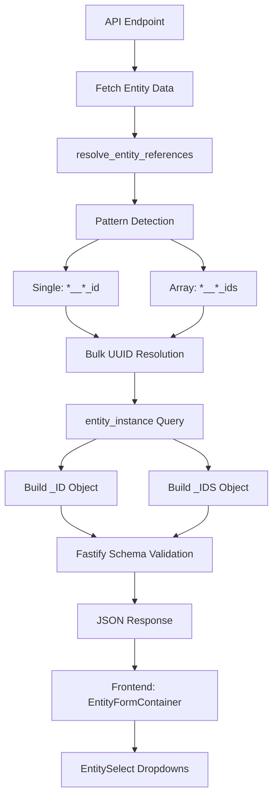

# Entity Resolution Service - Structured Reference Architecture

**Location**: `apps/api/src/services/entity-infrastructure.service.ts:451-622`
**Method**: `resolve_entity_references()`
**Pattern**: Structured `_ID`/`_IDS` Objects
**Version**: 3.1.0 (Production - Structured Reference Architecture)

---

## Semantics & Business Context

Converts UUID entity references to structured metadata objects containing both UUIDs and human-readable labels. Enables frontend forms to display meaningful labels and power dropdown selections without additional API calls.

**Key Principle**: Entity references are returned as separate metadata objects (`_ID`, `_IDS`), not flattened into the entity data, preventing React rendering errors and maintaining clean separation of concerns.

---

## Tooling & Framework Architecture

- **Backend**: Drizzle ORM with parameterized SQL templates (`sql.join()`)
- **Validation**: Fastify TypeBox schemas with `EntityReferenceSchema`
- **Frontend**: React Query (`QueryClientProvider`) + specialized field detection
- **Database**: `entity_instance` table (auto-populated registry)

---

## Architecture Overview



---

## Data Flow Diagram

### Input → Processing → Output

```
┌─────────────────────────────────────────────────────────────────┐
│ INPUT (Raw Entity Data)                                         │
├─────────────────────────────────────────────────────────────────┤
│ {                                                               │
│   "id": "proj-123",                                            │
│   "name": "Digital Transformation",                            │
│   "manager__employee_id": "emp-456",                          │
│   "sponsor__employee_id": "emp-789",                          │
│   "stakeholder__employee_ids": ["emp-111", "emp-222"]         │
│ }                                                               │
└─────────────────────────────────────────────────────────────────┘
                            ↓
┌─────────────────────────────────────────────────────────────────┐
│ PATTERN DETECTION (4 Regex Patterns)                           │
├─────────────────────────────────────────────────────────────────┤
│ ✓ manager__employee_id    → label: "manager", entity: "employee"│
│ ✓ sponsor__employee_id    → label: "sponsor", entity: "employee"│
│ ✓ stakeholder__employee_ids → label: "stakeholder", type: array│
└─────────────────────────────────────────────────────────────────┘
                            ↓
┌─────────────────────────────────────────────────────────────────┐
│ BULK UUID COLLECTION (Grouped by Entity Type)                  │
├─────────────────────────────────────────────────────────────────┤
│ employee: Set(["emp-456", "emp-789", "emp-111", "emp-222"])    │
└─────────────────────────────────────────────────────────────────┘
                            ↓
┌─────────────────────────────────────────────────────────────────┐
│ SINGLE DATABASE QUERY (Per Entity Type)                        │
├─────────────────────────────────────────────────────────────────┤
│ SELECT entity_instance_id::text, entity_instance_name          │
│ FROM app.entity_instance                                        │
│ WHERE entity_code = 'employee'                                  │
│   AND entity_instance_id IN (${sql.join([...], ', ')})        │
└─────────────────────────────────────────────────────────────────┘
                            ↓
┌─────────────────────────────────────────────────────────────────┐
│ STRUCTURED OUTPUT (Separate Metadata Objects)                  │
├─────────────────────────────────────────────────────────────────┤
│ {                                                               │
│   "id": "proj-123",                                            │
│   "name": "Digital Transformation",                            │
│   "manager__employee_id": "emp-456",                          │
│   "sponsor__employee_id": "emp-789",                          │
│   "stakeholder__employee_ids": ["emp-111", "emp-222"],        │
│   "_ID": {                                                     │
│     "manager": {                                               │
│       "entity_code": "employee",                              │
│       "manager__employee_id": "emp-456",                      │
│       "manager": "James Miller"                               │
│     },                                                         │
│     "sponsor": {                                               │
│       "entity_code": "employee",                              │
│       "sponsor__employee_id": "emp-789",                      │
│       "sponsor": "Sarah Johnson"                              │
│     }                                                          │
│   },                                                           │
│   "_IDS": {                                                    │
│     "stakeholder": [                                           │
│       {                                                        │
│         "entity_code": "employee",                            │
│         "stakeholder__employee_id": "emp-111",                │
│         "stakeholder": "Michael Chen"                         │
│       },                                                       │
│       {                                                        │
│         "entity_code": "employee",                            │
│         "stakeholder__employee_id": "emp-222",                │
│         "stakeholder": "Emily Davis"                          │
│       }                                                        │
│     ]                                                          │
│   }                                                            │
│ }                                                              │
└─────────────────────────────────────────────────────────────────┘
```

---

## Naming Convention Patterns

| Pattern | Example | Label | Entity | Type |
|---------|---------|-------|--------|------|
| `{label}__{entity}_id` | `manager__employee_id` | `manager` | `employee` | Single |
| `{label}__{entity}_ids` | `stakeholder__employee_ids` | `stakeholder` | `employee` | Array |
| `{entity}_id` | `project_id` | `project` | `project` | Single |
| `{entity}_ids` | `attachment_ids` | `attachment` | `attachment` | Array |

**Key Insight**: Label extraction enables structured grouping under `_ID` and `_IDS` keys.

---

## System Design - Backend Integration

### API Endpoint Pattern (Project Example)

```typescript
// apps/api/src/modules/project/routes.ts

fastify.get('/api/v1/project', {
  preHandler: [fastify.authenticate],
  schema: {
    response: {
      200: Type.Object({
        data: Type.Array(ProjectSchema),  // ← Includes _ID/_IDS
        total: Type.Number(),
        limit: Type.Number(),
        offset: Type.Number(),
      })
    }
  }
}, async (request, reply) => {
  const userId = request.user.sub;
  const rbacCondition = await entityInfra.get_entity_rbac_where_condition(
    userId, ENTITY_CODE, Permission.VIEW, 'e'
  );

  const projects = await db.execute(sql`
    SELECT e.* FROM app.project e
    WHERE ${rbacCondition}
    ORDER BY e.created_ts DESC
  `);

  // ✅ RESOLVE REFERENCES - One call per project
  const projectsWithReferences = await Promise.all(
    projects.map(async (project) => {
      const { _ID, _IDS } = await entityInfra.resolve_entity_references(project);
      return { ...project, _ID, _IDS };
    })
  );

  return createPaginatedResponse(projectsWithReferences, total, limit, offset);
});
```

### Fastify Schema Validation

```typescript
// EntityReferenceSchema definition
const EntityReferenceSchema = Type.Object({
  entity_code: Type.String(),
}, { additionalProperties: true });

// ProjectSchema includes metadata fields
const ProjectSchema = Type.Object({
  id: Type.String(),
  name: Type.String(),
  manager__employee_id: Type.Optional(Type.String()),
  sponsor__employee_id: Type.Optional(Type.String()),
  stakeholder__employee_ids: Type.Optional(Type.Array(Type.String())),
  // ... other fields
  _ID: Type.Optional(Type.Record(Type.String(), EntityReferenceSchema)),
  _IDS: Type.Optional(Type.Record(Type.String(), Type.Array(EntityReferenceSchema))),
});
```

**Critical**: Fastify strips fields not in schema. Without `_ID`/`_IDS` in schema, they vanish from response.

---

## Frontend Integration

### Field Detection (universalFormatterService.tsx:522-540)

```typescript
// _ID and _IDS marked as invisible in tables (same pattern as 'id' field)
if (fieldKey === '_ID' || fieldKey === '_IDS') {
  return {
    fieldName: fieldKey,
    visible: false,  // ← Prevents table rendering
    sortable: false,
    format: stringTransform,  // ← Same as 'id' field
    renderType: 'text',
    inputType: 'readonly',
    editable: false,
    pattern: 'METADATA',
    category: 'metadata'
  };
}
```

**Why**: React cannot render objects as children. Tables must exclude `_ID`/`_IDS` columns.

### React Query Setup (App.tsx:3-23, 365-387)

```typescript
import { QueryClient, QueryClientProvider } from '@tanstack/react-query';

const queryClient = new QueryClient({
  defaultOptions: {
    queries: {
      staleTime: 1000 * 60 * 5,
      refetchOnWindowFocus: false,
    },
  },
});

function App() {
  return (
    <QueryClientProvider client={queryClient}>
      <AuthProvider>
        <EntityMetadataProvider>
          <LabelToUuidMappingProvider>
            {/* ...other providers */}
          </LabelToUuidMappingProvider>
        </EntityMetadataProvider>
      </AuthProvider>
    </QueryClientProvider>
  );
}
```

**Required**: EntitySelect components use `useQuery` hook, needs QueryClient context.
**Note**: App.tsx JSX structure currently has indentation issues being addressed separately.

### Form Usage (EntityFormContainer.tsx:707-780)

```typescript
// Single references (_ID)
{data._ID && Object.entries(data._ID).map(([labelField, refData]) => {
  const uuidField = Object.keys(refData).find(k => k.endsWith('_id'));
  const entityCode = refData.entity_code;
  const currentLabel = refData[labelField];

  return (
    <EntitySelectDropdown
      label={generateFieldLabel(labelField)}
      entityCode={entityCode}
      value={refData[uuidField]}
      currentLabel={currentLabel}
      onChange={(newUuid, newLabel) => {
        onChange('_ID', {
          ...data._ID,
          [labelField]: {
            entity_code: entityCode,
            [uuidField]: newUuid,
            [labelField]: newLabel
          }
        });
      }}
    />
  );
})}

// Array references (_IDS)
{data._IDS && Object.entries(data._IDS).map(([labelField, refArray]) => {
  const firstItem = refArray[0] || {};
  const entityCode = firstItem.entity_code;

  return (
    <EntityMultiSelect
      label={generateFieldLabel(labelField)}
      entityCode={entityCode}
      currentItems={refArray}
      onAdd={(newUuid, newLabel) => { /* ... */ }}
      onRemove={(uuidToRemove) => { /* ... */ }}
    />
  );
})}
```

---

## Database Schema - entity_instance Table

**Purpose**: Global registry of all entity instances with human-readable names for UUID resolution.

| Column | Type | Constraints | Purpose |
|--------|------|-------------|---------|
| `entity_instance_id` | uuid | PRIMARY KEY | Entity UUID (matches primary table) |
| `entity_code` | text | NOT NULL | Entity type (employee, project, task, etc.) |
| `entity_instance_name` | text | NOT NULL | Human-readable label for dropdowns |
| `code` | text | NULL | Optional entity code (e.g., PROJ-001, EMP-123) |
| `order_id` | serial | NOT NULL | Auto-increment for sorting |
| `created_ts` | timestamp | DEFAULT now() | Record creation timestamp |
| `updated_ts` | timestamp | DEFAULT now() | Last update timestamp |

**Note**: Hard delete only (no `active_flag`). When entity deleted, registry entry removed immediately.

**Key Indexes:**
- Primary: `(entity_instance_id)` - Fast single UUID lookups
- Composite: `(entity_code, entity_instance_id)` - Optimized for bulk resolution queries
- Performance: Enables single-query resolution of N entity references

**Auto-Population**: Managed by Entity Infrastructure Service via `set_entity_instance_registry()` on CREATE/UPDATE operations.

**Example Data**:
```sql
entity_instance_id                  | entity_code | entity_instance_name
------------------------------------|-------------|--------------------
8260b1b0-5efc-4611-ad33-ee76c0cf7f13| employee    | James Miller
bf498ee8-fa8d-44ba-811e-01dac64d8ce8| project     | Digital Transformation
```

---

## Critical SQL Fixes (entity-infrastructure.service.ts)

### 1. Parent Entities CTE (Lines 897, 1110)

**Before (Broken)**:
```sql
WHERE ${entity_type} = ANY(SELECT jsonb_array_elements_text(...))
-- Error: malformed array literal
```

**After (Fixed)**:
```sql
WHERE EXISTS (
  SELECT 1 FROM jsonb_array_elements_text(d.child_entity_codes) AS child
  WHERE child = ${entity_type}
)
-- Uses EXISTS instead of = ANY(SELECT ...)
```

### 2. UUID Resolution Query (Line 541)

**Before (Broken)**:
```sql
AND entity_instance_id = ANY(${uuids}::uuid[])
-- Error: Drizzle parameterization conflict
```

**After (Fixed)**:
```sql
AND entity_instance_id IN (${sql.join(uuids.map(id => sql`${id}`), sql`, `)})
-- Proper Drizzle parameterized template
```

### 3. RBAC WHERE Condition (Line 1071)

**Before (Broken)**:
```typescript
async get_entity_rbac_where_condition(): Promise<string> {
  return `${table_alias}.id IN (${idsFormatted})`;
}
// Route: conditions.push(sql.raw(rbacWhereClause));
```

**After (Fixed)**:
```typescript
async get_entity_rbac_where_condition(): Promise<SQL> {
  return sql`${sql.raw(table_alias)}.id IN (${sql.join(
    accessibleIds.map(id => sql`${id}`), sql`, `
  )})`;
}
// Route: conditions.push(rbacWhereClause);  // No sql.raw()
```

---

## Performance Characteristics

### Bulk Resolution Optimization

**Scenario**: Resolve 3 managers + 5 stakeholders (all employees)

**Naive Approach** (8 queries):
- 1 query per manager UUID (3 queries)
- 1 query per stakeholder UUID (5 queries)

**Optimized Approach** (1 query):
```sql
SELECT entity_instance_id::text, entity_instance_name
FROM app.entity_instance
WHERE entity_code = 'employee'
  AND entity_instance_id IN (${sql.join([...8 UUIDs], ', ')})
```

**Result**: 8x reduction in database queries.

---

## User Interaction Flow

```
1. User navigates to /project/uuid-123
2. Frontend: GET /api/v1/project/uuid-123
3. Backend: Fetch project from app.project table
4. Backend: resolve_entity_references(project)
   ├─ Detect: manager__employee_id, sponsor__employee_id
   ├─ Query: SELECT ... WHERE entity_code='employee' AND id IN (...)
   └─ Build: _ID.manager, _ID.sponsor objects
5. Backend: Validate against ProjectSchema (includes _ID/_IDS)
6. Backend: Return JSON with _ID/_IDS metadata
7. Frontend: EntityFormContainer receives enriched data
8. Frontend: Render EntitySelectDropdown with currentLabel="James Miller"
9. User clicks dropdown → EntitySelect uses entity_code to fetch options
10. User selects new value → onChange updates _ID.manager object
11. Save → transformForApi() flattens _ID back to manager__employee_id
```

---

## Critical Considerations for Developers

### 1. Schema Validation is Mandatory
Add `_ID`/`_IDS` to **all** entity schemas that call `resolve_entity_references()`. Fastify strips unschematized fields.

### 2. Table Rendering Prevention
Mark `_ID`/`_IDS` as `visible: false` in field detection. React error: "Objects are not valid as React child."

### 3. SQL Template Parameterization
Always use `sql.join()` for UUID arrays. Never use string interpolation or `= ANY(SELECT ...)`.

### 4. RBAC Return Type Changed
`get_entity_rbac_where_condition()` returns `SQL` fragment, not `string`. Remove `sql.raw()` wrappers in routes.

### 5. React Query Context Required
All components using `useQuery` need `QueryClientProvider` ancestor. Added in `App.tsx:365`.

### 6. API Transform Symmetry
- **API → Frontend**: `resolve_entity_references()` builds `_ID`/`_IDS`
- **Frontend → API**: `transformForApi()` flattens `_ID`/`_IDS` back to `*__*_id` fields

---

## Related Documentation

| Document | Section | Status |
|----------|---------|--------|
| `ENTITY_INFRASTRUCTURE_SERVICE.md` | resolve_entity_references | ✅ Complete - Structured `_ID`/`_IDS` output documented |
| `UNIVERSAL_FORMATTER_SERVICE.md` | transformForApi | ✅ Complete - `_ID`/`_IDS` → UUID field flattening documented |
| `UNIVERSAL_FORMATTER_SERVICE.md` | Metadata Field Handling | ✅ Complete - `_ID`/`_IDS` visible: false pattern documented |
| `entity_endpoint_design.md` | Response Schemas | ⚠️ Pending - Add EntityReferenceSchema pattern to all entity examples |
| `COMPONENT_HIERARCHY.md` | EntityFormContainer | ⚠️ Pending - Document `_ID`/`_IDS` props structure |

---

**Version**: 3.1.0
**Date**: 2025-11-19
**Status**: ✅ Production - Structured Reference Architecture
**Breaking Changes**: Output format changed from flattened to structured objects (v3.0.0)
