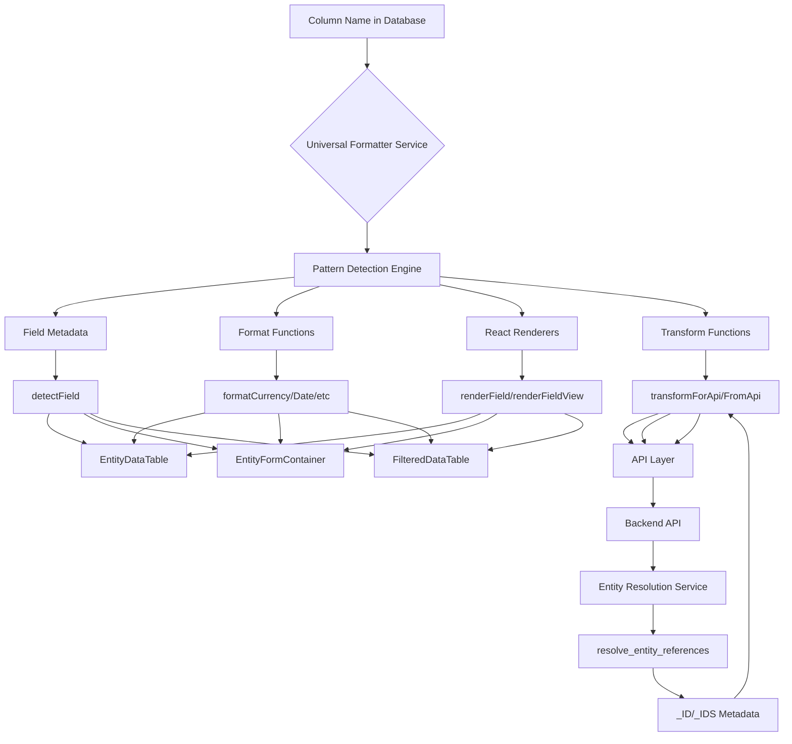

# Universal Formatter Service - Convention Over Configuration Architecture

**Location**: `apps/web/src/lib/universalFormatterService.tsx`
**Pattern**: Zero-Config Field Detection & Formatting
**Version**: 3.7.0 (Production - Metadata Integration Complete)

---

## Semantics & Business Context

Single source of truth for ALL field detection, formatting, and rendering across the entire frontend. Uses **convention over configuration** - column names automatically determine formatting, edit types, rendering behavior, and data transformation with ZERO configuration required.

**Key Principle**: Add a column to the database with proper naming → entire frontend auto-detects format, rendering, input type, editability, and API transformation without any code changes.

**Critical Integration**: Works in tandem with Entity Resolution Service to handle structured entity references (`_ID`/`_IDS`) and maintains transform symmetry between API and frontend data formats.

---

## Tooling & Framework Architecture

- **Frontend**: React 19 with TypeScript, custom render functions
- **Performance**: LRU cache (500 entries), cached Intl formatters, Set-based O(1) lookups
- **Badge Colors**: Database-driven from settings tables with semantic fallbacks
- **Transformation**: Bidirectional API ↔ Frontend with metadata flattening
- **No API Calls**: Pure frontend service (except badge color preloading from settings API)

---

## Architecture Overview



---

## Convention Over Configuration - Naming Pattern System

### Pattern Matching Table (Priority Order)

| Pattern | Detected As | Format | Edit Type | Align | Width | Example Column |
|---------|-------------|--------|-----------|-------|-------|----------------|
| `_ID`, `_IDS` | `metadata` | string | readonly | left | 150px | Entity reference metadata (invisible) |
| `id`, `*_ts`, `*_at` (system) | `system` | relative-time | readonly | left | 150px-300px | `id`, `created_ts`, `updated_at` |
| `*_amt`, `*_price`, `*_cost` | `currency` | $50,000.00 | number | right | 120px | `budget_allocated_amt` |
| `dl__*` | `badge` | 🟢 In Progress | select | left | 150px | `dl__project_stage` |
| `*_pct`, `*_rate` | `percentage` | 75.0% | number | right | 100px | `completion_pct` |
| `*_date` | `date` | Jan 15, 2025 | date | left | 120px | `due_date` |
| `is_*`, `has_*`, `*_flag` | `boolean` | ✓ Yes / ✗ No | checkbox | center | 80px | `is_active` |
| `*__*_id` (uuid) | `reference` | Link to entity | entity-select | left | 200px | `manager__employee_id` |
| `*__*_ids` (uuid[]) | `array` | Multiple refs | entity-multiselect | left | 200px | `stakeholder__employee_ids` |
| `tags`, `*_list` | `array` | [tag1] [tag2] | tags | left | 200px | `tags` |
| `metadata`, `*_json` | `json` | JSON viewer | textarea | left | 300px | `metadata` |
| Default | `text` | Plain text | text | left | 200px | Any other field |

**Auto-Detection Result**: Each pattern returns complete `UniversalFieldMetadata` object containing field name, visibility, sortability, format function, render type, edit type, transforms, and more.

---

## System Design - Field Rendering Architecture

```mermaid
graph TD
    A[Component Calls renderField] --> B{Mode?}

    B -->|view mode| C[renderFieldView]
    B -->|edit mode| D[renderFieldEdit]

    C --> E{Empty Value?}
    E -->|Yes| F[Return "—"]
    E -->|No| G{Has loadDataLabels Hint?}

    G -->|Yes| H[renderDataLabelBadge]
    G -->|No| I[detectField Pattern Match]

    I --> J{Pattern Matched}
    J -->|_ID/_IDS| K[Not Rendered - visible: false]
    J -->|*_amt| L[formatCurrency → $50,000.00]
    J -->|dl__*| H
    J -->|*_ts| M[formatRelativeTime → 2 hours ago]
    J -->|is_*| N[Boolean Badge → ✓ Yes]
    J -->|*__*_id| O[Entity Reference Link]
    J -->|default| P[Plain Text Span]

    D --> Q{inlineMode?}
    Q -->|true| R[Bordered Table Input]
    Q -->|false| S[Borderless Form Input]

    R --> T{editType from detectField}
    S --> T

    T -->|number/currency| U[input type=number]
    T -->|date| V[input type=date]
    T -->|checkbox| W[input type=checkbox]
    T -->|textarea| X[textarea rows=4]
    T -->|select| Y[ColoredDropdown with badges]
    T -->|entity-select| Z[EntitySelect component]
    T -->|readonly| AA[Disabled input]
```

---

## Data Transformation - API ↔ Frontend Symmetry

### Transform Flow Diagram

```
┌─────────────────────────────────────────────────────────────────┐
│ BACKEND API (entity-infrastructure.service.ts)                  │
│ resolve_entity_references() - Builds _ID/_IDS metadata         │
├─────────────────────────────────────────────────────────────────┤
│ INPUT (Flat Database Format):                                   │
│ {                                                                │
│   id: "proj-123",                                               │
│   name: "Digital Transformation",                               │
│   manager__employee_id: "emp-456",                             │
│   sponsor__employee_id: "emp-789",                             │
│   stakeholder__employee_ids: ["emp-111", "emp-222"]            │
│ }                                                                │
└─────────────────────────────────────────────────────────────────┘
                            ↓
┌─────────────────────────────────────────────────────────────────┐
│ STEP 1: Pattern Detection                                       │
│ - manager__employee_id → label: "manager", entity: "employee"  │
│ - sponsor__employee_id → label: "sponsor", entity: "employee"  │
│ - stakeholder__employee_ids → label: "stakeholder", array type │
└─────────────────────────────────────────────────────────────────┘
                            ↓
┌─────────────────────────────────────────────────────────────────┐
│ STEP 2: Bulk UUID Resolution (Single Query per Entity Type)    │
│ SELECT entity_instance_id::text, entity_instance_name          │
│ FROM app.entity_instance                                        │
│ WHERE entity_code = 'employee'                                  │
│   AND entity_instance_id IN (emp-456, emp-789, emp-111, ...)  │
└─────────────────────────────────────────────────────────────────┘
                            ↓
┌─────────────────────────────────────────────────────────────────┐
│ OUTPUT (Structured Frontend Format with Metadata):             │
│ {                                                                │
│   id: "proj-123",                                               │
│   name: "Digital Transformation",                               │
│   manager__employee_id: "emp-456",    ← Preserved flat field   │
│   sponsor__employee_id: "emp-789",                             │
│   stakeholder__employee_ids: ["emp-111", "emp-222"],           │
│   _ID: {                              ← Added metadata          │
│     manager: {                                                  │
│       entity_code: "employee",                                 │
│       manager__employee_id: "emp-456",                         │
│       manager: "James Miller"         ← Human-readable label   │
│     },                                                          │
│     sponsor: {                                                  │
│       entity_code: "employee",                                 │
│       sponsor__employee_id: "emp-789",                         │
│       sponsor: "Sarah Johnson"                                 │
│     }                                                           │
│   },                                                            │
│   _IDS: {                                                       │
│     stakeholder: [                                              │
│       {                                                         │
│         entity_code: "employee",                               │
│         stakeholder__employee_id: "emp-111",                   │
│         stakeholder: "Michael Chen"                            │
│       },                                                        │
│       {                                                         │
│         entity_code: "employee",                               │
│         stakeholder__employee_id: "emp-222",                   │
│         stakeholder: "Emily Davis"                             │
│       }                                                         │
│     ]                                                           │
│   }                                                             │
│ }                                                                │
└─────────────────────────────────────────────────────────────────┘
                            ↓
┌─────────────────────────────────────────────────────────────────┐
│ FRONTEND (React Components)                                     │
│ - EntityFormContainer renders dropdowns using _ID/_IDS labels  │
│ - detectField('_ID') → visible: false (prevents table render)  │
│ - detectField('_IDS') → visible: false                         │
│ - User edits fields in form                                     │
└─────────────────────────────────────────────────────────────────┘
                            ↓
┌─────────────────────────────────────────────────────────────────┐
│ FRONTEND (universalFormatterService.tsx)                       │
│ transformForApi() - Flattens _ID/_IDS back to UUID fields      │
├─────────────────────────────────────────────────────────────────┤
│ INPUT (Edited Frontend Data):                                   │
│ {                                                                │
│   id: "proj-123",                                               │
│   name: "Updated Project Name",                                 │
│   _ID: {                                                        │
│     manager: {                                                  │
│       entity_code: "employee",                                 │
│       manager__employee_id: "emp-999",  ← Changed to new mgr   │
│       manager: "New Manager"                                    │
│     }                                                           │
│   },                                                            │
│   _IDS: {                                                       │
│     stakeholder: [                                              │
│       { stakeholder__employee_id: "emp-111", ... },           │
│       { stakeholder__employee_id: "emp-333", ... }  ← Changed  │
│     ]                                                           │
│   }                                                             │
│ }                                                                │
└─────────────────────────────────────────────────────────────────┘
                            ↓
┌─────────────────────────────────────────────────────────────────┐
│ STEP 3: Flatten _ID Objects                                     │
│ - Extract manager__employee_id: "emp-999" from _ID.manager     │
│ - Remove _ID.manager.manager label field                        │
└─────────────────────────────────────────────────────────────────┘
                            ↓
┌─────────────────────────────────────────────────────────────────┐
│ STEP 4: Flatten _IDS Arrays                                     │
│ - Extract all *__*_id fields from array objects                │
│ - Convert to *__*_ids array: ["emp-111", "emp-333"]           │
└─────────────────────────────────────────────────────────────────┘
                            ↓
┌─────────────────────────────────────────────────────────────────┐
│ OUTPUT (Flat API Format - Ready for Backend):                  │
│ {                                                                │
│   id: "proj-123",                                               │
│   name: "Updated Project Name",                                 │
│   manager__employee_id: "emp-999",                             │
│   stakeholder__employee_ids: ["emp-111", "emp-333"]            │
│ }                                                                │
│ ✅ _ID and _IDS removed                                         │
│ ✅ Flat UUID fields ready for database UPDATE                   │
└─────────────────────────────────────────────────────────────────┘
                            ↓
                    Backend Database Update
```

**Key Insight**: Perfect symmetry between backend `resolve_entity_references()` (enrichment) and frontend `transformForApi()` (flattening) ensures zero data loss and clean separation of concerns.

---

## Metadata Field Handling - React Rendering Prevention

### Why `_ID` and `_IDS` Must Be Invisible

**Problem**: React cannot render objects as children. Attempting to display `_ID` or `_IDS` in table cells causes:
```
Uncaught Error: Objects are not valid as a React child
(found: object with keys {manager, sponsor})
```

**Solution**: Mark as `visible: false` following same pattern as `id` field.

### Field Detection Pattern (Lines 522-540)

```
Input: fieldKey = "_ID" or "_IDS"

Detection Result:
├─ visible: false          ← Prevents EntityDataTable column generation
├─ sortable: false         ← Not sortable
├─ filterable: false       ← Not filterable
├─ searchable: false       ← Excluded from text search
├─ format: stringTransform ← Same as 'id' field (not empty renderer)
├─ renderType: 'text'      ← Same as 'id' field
├─ inputType: 'readonly'   ← Cannot be edited directly
├─ editable: false         ← Not editable
├─ pattern: 'METADATA'     ← Special category
└─ category: 'metadata'    ← Metadata classification

Usage by EntityDataTable:
1. Calls detectField('_ID')
2. Receives visible: false
3. Skips column creation
4. Metadata available in data object for EntityFormContainer
```

**Critical**: EntityFormContainer accesses `data._ID` and `data._IDS` directly from record object (NOT as table columns) to render EntitySelect dropdowns with labels.

---

## Badge Rendering System - Database-Driven Colors

### Color Resolution Architecture

```
User Request: Render badge for "In Progress" in project_stage field
                            ↓
┌─────────────────────────────────────────────────────────────────┐
│ renderDataLabelBadge(colorCode, value)                         │
├─────────────────────────────────────────────────────────────────┤
│ STEP 1: Check Global COLOR_MAP Cache                           │
│ - Key format: "datalabel:value"                                │
│ - Example: "project_stage:In Progress"                         │
│ - Lookup: O(1) from Map                                         │
└─────────────────────────────────────────────────────────────────┘
                            ↓
                    Cache Hit? ────────┐
                       │                │
                       No               Yes
                       ↓                ↓
┌──────────────────────────────┐  Return cached color
│ STEP 2: Semantic Fallbacks   │       ↓
│ - "Completed" → green         │  Render badge immediately
│ - "In Progress" → blue        │
│ - "Planning" → cyan           │
│ - "Pending" → yellow          │
│ - "On Hold" → orange          │
│ - "Cancelled" → red           │
│ - "Draft" → gray              │
└──────────────────────────────┘
                            ↓
┌─────────────────────────────────────────────────────────────────┐
│ STEP 3: Default to Provided colorCode or Gray                  │
│ - Use colorCode parameter if available                          │
│ - Fallback to 'gray' if nothing matches                         │
└─────────────────────────────────────────────────────────────────┘
                            ↓
┌─────────────────────────────────────────────────────────────────┐
│ STEP 4: Render Badge Component                                 │
│ - Tailwind classes: bg-{color}-100 text-{color}-800           │
│ - Format: 🟢 {value}                                            │
│ - Example: <span class="bg-blue-100 text-blue-800">           │
│              In Progress                                        │
│            </span>                                              │
└─────────────────────────────────────────────────────────────────┘

Color Preloading (Optional Optimization):
┌─────────────────────────────────────────────────────────────────┐
│ loadSettingsColors('project_stage')                            │
│ ↓                                                                │
│ GET /api/v1/setting?category=project_stage                     │
│ ↓                                                                │
│ Populate COLOR_MAP:                                             │
│ - "project_stage:Planning" → "blue"                            │
│ - "project_stage:In Progress" → "cyan"                         │
│ - "project_stage:Completed" → "green"                          │
│ - "project_stage:On Hold" → "orange"                           │
│ ↓                                                                │
│ Future renderDataLabelBadge() calls: O(1) cache lookup         │
└─────────────────────────────────────────────────────────────────┘
```

**Performance**: Global COLOR_MAP shared across ALL components. Preload once on mount, use everywhere with O(1) lookups.

---

## User Interaction Flow - Complete Lifecycle

```
1. User navigates to /project
   ↓
2. Frontend: GET /api/v1/project
   ↓
3. Backend: Fetch projects + resolve_entity_references()
   ↓
4. Backend: Returns enriched data with _ID/_IDS metadata
   ↓
5. Frontend: EntityDataTable receives data
   ↓
6. For each column:
   a. Call detectField(columnKey)
   b. If columnKey === '_ID' or '_IDS':
      - visible: false → skip column creation
   c. Else:
      - Create column with auto-detected format
   ↓
7. Render table WITHOUT _ID/_IDS columns
   ↓
8. User clicks row → Navigate to /project/{id}
   ↓
9. Frontend: EntityFormContainer receives full record
   ↓
10. Form field generation:
    a. Regular fields: detectField() → renderField()
    b. _ID metadata: Render EntitySelect with current label
       - manager: {
           entity_code: "employee",
           manager__employee_id: "emp-456",
           manager: "James Miller"  ← Shows in dropdown
         }
    c. _IDS metadata: Render EntityMultiSelect with labels
   ↓
11. User edits manager dropdown → selects new employee
    ↓
12. onChange updates _ID.manager object:
    {
      entity_code: "employee",
      manager__employee_id: "emp-999",  ← New UUID
      manager: "New Manager Name"        ← New label
    }
   ↓
13. User clicks Save
    ↓
14. transformForApi(editedData) flattens:
    - _ID.manager → manager__employee_id: "emp-999"
    - _IDS.stakeholder → stakeholder__employee_ids: ["uuid1", "uuid2"]
    - Remove _ID and _IDS keys
   ↓
15. PATCH /api/v1/project/{id} with flat format
    ↓
16. Backend: UPDATE app.d_project SET manager__employee_id = 'emp-999'
    ↓
17. Backend: update_entity_instance_registry() if name changed
    ↓
18. Response: Updated project data
    ↓
19. Frontend: Re-fetch + resolve_entity_references() → _ID/_IDS rebuilt
    ↓
20. UI updates with new labels
```

---

## Performance Optimizations

### 1. LRU Cache for Field Titles (500 Max Entries)

```
First Call: generateFieldLabel('budget_allocated_amt')
├─ Split by underscore: ['budget', 'allocated', 'amt']
├─ Capitalize each word: ['Budget', 'Allocated', 'Amt']
├─ Join with spaces: "Budget Allocated Amt"
├─ Store in cache: Map.set('budget_allocated_amt', 'Budget Allocated Amt')
└─ Return: "Budget Allocated Amt"

Subsequent Calls: O(1) cache lookup
├─ Check: Map.has('budget_allocated_amt') → true
└─ Return: Map.get('budget_allocated_amt') → "Budget Allocated Amt"

LRU Eviction:
├─ Cache size ≥ 500
├─ Delete oldest entry (first key in Map)
└─ Insert new entry
```

### 2. Cached Intl Formatters (Created Once)

```
Currency Formatter:
const CURRENCY_FORMATTER = new Intl.NumberFormat('en-CA', {
  style: 'currency',
  currency: 'CAD'
});

Usage: CURRENCY_FORMATTER.format(50000) → "$50,000.00"
Performance: 10x faster than creating new formatter each call

Date Formatter:
const DATE_FORMATTER = new Intl.DateTimeFormat('en-US', {
  year: 'numeric',
  month: 'short',
  day: 'numeric'
});

Usage: DATE_FORMATTER.format(new Date()) → "Jan 15, 2025"
```

### 3. Set-Based O(1) Lookups

```
System Fields Detection:
const SYSTEM_FIELDS = new Set(['id', 'created_ts', 'updated_ts', ...]);

Check: if (SYSTEM_FIELDS.has(fieldKey)) → O(1)
vs Array.includes(fieldKey) → O(n)

Known Entities Detection:
const KNOWN_ENTITIES = new Set(['employee', 'project', 'task', ...]);

Foreign Key Pattern:
if (fieldKey.endsWith('_id') && KNOWN_ENTITIES.has(entityPart)) → O(1)
```

### 4. Global Color Map (Preloaded per Datalabel)

```
Preload Operation:
await loadSettingsColors('project_stage');
↓
GET /api/v1/setting?category=project_stage
↓
Response: [
  { label: "Planning", color: "blue" },
  { label: "In Progress", color: "cyan" },
  { label: "Completed", color: "green" }
]
↓
Populate COLOR_MAP:
Map.set('project_stage:Planning', 'blue')
Map.set('project_stage:In Progress', 'cyan')
Map.set('project_stage:Completed', 'green')

Later Badge Rendering:
renderDataLabelBadge(undefined, 'In Progress', 'project_stage')
↓
COLOR_MAP.get('project_stage:In Progress') → 'cyan' (O(1))
↓
Render: 🟢 "In Progress" with cyan background
```

---

## Integration Points

### Components Using Universal Formatter

| Component | View Mode | Edit Mode | Transform | Notes |
|-----------|-----------|-----------|-----------|-------|
| **EntityDataTable** | ✅ renderField() | ✅ renderField() | ✅ transformForApi() | inlineMode: true, 100% usage |
| **EntityFormContainer** | ✅ renderField() | ✅ renderField() | ✅ transformForApi() | inlineMode: false, handles _ID/_IDS |
| **FilteredDataTable** | ✅ formatFieldValue() | ❌ | ❌ | Display only, no editing |
| **EntityDetailPage** | ✅ renderFieldView() | ❌ | ❌ | Read-only detail view |
| **SettingsDataTable** | ✅ renderDataLabelBadge() | ✅ ColoredDropdown | ❌ | Badge-focused UI |

### External Components (Delegated by renderField)

Special-case components that renderField delegates to when detected:

| Component | Trigger | Purpose | Data Source |
|-----------|---------|---------|-------------|
| **EntitySelect** | `*__*_id` + _ID metadata | Single entity reference picker | `data._ID[label]` object |
| **EntityMultiSelect** | `*__*_ids` + _IDS metadata | Multiple entity reference picker | `data._IDS[label]` array |
| **ColoredDropdown** | `dl__*` or loadDataLabels: true | Settings dropdown with badges | `/api/v1/setting?category=X` |
| **InlineFileUploadCell** | editType === 'file' | Drag-drop file uploads | S3 presigned URLs |
| **DAGVisualizer** | `dl__*_stage` fields | Workflow stage visualization | Settings DAG structure |

---

## Column Hints System - Override Auto-Detection

### Problem
Some columns can't express their intent via naming conventions alone (e.g., `project_stage` without `dl__` prefix).

### Solution: Priority Order

```
Priority 1: loadDataLabels: true
   ↓
   Force badge rendering even without dl__ prefix
   Example: { key: 'project_stage', loadDataLabels: true }

Priority 2: editType: 'select'
   ↓
   Force dropdown input instead of auto-detected type
   Example: { key: 'status', editType: 'select' }

Priority 3: customRender: (value, record) => React.ReactNode
   ↓
   Custom rendering function overrides all auto-detection
   Example: { key: 'budget', customRender: (v, r) => r.is_critical ? <Red>${v}</Red> : null }
   Note: Return null to fallback to auto-detection

Priority 4: Auto-Detection
   ↓
   Pattern matching from column name

Priority 5: Default
   ↓
   Plain text rendering
```

### Example: Non-Prefixed Data Label Field

```
Column Configuration:
{
  key: 'project_stage',     // ← No dl__ prefix
  title: 'Stage',
  loadDataLabels: true      // ← Explicit hint forces badge
}

renderFieldView Execution:
├─ Check: loadDataLabels === true? → Yes
├─ Extract datalabel: 'project_stage'
├─ Call: getSettingColor('project_stage', 'Planning')
├─ Render: renderDataLabelBadge('blue', 'Planning')
└─ Output: 🟢 "Planning" badge

Without Hint (Auto-Detection Only):
├─ Pattern: 'project_stage' doesn't match dl__* or *_amt, etc.
├─ Default to: renderType: 'text'
└─ Output: Plain text "Planning" (no badge)
```

---

## Critical Considerations for Developers

### 1. Metadata Field Visibility is Critical
`_ID` and `_IDS` **MUST** be marked `visible: false` to prevent React rendering errors. EntityFormContainer accesses these directly from `data._ID` and `data._IDS` objects, NOT from table columns.

### 2. Transform Symmetry Must Be Maintained
Backend `resolve_entity_references()` (enrichment) and frontend `transformForApi()` (flattening) must stay synchronized:
- Backend adds `_ID`/`_IDS` metadata while preserving flat UUID fields
- Frontend flattens `_ID`/`_IDS` back to flat UUID fields before API submission
- Breaking either side causes data loss or API validation errors

### 3. Always Use transformForApi Before API Calls
Never submit frontend data format directly to API. Always call `transformForApi()` to:
- Flatten `_ID` → `*__*_id` fields
- Flatten `_IDS` → `*__*_ids` arrays
- Remove metadata keys
- Transform dates to API format
- Handle empty string → null conversion

### 4. Badge Colors Require Preloading (Optional)
For optimal performance, preload badge colors on component mount:
```
useEffect(() => {
  preloadSettingsColors(['project_stage', 'task_priority', 'client_status']);
}, []);
```
Without preloading, semantic fallbacks still work but may not match database colors exactly.

### 5. Respect inlineMode Styling
- **inlineMode: true** → Use for EntityDataTable (bordered inputs for tables)
- **inlineMode: false** → Use for EntityFormContainer (borderless inputs for forms)
- Mixing modes causes UI inconsistency

### 6. Trust Auto-Detection, Use Hints Sparingly
Only use column hints when naming conventions genuinely cannot express intent. Over-hinting reduces maintainability and creates configuration drift.

### 7. EntityFormContainer Field Exclusion
When building form field lists, exclude metadata and system fields:
```
const formFields = Object.keys(data).filter(key => {
  const meta = detectField(key);
  return meta.visible && meta.editable && key !== 'id';
});
```
This excludes `_ID`, `_IDS`, `id`, `created_ts`, etc., which should not appear as editable form fields.

---

## Complete Service API Reference

### Category 1: Field Detection & Metadata (6 Functions)

| Function | Purpose | Input | Output | Use When |
|----------|---------|-------|--------|----------|
| `detectField(key, type?)` | Auto-detect complete field metadata from column name | Column name, optional type | `UniversalFieldMetadata` object | Need complete metadata for any field |
| `detectFields(keys[], types?)` | Batch detection with shared cache | Array of column names | Array of metadata objects | Detecting multiple fields at once |
| `generateFieldLabel(key)` | Convert column name to human-readable label | Column name | String label | Need display label without full detection |
| `getEditType(key, type)` | Determine edit input type from column name | Column name, data type | EditType enum | Need only the edit type |
| `clearFieldCache()` | Clear all cached field data | None | void | Testing or memory cleanup |
| `clearFieldTitleCache()` | Clear only title cache | None | void | Hot module reload |

**Example Detection Flow**:
```
detectField('budget_allocated_amt', 'numeric')
↓
Returns complete metadata:
{
  fieldName: "Budget Allocated",
  visible: true,
  renderType: "currency",
  editType: "number",
  format: formatCurrency,
  align: "right",
  width: "120px",
  editable: true,
  pattern: "CURRENCY",
  category: "financial",
  ...complete metadata object
}
```

---

### Category 2: Value Formatting (5 Functions)

| Function | Purpose | Input | Output | Use When |
|----------|---------|-------|--------|----------|
| `formatFieldValue(val, type)` | Generic formatter dispatcher | Value + format type | Formatted string | Generic formatting needs |
| `formatCurrency(val)` | Currency formatter | Number | "$50,000.00" | Currency display |
| `formatRelativeTime(val)` | Relative time formatter | Timestamp | "2 hours ago" | Timestamps |
| `formatFriendlyDate(val)` | Date formatter | Date | "Jan 15, 2025" | Date display |
| `isCurrencyField(key)` | Check if field is currency | Column name | Boolean | Conditional logic for currency |

**Format Type Mapping**:
```
formatFieldValue(50000, 'currency')     → "$50,000.00"
formatFieldValue(new Date(), 'date')    → "Jan 15, 2025"
formatFieldValue(timestamp, 'relative-time') → "2 hours ago"
formatFieldValue(0.75, 'percentage')    → "75.0%"
formatFieldValue(true, 'boolean')       → "✓ Yes"
```

---

### Category 3: React Rendering (5 Functions)

| Function | Purpose | Input | Output | Use When |
|----------|---------|-------|--------|----------|
| `renderField(options)` | **Master renderer** - handles view AND edit modes | RenderFieldOptions | React.ReactElement | Primary rendering function for ALL fields |
| `renderFieldView(key, val, data?, hint?)` | View mode only | Field key, value, record, hints | React.ReactElement | Display-only contexts |
| `renderFieldEdit(options)` | Edit mode only | Edit options | React.ReactElement | Edit-only contexts |
| `renderFieldDisplay(val, format)` | Legacy display renderer | Value, format config | React.ReactElement | Backwards compatibility |
| `getFieldCapability(key, type?)` | Determine editability | Column name, type | FieldCapability | Check before rendering edit mode |

**renderField Master API**:
```
Input Interface:
{
  fieldKey: string              // Column name (required)
  value: any                    // Current value (required)
  mode: 'view' | 'edit'        // Display or edit (required)
  data?: Record<string, any>    // Full record for context
  onChange?: (key, val) => void // Required for edit mode
  required?: boolean            // Mark as required
  disabled?: boolean            // Disable editing
  inlineMode?: boolean          // Table vs form styling
  customRender?: Function       // Custom override
  loadDataLabels?: boolean      // Force badge rendering
  editType?: EditType          // Override auto-detection
}

Rendering Decision Tree:
├─ Has customRender? → Use custom (if returns JSX)
├─ mode === 'view' → renderFieldView()
│   ├─ Empty value → "—"
│   ├─ loadDataLabels hint → Badge
│   └─ Auto-detect → Pattern match
└─ mode === 'edit' → renderFieldEdit()
    ├─ inlineMode: true → Bordered table input
    ├─ inlineMode: false → Borderless form input
    └─ editType determines input component
```

---

### Category 4: Badge Rendering (5 Functions)

| Function | Purpose | Input | Output | Use When |
|----------|---------|-------|--------|----------|
| `renderDataLabelBadge(color, value)` | Render colored status badge | Color code, value string | React.ReactElement | Display settings values with colors |
| `renderBadge(color, value)` | Low-level badge renderer | Color code, value string | React.ReactElement | Direct badge rendering |
| `loadSettingsColors(category)` | Fetch and cache colors for category | Settings category name | Promise<void> | Preload badge colors on mount |
| `getSettingColor(category, value)` | Get cached color for value | Category + value | String color code | Lookup color before rendering |
| `preloadSettingsColors(categories[])` | Batch preload multiple categories | Array of category names | Promise<void> | Preload all badge colors at once |

**Badge Color Resolution Priority**:
```
Priority 1: COLOR_MAP Cache
├─ Key: "category:value"
├─ Example: "project_stage:Planning" → "blue"
└─ Performance: O(1) lookup

Priority 2: Semantic Fallbacks
├─ "Completed" → green
├─ "In Progress" → blue
├─ "Planning" → cyan
├─ "Pending" → yellow
├─ "On Hold" → orange
├─ "Cancelled" → red
└─ "Draft" → gray

Priority 3: Provided colorCode Parameter

Priority 4: Default Gray
```

**Preloading Pattern**:
```
Component Mount:
useEffect(() => {
  preloadSettingsColors([
    'project_stage',
    'task_priority',
    'client_status',
    'task_update_type'
  ]);
}, []);

Result:
- All colors fetched once
- Cached in global COLOR_MAP
- All future badge renders: O(1)
```

---

### Category 5: Data Transformation (4 Functions)

| Function | Purpose | Input | Output | Use When |
|----------|---------|-------|--------|----------|
| `transformForApi(data, original?)` | **Critical** - Flatten frontend data for API | Frontend record | API-ready record | Before ALL API submissions |
| `transformFromApi(data)` | Convert API format to frontend | API response | Frontend format | After API responses (rarely needed) |
| `transformArrayField(value)` | Parse array field values | String or Array | Parsed array | Array field handling |
| `transformDateField(value)` | Convert date to API format | Date string/object | ISO string | Date field submission |

**transformForApi Critical Operations**:
```
Operation 1: Flatten _ID Objects
├─ Input: _ID.manager = { entity_code: "employee", manager__employee_id: "uuid", manager: "Name" }
├─ Extract: manager__employee_id → "uuid"
├─ Remove: _ID.manager object
└─ Output: manager__employee_id: "uuid"

Operation 2: Flatten _IDS Arrays
├─ Input: _IDS.stakeholder = [{ stakeholder__employee_id: "uuid1" }, { stakeholder__employee_id: "uuid2" }]
├─ Extract: All stakeholder__employee_id values
├─ Convert: stakeholder__employee_id → stakeholder__employee_ids (plural)
├─ Remove: _IDS.stakeholder array
└─ Output: stakeholder__employee_ids: ["uuid1", "uuid2"]

Operation 3: Date Transformation
├─ Detect: *_date fields
├─ Convert: "2025-01-15" → ISO timestamp
└─ Output: API-compatible date format

Operation 4: Array Transformation
├─ Detect: Array fields in original record
├─ Convert: "tag1, tag2, tag3" → ["tag1", "tag2", "tag3"]
└─ Output: Proper array format

Operation 5: Empty String Handling
├─ Detect: value === ''
├─ Convert: '' → null
└─ Output: Database NULL instead of empty string
```

**Critical Usage Pattern**:
```
❌ WRONG - Submitting frontend data directly:
await api.patch(`/project/${id}`, editedData);

✅ CORRECT - Always transform first:
const apiData = transformForApi(editedData, originalData);
await api.patch(`/project/${id}`, apiData);

Why Critical:
- Frontend has _ID/_IDS metadata objects
- Backend expects flat UUID fields
- Without transform: API validation errors
- With transform: Clean, compatible payload
```

---

### Category 6: Helper Utilities (2 Functions)

| Function | Purpose | Input | Output | Use When |
|----------|---------|-------|--------|----------|
| `getEntityReferenceFields(data)` | Extract entity reference field labels from _ID/_IDS | Record with _ID/_IDS | Array of label strings | Building entity reference forms |
| `getVisibleFields(data, mode?)` | Filter to only visible, editable fields | Record + mode | Array of field keys | Building form field lists |

**getEntityReferenceFields**:
```
Input:
{
  id: "proj-123",
  name: "Project Alpha",
  _ID: {
    manager: { ... },
    sponsor: { ... }
  },
  _IDS: {
    stakeholder: [ ... ]
  }
}

Output: ["manager", "sponsor", "stakeholder"]

Usage:
const refFields = getEntityReferenceFields(data);
// Use to render EntitySelect/EntityMultiSelect components
```

**getVisibleFields**:
```
Mode: 'create'
├─ Excludes: id, created_ts, updated_ts, _ID, _IDS
├─ Excludes: All *_id and *_ids fields (entity references)
└─ Returns: Editable fields for create form

Mode: 'edit' (default)
├─ Excludes: id, name, code, created_ts, updated_ts, _ID, _IDS
├─ Excludes: All *_id and *_ids fields
└─ Returns: Editable fields for edit form

Usage:
const formFields = getVisibleFields(data, 'create');
formFields.forEach(key => {
  const meta = detectField(key);
  if (meta.editable) {
    renderField({ fieldKey: key, value: data[key], mode: 'edit' });
  }
});
```

---

### Category 7: Constants & Configuration (3 Exports)

| Constant | Type | Purpose | Contains |
|----------|------|---------|----------|
| `COLOR_MAP` | Map<string, string> | Global badge color cache | Key: "category:value", Value: color code |
| `SYSTEM_FIELDS` | Set<string> | System-managed fields | id, created_ts, updated_ts, created_at, updated_at, version, from_ts, to_ts, active_flag |
| `READONLY_FIELDS` | Set<string> | Never-editable fields | Same as SYSTEM_FIELDS (alias) |

**Usage**:
```
Check if system field:
if (SYSTEM_FIELDS.has(fieldKey)) {
  // Skip rendering edit input
}

Check color cache:
const cached = COLOR_MAP.get('project_stage:Planning');
if (cached) {
  renderBadge(cached, 'Planning');
}

Readonly check:
if (READONLY_FIELDS.has(fieldKey)) {
  return { editType: 'readonly', editable: false };
}
```

---

## Common Usage Patterns

### Pattern 1: Table Column Rendering
```
EntityDataTable component:
1. Fetch data from API
2. For each column:
   a. detectField(columnKey) → Get metadata
   b. If metadata.visible === false → Skip column
   c. renderField({ fieldKey, value, mode: 'view', inlineMode: true })
3. Result: Fully formatted table with auto-detected columns
```

### Pattern 2: Form Field Rendering
```
EntityFormContainer component:
1. Fetch entity data (includes _ID/_IDS metadata)
2. Filter fields: getVisibleFields(data, 'edit')
3. For each field:
   a. detectField(key) → Get metadata
   b. renderField({
        fieldKey: key,
        value: data[key],
        mode: isEditing ? 'edit' : 'view',
        onChange: handleChange,
        inlineMode: false
      })
4. Handle entity references separately using _ID/_IDS metadata
5. On save: transformForApi(editedData) → Submit to API
```

### Pattern 3: Badge Preloading
```
Component with many badges:
1. On mount: preloadSettingsColors(['stage', 'priority', 'status'])
2. Render: renderDataLabelBadge(undefined, value, category)
3. Result: O(1) color lookups, no API calls per badge
```

### Pattern 4: Entity Reference Handling
```
Form with entity references:
1. Backend returns: { _ID: { manager: {...} }, _IDS: { stakeholder: [...] } }
2. Detect metadata: detectField('_ID') → visible: false
3. EntityDataTable: Skips _ID/_IDS columns (not rendered)
4. EntityFormContainer: Access data._ID directly
5. Render: EntitySelect using _ID.manager.manager label
6. On save: transformForApi() → Flattens to manager__employee_id
7. API receives: { manager__employee_id: "uuid" }
```

### Pattern 5: Custom Rendering with Fallback
```
Special case with fallback to auto-detection:
renderField({
  fieldKey: 'budget',
  value: 50000,
  mode: 'view',
  customRender: (value, record) => {
    if (record.is_critical) {
      return <span className="text-red-600">${value}</span>;
    }
    return null; // ← Fallback to auto-detection
  }
});

Result:
- is_critical === true → Custom red render
- is_critical === false → Auto-detects as currency, uses formatCurrency
```

---

## Related Documentation

| Document | Section | Status |
|----------|---------|--------|
| `ENTITY_INFRASTRUCTURE_SERVICE.md` | resolve_entity_references | ✅ Complete - Structured `_ID`/`_IDS` output documented |
| `ENTITY_RESOLUTION_SERVICE.md` | API Transform Symmetry | ✅ Complete - `transformForApi()` flattening documented |
| `ENTITY_RESOLUTION_SERVICE.md` | Database Schema | ✅ Complete - entity_instance table structure documented |
| `entity_endpoint_design.md` | Response Schemas | ⚠️ Pending - Add `_ID`/`_IDS` schema requirements for all entities |
| `COMPONENT_HIERARCHY.md` | EntityFormContainer | ⚠️ Pending - Document `_ID`/`_IDS` metadata handling props |
| `COMPONENT_HIERARCHY.md` | EntityDataTable | ⚠️ Pending - Document metadata field exclusion pattern |
| `UNIVERSAL_FILTER_BUILDER.md` | Auto-Filter Patterns | ⚠️ Pending - Reference detectField for type detection patterns |

---

**Version**: 3.7.0
**Date**: 2025-11-19
**Status**: ✅ Production - Metadata Integration Complete
**Breaking Changes**: Metadata field handling (`_ID`/`_IDS` visible: false) ensures React compatibility (v3.6.0)
