# Universal Formatter Service - Complete Architecture

**Version**: 3.5.0
**Status**: Production (Zero Backwards Compatibility)
**File**: `apps/web/src/lib/universalFormatterService.tsx`

---

## Executive Summary

Single source of truth for ALL field detection, formatting, and rendering across the entire frontend. Uses **convention over configuration** - column names automatically determine formatting, edit types, and rendering behavior.

**Key Principle**: Add a column to the database with proper naming → entire frontend auto-detects format, rendering, and behavior with ZERO configuration.

---

## Architecture Overview

```
┌─────────────────────────────────────────────────────────────────┐
│                   UNIVERSAL FORMATTER SERVICE                    │
│                  (universalFormatterService.tsx)                 │
├─────────────────────────────────────────────────────────────────┤
│                                                                   │
│  ┌──────────────────┐  ┌──────────────────┐  ┌───────────────┐ │
│  │ Format Detection │  │ React Renderers  │  │ Data Transform│ │
│  │                  │  │                  │  │               │ │
│  │ detectField()    │  │ renderFieldView()│  │ transformForApi│ │
│  │ detectFieldFormat│  │ renderFieldEdit()│  │ transformFrom │ │
│  │ getEditType()    │  │ renderField()    │  │               │ │
│  └──────────────────┘  └──────────────────┘  └───────────────┘ │
│                                                                   │
│  ┌──────────────────┐  ┌──────────────────┐  ┌───────────────┐ │
│  │ Value Formatting │  │ Badge Rendering  │  │ Field Caps    │ │
│  │                  │  │                  │  │               │ │
│  │ formatCurrency() │  │renderDataLabel   │  │getFieldCap()  │ │
│  │ formatDate()     │  │Badge()           │  │               │ │
│  │ formatRelative() │  │getSettingColor() │  │               │ │
│  └──────────────────┘  └──────────────────┘  └───────────────┘ │
└─────────────────────────────────────────────────────────────────┘
                               │
          ┌────────────────────┼────────────────────┐
          ▼                    ▼                    ▼
  EntityDataTable      EntityFormContainer   FilteredDataTable
  (100% usage)         (100% usage)          (100% usage)
```

---

## System Design: Field Rendering Flow

```mermaid
graph TD
    A[Column Name: budget_allocated_amt] --> B{renderField}
    B --> C{Mode?}

    C -->|view| D[renderFieldView]
    C -->|edit| E[renderFieldEdit]

    D --> F{Check Empty?}
    F -->|null/undefined| G[Return —]
    F -->|has value| H{loadDataLabels hint?}

    H -->|true| I[renderDataLabelBadge]
    H -->|false| J[detectField]

    J --> K{Pattern Match}
    K -->|*_amt| L[formatCurrency → $50,000.00]
    K -->|dl__*| I
    K -->|*_ts| M[formatRelativeTime → 2 hours ago]
    K -->|is_*| N[Boolean badge → ✓ Yes]

    E --> O{inlineMode?}
    O -->|true| P[Bordered input - table style]
    O -->|false| Q[Borderless input - form style]

    P --> R{editType?}
    Q --> R

    R -->|number| S[&lt;input type=number&gt;]
    R -->|date| T[&lt;input type=date&gt;]
    R -->|checkbox| U[&lt;input type=checkbox&gt;]
```



---

## Core Functions

### 1. Format Detection (Convention → Configuration)

#### `detectField(fieldKey: string, dataType: string): UniversalFieldMetadata`

Auto-detects complete field metadata from column name.

**Pattern Matching Table**:

| Pattern | Render Type | Edit Type | Align | Width | Example |
|---------|-------------|-----------|-------|-------|---------|
| `*_amt`, `*_price`, `*_cost` | `currency` | `number` | `right` | `120px` | `budget_allocated_amt` |
| `dl__*` | `badge` | `select` | `left` | `150px` | `dl__project_stage` |
| `*_ts`, `*_at` | `timestamp` | `datetime` | `left` | `150px` | `created_ts` |
| `*_date` | `date` | `date` | `left` | `120px` | `due_date` |
| `is_*`, `has_*`, `*_flag` | `boolean` | `checkbox` | `center` | `80px` | `is_active` |
| `*_pct`, `*_rate` | `percentage` | `number` | `right` | `100px` | `completion_pct` |
| `*__*_id` (uuid) | `reference` | `entity-select` | `left` | `200px` | `manager__employee_id` |
| `*__*_ids` (uuid[]) | `array` | `entity-multiselect` | `left` | `200px` | `stakeholder__employee_ids` |
| `tags`, `*_list` | `array` | `tags` | `left` | `200px` | `tags` |
| `metadata`, `*_json` | `json` | `textarea` | `left` | `300px` | `metadata` |

**Returns**:
```typescript
interface UniversalFieldMetadata {
  fieldName: string;          // Human-readable: "Budget Allocated"
  renderType: RenderType;     // How to display: 'currency'
  inputType: InputType;       // Form input type: 'currency'
  editType: EditType;         // Edit component: 'number'
  format: (value) => string;  // Formatter function
  editable: boolean;          // Can be edited
  align: 'left'|'center'|'right';
  width: string;              // Column width
  loadFromSettings?: boolean; // For dl__* fields
  settingsDatalabel?: string; // Extracted datalabel name
}
```

---

### 2. React Field Renderers (Master API)

#### `renderField(options: RenderFieldOptions): React.ReactElement`

**Single function** for rendering ANY field in ANY mode.

**Interface**:
```typescript
interface RenderFieldOptions {
  fieldKey: string;              // Column name
  value: any;                    // Current value
  mode: 'view' | 'edit';         // Display or edit mode
  data?: Record<string, any>;    // Full record (for context)
  onChange?: (key, val) => void; // Edit mode callback (required for edit)
  required?: boolean;            // Mark as required
  disabled?: boolean;            // Disable editing
  inlineMode?: boolean;          // Table vs form styling
  customRender?: (value, record) => React.ReactNode; // Custom override

  // COLUMN HINTS (override auto-detection)
  loadDataLabels?: boolean;      // Force badge rendering
  editType?: EditType;           // Override detected edit type
}
```

**Execution Flow**:
```typescript
renderField(options)
    │
    ├─ Has customRender && mode='view'?
    │   └─→ Use custom renderer
    │
    ├─ mode === 'view'
    │   └─→ renderFieldView(fieldKey, value, data, loadDataLabels)
    │       ├─ value empty? → "—"
    │       ├─ loadDataLabels hint? → renderDataLabelBadge()
    │       └─ detectField() → auto-render
    │
    └─ mode === 'edit'
        └─→ renderFieldEdit({ ...options })
            ├─ Check editType
            ├─ Apply inlineMode styling
            └─ Return appropriate input
```

---

### 3. View Mode Rendering

#### `renderFieldView(fieldKey, value, data?, loadDataLabels?): React.ReactElement`

Renders field for display (read-only).

**Priority Order**:
1. **Empty check** → `<span className="text-dark-600 italic">—</span>`
2. **Explicit hint** (`loadDataLabels: true`) → Force badge
3. **Auto-detection** → Pattern matching

**Render Type Mapping**:

```typescript
switch (fieldMeta.renderType) {
  case 'currency':
    return <span className="font-medium">{formatCurrency(value)}</span>;
    // Example: $50,000.00

  case 'date':
    return <span>{formatFriendlyDate(value)}</span>;
    // Example: Jan 15, 2025

  case 'timestamp':
    return <span title={formatFriendlyDate(value)}>{formatRelativeTime(value)}</span>;
    // Example: "2 hours ago" (hover shows "Jan 15, 2025, 2:30 PM")

  case 'badge':
    return renderDataLabelBadge(colorCode, String(value));
    // Example: 🟢 "In Progress"

  case 'boolean':
    return (
      <span className={value ? 'bg-green-100' : 'bg-gray-100'}>
        {value ? '✓ Yes' : '✗ No'}
      </span>
    );

  case 'percentage':
    return <span>{value}%</span>;
    // Example: 75.0%

  case 'array':
    return (
      <div className="flex gap-1">
        {value.map(item => (
          <span className="chip">{item}</span>
        ))}
      </div>
    );
    // Example: [urgent] [client] [phase-1]

  case 'json':
    return <pre>{JSON.stringify(value, null, 2)}</pre>;

  default:
    return <span>{value || '-'}</span>;
}
```

---

### 4. Edit Mode Rendering

#### `renderFieldEdit(options: RenderFieldEditOptions): React.ReactElement`

Renders editable input component.

**Styling Modes**:
```typescript
// INLINE MODE (EntityDataTable)
inlineMode: true
→ className: "w-full px-2 py-1.5 border border-dark-400 rounded-md
              focus:ring-2 focus:ring-slate-500/30"
→ Bordered, padded, table-friendly

// FORM MODE (EntityFormContainer)
inlineMode: false
→ className: "w-full border-0 bg-transparent px-0 py-0.5
              focus:ring-0"
→ Borderless, transparent, form-friendly
```

**Edit Type Handling**:
```typescript
switch (editType) {
  case 'number':
  case 'currency':
    return (
      <input
        type="number"
        value={value || ''}
        onChange={(e) => onChange(fieldKey, parseFloat(e.target.value) || 0)}
        className={baseClassName}
      />
    );

  case 'date':
    return (
      <input
        type="date"
        value={formatDateForInput(value)}
        onChange={(e) => onChange(fieldKey, e.target.value || null)}
        className={baseClassName}
      />
    );

  case 'checkbox':
    return (
      <input
        type="checkbox"
        checked={value || false}
        onChange={(e) => onChange(fieldKey, e.target.checked)}
        className="h-4 w-4 rounded"
      />
    );

  case 'textarea':
    return (
      <textarea
        value={value || ''}
        onChange={(e) => onChange(fieldKey, e.target.value)}
        className={baseClassName}
        rows={4}
      />
    );

  case 'tags':
    return (
      <input
        type="text"
        value={value || ''}
        placeholder="Enter tags (comma-separated)"
        onChange={(e) => onChange(fieldKey, e.target.value)}
        className={baseClassName}
      />
    );

  default:  // text
    return (
      <input
        type="text"
        value={value || ''}
        onChange={(e) => onChange(fieldKey, e.target.value)}
        className={baseClassName}
      />
    );
}
```

---

### 5. Badge Rendering (Data Labels)

#### `renderDataLabelBadge(colorCode: string | undefined, value: string): React.ReactElement`

Renders colored status badges with database-driven colors.

**Color Resolution Flow**:
```typescript
// 1. Check global COLOR_MAP cache
const cachedColor = COLOR_MAP.get(`${datalabel}:${value}`);
if (cachedColor) return renderBadge(cachedColor, value);

// 2. Fallback to semantic color mapping
const semanticColors = {
  'Completed': 'green',
  'In Progress': 'blue',
  'Planning': 'cyan',
  'Pending': 'yellow',
  'On Hold': 'orange',
  'Cancelled': 'red',
  'Draft': 'gray'
};

// 3. Default to provided colorCode or gray
const finalColor = semanticColors[value] || colorCode || 'gray';
```

**Badge Component**:
```typescript
<span
  className={`inline-flex items-center px-2.5 py-0.5 rounded-full
              text-xs font-medium bg-${color}-100 text-${color}-800`}
>
  {value}
</span>
```

**Preloading Colors**:
```typescript
// Preload all colors for a datalabel
await loadSettingsColors('project_stage');

// Populates COLOR_MAP:
// "project_stage:Planning" → "blue"
// "project_stage:In Progress" → "cyan"
// "project_stage:Completed" → "green"
```

---

### 6. Data Transformation

#### `transformForApi(data: Record<string, any>): Record<string, any>`

Transforms frontend structure → API-ready format.

**Transformation Rules**:

```typescript
// INPUT (Frontend Format):
{
  name: "Project Alpha",
  budget_allocated_amt: 50000,
  _ID: {
    manager: {
      entity_code: 'employee',
      manager__employee_id: 'uuid-123',
      manager: 'John Doe'
    }
  },
  _IDS: {
    stakeholder: [
      { stakeholder__employee_id: 'uuid-1', stakeholder: 'Alice' },
      { stakeholder__employee_id: 'uuid-2', stakeholder: 'Bob' }
    ]
  }
}

// OUTPUT (API Format):
{
  name: "Project Alpha",
  budget_allocated_amt: 50000,
  manager__employee_id: 'uuid-123',
  stakeholder__employee_ids: ['uuid-1', 'uuid-2']
}
```

**Algorithm**:
```typescript
1. Flatten _ID objects:
   - Extract {labelField__entityCode_id: uuid}
   - Remove label values

2. Flatten _IDS arrays:
   - Extract UUIDs into array
   - Convert to {labelField__entityCode_ids: [uuid1, uuid2]}

3. Remove _ID and _IDS top-level keys

4. Pass through all other fields
```

#### `transformFromApi(data: Record<string, any>): Record<string, any>`

API format → frontend structure (inverse transformation).

---

## Column Hints System

**Problem**: Some columns can't express their intent via naming conventions alone.

**Solution**: Explicit hints override auto-detection.

### Priority Order

```
1. loadDataLabels: true     → Force badge rendering
2. editType: 'select'       → Force dropdown
3. customRender: (v) => ... → Custom renderer
4. Auto-detection           → Pattern matching
5. Default                  → Plain text
```

### Example: Non-Prefixed Data Label Field

```typescript
// Column config
{
  key: 'project_stage',     // ← No dl__ prefix
  title: 'Stage',
  loadDataLabels: true      // ← Explicit hint
}

// renderFieldView checks hints FIRST
if (loadDataLabels && typeof value === 'string') {
  const datalabel = fieldKey.replace(/_name$/, '');
  const colorCode = getSettingColor(datalabel, value);
  return renderDataLabelBadge(colorCode, value);  // ✅ Forced badge
}

// Then auto-detection
const fieldMeta = detectField(fieldKey, typeof value);
```

---

## Performance Optimizations

### 1. LRU Cache for Field Titles

```typescript
const TITLE_CACHE = new LRUCache<string, string>({ max: 500 });

generateFieldLabel('budget_allocated_amt')
// First call: Generates "Budget Allocated" → stores in cache
// Subsequent calls: O(1) lookup
```

### 2. Cached Intl Formatters

```typescript
// Created once, reused forever
const currencyFormatter = new Intl.NumberFormat('en-CA', {
  style: 'currency',
  currency: 'CAD',
  minimumFractionDigits: 2
});

const dateFormatter = new Intl.DateTimeFormat('en-CA', {
  year: 'numeric',
  month: 'short',
  day: 'numeric'
});
```

### 3. Set-Based Lookups (O(1))

```typescript
const SYSTEM_FIELDS = new Set([
  'id', 'created_ts', 'updated_ts', 'created_by', 'updated_by'
]);

// Fast membership check
if (SYSTEM_FIELDS.has(fieldKey)) {
  return { editable: false };
}
```

### 4. Global Color Map

```typescript
COLOR_MAP = new Map<string, string>();
// Format: "datalabel:value" → "colorCode"

// Preloaded once per datalabel
loadSettingsColors('project_stage');
// Populates all project_stage values and colors

// Later lookups: O(1)
const color = COLOR_MAP.get('project_stage:Planning');
```

---

## Integration Points

### Components Using Universal Formatter

| Component | View Mode | Edit Mode | Notes |
|-----------|-----------|-----------|-------|
| **EntityDataTable** | ✅ `renderField()` | ✅ `renderField()` | 100% usage, inlineMode: true |
| **EntityFormContainer** | ✅ `renderField()` | ✅ `renderField()` | 100% usage, inlineMode: false |
| **FilteredDataTable** | ✅ `formatFieldValue()` | ❌ | Display only |
| **EntityDetailPage** | ✅ `renderFieldView()` | ❌ | Read-only details |
| **SettingsDataTable** | ✅ `renderDataLabelBadge()` | ✅ `ColoredDropdown` | Badge-focused |

### External Components (Not Handled by renderField)

Special-case components that renderField delegates to:

| Component | When Used | Purpose |
|-----------|-----------|---------|
| **InlineFileUploadCell** | `editType === 'file'` | Drag-drop file uploads |
| **ColoredDropdown** | `editType === 'select' && hasSettingOptions` | Settings dropdown with badges |
| **EntitySelect** | `_ID` fields | Single entity reference picker |
| **EntityMultiSelect** | `_IDS` fields | Multiple entity reference picker |
| **DAGVisualizer** | `dl__*_stage` fields | Workflow stage visualization |

---

## Data Flow Diagram

```
User Interaction
       │
       ▼
┌─────────────────────────────────────────┐
│  EntityDataTable / EntityFormContainer  │
└─────────────────────────────────────────┘
       │
       ├─ View Mode ──────────────────┐
       │                              │
       ▼                              ▼
┌──────────────┐              ┌──────────────┐
│ renderField()│              │ customRender?│
└──────────────┘              └──────────────┘
       │                              │
       ▼                              ▼
┌────────────────────┐         [Custom Logic]
│ renderFieldView()  │
└────────────────────┘
       │
       ├─ Empty? → "—"
       ├─ loadDataLabels? → renderDataLabelBadge()
       └─ detectField() → Pattern match
              │
              ├─ *_amt → formatCurrency()
              ├─ dl__* → renderDataLabelBadge()
              ├─ *_ts → formatRelativeTime()
              ├─ is_* → Boolean badge
              └─ default → Plain text
       │
       ▼
┌────────────────────┐
│  Rendered Element  │
└────────────────────┘

       │
       ├─ Edit Mode ──────────────────┐
       │                              │
       ▼                              ▼
┌──────────────┐              ┌──────────────────┐
│ renderField()│              │ Special Component│
└──────────────┘              │ (File/Select)    │
       │                      └──────────────────┘
       ▼
┌────────────────────┐
│ renderFieldEdit()  │
└────────────────────┘
       │
       ├─ inlineMode? → Apply table/form styling
       └─ editType? → Return input component
              │
              ├─ number → <input type="number" />
              ├─ date → <input type="date" />
              ├─ checkbox → <input type="checkbox" />
              └─ text → <input type="text" />
       │
       ▼
┌────────────────────┐
│  Input Component   │
└────────────────────┘
       │
       ▼
  onChange(key, value)
       │
       ▼
┌────────────────────┐
│ transformForApi()  │
└────────────────────┘
       │
       ▼
    API Call
```

---

## Usage Examples

### Example 1: EntityDataTable

```typescript
// View mode
{renderField({
  fieldKey: 'budget_allocated_amt',
  value: 50000,
  mode: 'view',
  data: record
})}
// Renders: <span className="font-medium">$50,000.00</span>

// Edit mode (inline table editing)
{renderField({
  fieldKey: 'budget_allocated_amt',
  value: editedData['budget_allocated_amt'],
  mode: 'edit',
  onChange: (key, val) => handleInlineEdit(recordId, key, val),
  inlineMode: true  // ← Bordered input for tables
})}
// Renders: <input type="number" className="border rounded..." />
```

### Example 2: EntityFormContainer

```typescript
// Form field rendering
{fields.map(field => (
  <div key={field.key} className="form-field">
    <label>{field.label}</label>
    {renderField({
      fieldKey: field.key,
      value: data[field.key],
      mode: isEditing ? 'edit' : 'view',
      onChange: handleChange,
      required: field.required,
      inlineMode: false,  // ← Borderless for forms
      loadDataLabels: field.loadDataLabels
    })}
  </div>
))}
```

### Example 3: Data Label with Hint

```typescript
// Column doesn't follow dl__* convention
const column = {
  key: 'project_stage',
  loadDataLabels: true  // ← Explicit hint
};

{renderField({
  fieldKey: column.key,
  value: 'Planning',
  mode: 'view',
  loadDataLabels: column.loadDataLabels  // ← Pass hint
})}
// Renders: renderDataLabelBadge('project_stage', 'Planning')
// → 🟢 "Planning" badge
```

### Example 4: Custom Renderer with Fallback

```typescript
{renderField({
  fieldKey: 'budget_allocated_amt',
  value: 50000,
  mode: 'view',
  customRender: (value, record) => {
    if (record.is_critical) {
      return <span className="text-red-600 font-bold">${value}</span>;
    }
    // Return null to fallback to auto-detection
    return null;
  }
})}
// If is_critical: Custom rendering
// Otherwise: Auto-detection → formatCurrency()
```

---

## Critical Considerations for Developers

### ✅ DO

1. **Trust auto-detection** - Use naming conventions (dl__*, *_amt, etc.)
2. **Use renderField() directly** - Don't create wrapper functions
3. **Handle empty values** - All renderers return "—" for null/undefined
4. **Preload colors** - Call `loadSettingsColors(datalabel)` on mount
5. **Set inlineMode correctly** - `true` for tables, `false` for forms
6. **Use column hints** - When naming conventions can't express intent

### ❌ DON'T

1. **Don't bypass renderField()** - Even for "simple" text fields
2. **Don't duplicate formatting** - Import from this service
3. **Don't hardcode field types** - Let detection work
4. **Don't create new badge renderers** - Use `renderDataLabelBadge()`
5. **Don't forget onChange** - Required for edit mode
6. **Don't mix inline/form styles** - Use inlineMode parameter

---

## Breaking Changes (v3.5.0)

### REMOVED (No Migration Path)

```typescript
// ❌ REMOVED - Use renderDataLabelBadge()
renderSettingBadge(colorCode, value)

// ❌ REMOVED - Use renderDataLabelBadge()
renderColorBadge(colorCode, value)

// ❌ REMOVED - Use renderField() with hints
createSettingBadgeRenderer(datalabel)

// ❌ REMOVED - Use loadDataLabels
column.loadOptionsFromSettings
```

### Replacements

```typescript
// OLD
renderSettingBadge('blue', 'Planning')

// NEW
renderDataLabelBadge('blue', 'Planning')

---

// OLD
column.loadOptionsFromSettings = true

// NEW
column.loadDataLabels = true

---

// OLD
render: createSettingBadgeRenderer('project_stage')

// NEW
renderField({
  fieldKey: 'project_stage',
  value: 'Planning',
  mode: 'view',
  loadDataLabels: true
})
```

---

## Version History

| Version | Date | Changes |
|---------|------|---------|
| **3.5.0** | 2025-01-19 | Removed ALL backwards compatibility, purged deprecated wrappers |
| 3.4.0 | 2025-01-18 | Added column hints system (loadDataLabels) |
| 3.3.0 | 2025-01-17 | Renamed renderSettingBadge → renderDataLabelBadge |
| 3.2.0 | 2025-01-15 | Added renderField() master API |
| 3.1.0 | 2025-01-10 | Added React renderer functions |
| 3.0.0 | 2025-01-05 | Consolidated detector + formatter into single service |

---

## File Details

**Location**: `/home/user/pmo/apps/web/src/lib/universalFormatterService.tsx`
**Size**: ~1900 lines
**Dependencies**:
- `react` - JSX rendering
- `lucide-react` - Icon components (Copy, Check)
- `./config/locale` - Intl formatters
- `./config/display` - Display configuration

**No API Dependencies** - Pure frontend service

---

**End of Document**
